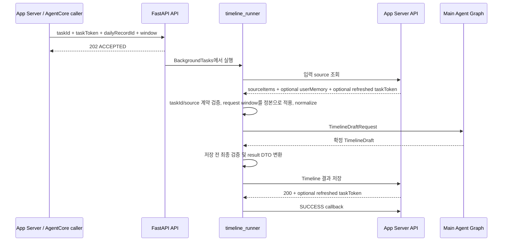
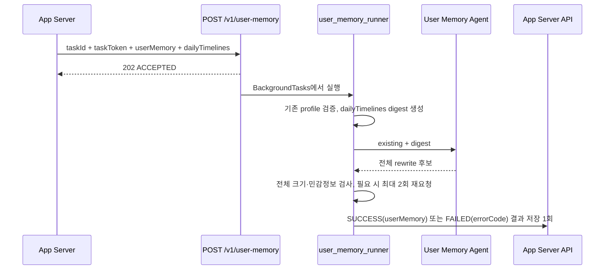

# Laimory AI 시스템 아키텍처

## 시스템의 역할

Laimory AI 서버는 센서·일정·사진·알림·건강 데이터를 영속 저장하는 서버가 아니다. App Server가 제공하는 하루치 source를 해석해 사용자가 읽고 보완할 수 있는 Timeline을 만들고, 확정된 여러 날의 Timeline을 바탕으로 User Memory를 갱신하는 무상태 실행 서버다.

제품 데이터의 소유권은 App Server에 있다.

- source 원본 저장과 조회
- Timeline 결과 저장
- User Memory 저장
- task 상태와 수명 관리
- Timeline 결과와 일별 기록의 연결

AI 서버가 소유하는 것은 실행 중 임시 상태다.

- 요청 하나의 정규화된 입력
- Agent 중간 결과와 Timeline draft
- provider/client와 prompt cache
- 프로세스 로컬 inflight counter
- 로그와 trace를 조립하기 위한 실행 context

## 컴포넌트 책임

| 계층 | 책임 | 하지 않는 일 |
|---|---|---|
| `app/api` | HTTP 요청 검증, 202 접수, background task 등록, AgentCore adapter | 비즈니스 pipeline 중복 구현, DB 접근 |
| `app/services/*_runner.py` | task 전체 순서, timeout, 최종 상태, 결과 전달 | 의미 판단, provider별 SDK 처리 |
| `app/services/app_server_client.py` | App Server header, TaskToken, retry, status 해석 | Timeline 생성, task 상태 결정 |
| `app/services/normalizer.py` | 평평한 source item을 domain별 입력으로 변환 | 사건 의미 추론 |
| `app/agents` | source 해석, 의미 병합, Repair 계획, 회고 질문, User Memory rewrite | 제품 persistence |
| `app/services/*_guard.py` | source·시간·장소·길이 등 결정론 검사와 보정 | 자연어 의미를 임의로 재작성 |
| `app/schemas` | 내부·외부 데이터 계약과 교차 검증 | I/O, orchestration |
| `app/core` | 설정, LLM provider, 오류 코드, logging, Langfuse, inflight | 특정 도메인의 Timeline 규칙 |

## Timeline task 전체 흐름

Timeline trigger에는 source 본문을 싣지 않는다. 접수 body는 작업 상관값과 정본 window를 전달하고, 실제 source는 background runner가 App Server API로 조회한다. 입력 조회 응답에도 window가 있을 수 있지만 접수 request의 window가 최종 정본이다.

### 결과 저장과 callback은 다르다

Timeline 결과는 result API로 저장하고 callback은 terminal 상태만 통보한다. 성공 순서는 반드시 다음과 같다.

1. 결과 저장 요청을 보낸다.
2. 저장 성공 응답을 확인한다.
3. 그 뒤에만 SUCCESS callback을 보낸다.

결과 저장 성공 뒤 callback이 실패해도 이미 저장된 결과를 FAILED로 바꾸지 않는다. 반대로 결과 저장이 실패하면 사용자에게 전달된 결과가 없으므로 SUCCESS callback을 보내면 안 된다.

### TaskToken 수명

Timeline task는 최초 접수 body의 `taskToken`으로 시작한다. App Server 응답 body에 새 token이 있으면 holder를 갱신하고 이후 호출은 최신 값을 `Task-Token` header로 보낸다. 값 자체는 로그나 Langfuse에 남기지 않고 갱신 횟수만 관측한다.

timeout과 5xx는 같은 token과 같은 body로 재시도한다. 401, 404, 409는 재시도해도 해결되지 않거나 callback도 거절될 상태이므로 retry와 callback 없이 중단한다.

## User Memory 갱신 task 전체 흐름

User Memory task는 Timeline task의 후속 graph node가 아니다. 여러 날의 확정 기록을 입력으로 받고 Timeline이 아닌 사용자 profile 전체를 출력하기 때문에 별도 endpoint, runner, timeout, trace를 가진다.

이 task에는 callback이 없다. 결과 저장 요청 하나가 결과 전달과 종료 통보를 함께 맡는다. 따라서 성공이든 실패든 모든 경로가 결과 저장 호출 정확히 한 번으로 수렴해야 한다. 이 호출이 빠지면 App Server는 작업이 끝났는지 알지 못하고 TTL까지 기다리게 된다.

User Memory FAILED는 하루 기록 저장 실패가 아니다. 사용자가 저장한 DailyRecord의 상태 전이는 이미 App Server에서 끝났고, FAILED는 오직 “이번 User Memory 갱신이 반영되지 않았다”는 뜻이다.

## 비동기와 thread 경계

provider SDK 호출은 동기 방식이다. 이를 FastAPI event loop에서 직접 호출하면 다른 요청과 `/ping`을 막을 수 있으므로 `asyncio.to_thread`에서 실행한다.

- 다섯 Event Agent: 각각 worker thread에서 실행하고 `asyncio.gather`로 병렬 대기
- Timeline Agent: worker thread
- Repair Agent: 반복적인 LLM 호출과 도구 실행 전체를 worker thread
- Question Agent: worker thread
- User Memory build: worker thread + `asyncio.wait_for`
- Langfuse flush: worker thread

Python `contextvars`는 `asyncio.to_thread`로 복사되므로 taskId, execution stage, Agent 이름 같은 상관 context가 thread 경계에서도 유지된다.

## timeout과 inflight

Timeline 전체 pipeline과 User Memory 갱신은 각각 설정된 timeout으로 감싼다. timeout은 단순한 HTTP 응답 시간 문제가 아니다. background 작업이 장시간 끝나지 않으면 inflight counter가 유지되고 `/ping`이 `HealthyBusy`를 반환해 배포가 기존 컨테이너를 교체하지 못한다.

`inflight`는 프로세스 로컬 카운터다. 이 때문에 현재 Uvicorn worker를 하나만 사용한다. worker를 여러 개로 늘리면 한 프로세스의 `/ping`이 다른 프로세스에서 진행 중인 작업을 모르므로 “idle”을 잘못 보고할 수 있다.

## 무상태 설계의 장점과 한계

장점은 AI 서버 재배포와 scale-out이 제품 DB migration에 의존하지 않고, 데이터 소유권이 App Server 한곳에 유지된다는 것이다. 또한 AI가 중간 상태를 영속 저장하지 않으므로 source/result 계약이 명확하다.

한계도 분명하다.

- FastAPI `BackgroundTasks`는 durable queue가 아니다.
- 프로세스가 종료되면 실행 중 task를 다른 worker가 이어받지 않는다.
- AI 서버에는 task 조회 endpoint나 재처리 queue가 없다.
- inflight가 프로세스 로컬이라 multi-worker/multi-replica 전체 busy 상태를 합산하지 못한다.
- App Server의 result/callback idempotency와 DB transaction은 이 저장소에서 검증할 수 없다.

## 주요 코드 위치

- `app/api/v1/timeline.py`: Timeline 202 접수
- `app/api/v1/user_memory.py`: User Memory 202 접수
- `app/api/agentcore.py`: `/invocations`, `/ping` adapter
- `app/services/timeline_runner.py`: Timeline task 전체 순서와 최종 상태
- `app/services/user_memory_runner.py`: User Memory task와 결과 저장 1회 수렴
- `app/services/app_server_client.py`: 서버간 API, retry, TaskToken
- `app/agents/main/main_agent.py`: Timeline LangGraph
- `app/core/inflight.py`: process-local busy 상태

