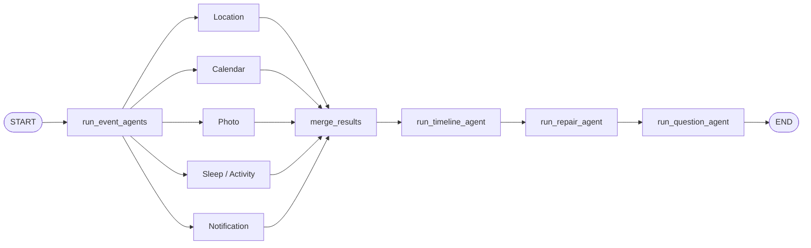
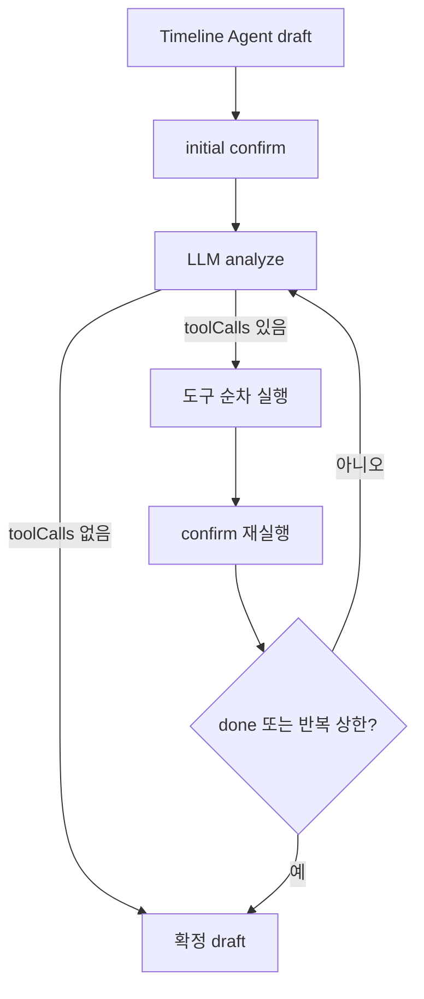

# Timeline LangGraph와 Agent 엔지니어링

## 전체 그래프

Timeline 생성의 main graph는 고정된 직선 구조와 내부 병렬 fan-out/fan-in을 결합한다.

실제 LangGraph node는 다음 다섯 개다.

1. `run_event_agents`
2. `merge_results`
3. `run_timeline_agent`
4. `run_repair_agent`
5. `run_question_agent`

Event Agent들은 node 내부에서 병렬 실행된다. 그래프에 다섯 node로 직접 펼치지 않은 이유는 Agent 목록과 결과를 이름 key로 관리하고, Repair가 특정 Event Agent만 재실행할 수 있게 하기 위해서다.

## 그래프 state

`_MainAgentState`는 요청 하나의 실행 중 상태를 가진다.

| 필드 | 의미 |
|---|---|
| `request` | 정규화가 끝난 `TimelineDraftRequest` |
| `event_agents` | 유일한 이름 → Event Agent 인스턴스 |
| `event_results` | 같은 이름 → 마지막 `AgentEventResult` |
| `merged_result` | 다섯 결과의 candidates, fragments, warnings를 취합한 값 |
| `timeline_agent` | Timeline Agent 인스턴스 |
| `repair_agent` | Repair Agent 인스턴스 |
| `question_agent` | Question Agent 인스턴스 |
| `draft` | Timeline → Repair → Question을 지나며 갱신되는 `TimelineDraft` |

Event Agent 이름은 단순 표시용이 아니다. Repair 도구 `rerun_event_agent`가 어느 Agent를 다시 돌리고 어느 기존 결과를 교체할지 정하는 key다. 같은 이름이 중복되면 `-2`, `-3` suffix를 붙인다. `event_agents`와 `event_results`의 key가 어긋나면 재실행 결과가 이전 결과를 교체하지 못해 같은 후보가 중복 병합될 수 있다.

## 중간 산출물

### Candidate

Candidate는 하나의 Timeline event가 될 만큼 근거가 있는 중간 결과다. `sourceRefs`로 원본 `rawId`를 가리키고, 시간·장소·event type·confidence·inference level 같은 해석 정보를 갖는다. Candidate도 최종 정답은 아니며 Timeline Agent가 다른 source와 병합하거나 제외할 수 있다.

### Fragment

Fragment는 단독 event로 확정하기에는 약하지만 다른 source와 결합할 가치가 있는 단서다. 예를 들어 이동 구간 사이의 공백, 의미가 약한 notification, 사건 맥락을 보강하는 photo가 될 수 있다. 단순 원본 요약과 동의어가 아니며 Timeline Agent는 Candidate보다 낮은 우선순위로 사용한다.

### TimelineDraft

TimelineDraft는 App Server에 바로 보내는 결과보다 넓은 내부 모델이다.

- 편집 가능한 `events`
- 시간·장소 모호성을 나타내는 내부 `questions`
- 복구 가능한 문제를 나타내는 `warnings`
- confidence, inference level, uncertainty, sourceRefs
- Repair 동안 사용하는 `clientEventId`

Repair 후 result mapper가 App Server 저장 DTO로 필요한 필드만 투영한다.

## Event Agent 공통 실행 계약

`EventAgent.generate()`는 담당 source가 없으면 LLM을 호출하지 않고 빈 결과를 반환한다. LLM 또는 파싱 실패는 전체 pipeline으로 예외를 올리지 않고 Agent warning과 빈 결과로 흡수한다.

정상 LLM 결과도 그대로 신뢰하지 않는다.

- 현재 요청에 없는 `rawId` reference 제거
- 유효한 reference가 사라진 Candidate/Fragment 제거
- request window 밖의 항목 제거, 경계에 걸친 구간 clamp
- 담당 source가 Candidate 또는 Fragment로 보존됐는지 coverage 검사
- source별 민감정보·시간·사진·위치 규칙 검사

Event Agent의 문장은 최종 일기가 아니라 source 사실 보고다. 분 단위 시각이나 걸음 수처럼 원본에 있는 정확한 수치를 이 단계에서 숨기지 않는다. 사용자 노출 일기 문체로 바꾸는 책임은 Timeline과 Repair에 있다.

## 다섯 Event Agent

### Location Event Agent

담당 입력은 `stays`와 `movements`다. 장소 체류, 이동, 이어진 여정, 왕복, source 공백을 해석한다. 코드가 평균 속도, 구간 공백, 첫·마지막 관측 같은 `derivedMetrics`를 미리 계산해 raw item과 함께 준다. LLM이 매번 시간 차와 속도를 암산하게 하지 않고 재현 가능한 수치 계산은 코드가 맡는다.

v1은 자유 텍스트 infer 후 review가 structured output으로 정리하는 2단계 graph다. v2는 더 적극적인 상위 여정 복원을 목표로 review를 제거하고 단일 structured call을 사용한다. 최종 결과는 location guard가 source와 시간 경계를 다시 검사한다.

### Calendar Event Agent

담당 입력은 calendar items다. 일정의 제목, 시간, 장소, 참석 의미를 candidate/fragment로 해석한다. Calendar item은 누락되면 사용자가 명시적으로 만든 일정이 사라지는 문제이므로 Repair의 `ensure_calendar_events`가 최종 Timeline에서 빠진 일정도 결정론적으로 복원한다.

일정이 존재한다는 사실과 실제 참석했다는 사실은 구분한다. 다른 source가 참석을 지지하지 않으면 confidence와 inference level로 불확실성을 표현한다.

### Photo Event Agent

담당 입력은 photos다. 사진 다운로드와 vision 설명, metadata fallback, 시간대별 grouping, 후보 생성을 분리한다.

1. `photoUrl`에서 이미지를 제한된 timeout·용량·장수·총 byte 예산 안에서 다운로드한다.
2. 실제 이미지가 있으면 vision prompt로 보이는 내용을 구조화한다.
3. 다운로드나 vision이 불가능하면 metadata 기반 LLM describer를 사용한다.
4. Photo Event Agent가 여러 사진을 시간과 의미로 그룹화해 Candidate/Fragment를 만든다.

최종 draft에서는 사진 하나가 event 여러 개에 중복 귀속되지 않는지 검사한다. 어느 event가 사진의 의미상 주인인지는 시간만으로 정할 수 없으므로 검사는 코드가 하고 실제 재배치는 Repair Agent가 판단한다.

### Sleep/Activity Event Agent

담당 입력은 health items이며 metric을 기준으로 sleep과 steps/activity를 구분한다. 수면 구간과 기상, 하루 활동량을 사실 중심으로 해석한다.

Location과 마찬가지로 v1은 infer→review, v2는 단일 structured call이다. 이후 `sleep_guard`는 알려진 기상 경계 이전의 일반 event를 제거하거나 수면에 걸친 event를 clamp한다. 수면 경계를 알 수 없으면 시간을 새로 만들어내지 않는다.

### Notification Event Agent

담당 입력은 notifications다. 앱 사전과 코드 분류를 사용해 메신저, 결제·송금, 예약·교통·업무 등 category를 해석한다. Notification 원문에는 token, 카드·계좌·전화번호, 주소, 민감한 대화가 들어올 수 있어 Agent 결과와 최종 draft 양쪽에서 민감정보를 검사한다.

알림은 실제 사건과 동일하지 않을 수 있다. 예약 알림은 미래 일정의 존재를 알려줄 수 있지만 오늘 참석했다는 증거는 아니다. 메시지 내용도 사용자의 실제 행동으로 확정하지 않는다.

## merge_results

다섯 Agent 결과는 `merge_event_results`에서 단순하고 투명하게 이어 붙인다.

- Candidate 목록 concat
- Fragment 목록 concat
- Warning 목록 concat

이 node 자체는 의미 병합을 하지 않는다. 의미 병합은 Timeline Agent가 맡는다. 명시적인 fan-in node를 두어 Langfuse graph에서도 다섯 병렬 Agent가 Timeline으로 합류하는 구조가 보이도록 한다.

## Timeline Agent

Timeline Agent는 여러 source가 같은 실제 사건을 가리키는지 판단하고 사용자가 읽을 draft를 만든다.

주요 책임은 다음과 같다.

- 시간, 장소, 활동 의미가 같은 Candidate/Fragment 병합
- 하루 중심 흐름 구성
- raw source type보다 사람 중심 event type 선택
- 사용자 노출 title/description 작성
- 충돌·모호성은 warning, 내부 question, uncertainty로 표현
- User Memory를 해석과 표현의 보조 context로 사용

Timeline Agent의 출력은 아직 확정본이 아니다. LLM이 준 `userId`, date, timezone, `clientEventId`를 신뢰하지 않는다. date/timezone은 request 기준으로 정하고 ID는 유효 event를 읽은 순서대로 임시 부여한다.

JSON 전체를 읽을 수 없거나 호출이 실패하면 빈 draft와 HIGH warning으로 fallback한다. 개별 event/question/warning이 Pydantic 검증을 어기면 그 항목만 제외하고 나머지는 살린다.

## Repair Agent

Repair Agent는 “LLM이 문장을 한번 더 써주는 단계”가 아니다. 코드 확정 pass와 제한된 LLM 도구 개선을 결합한다.

LLM 호출 여부와 관계없이 최초 confirm을 한 번 실행한다. 반복 중 LLM/parse가 실패하면 마지막으로 confirm에 성공한 deep copy를 복원한다. 개별 도구 실패는 전체 Repair 실패로 올리지 않고 `ok=false` 결과로 다음 분석 prompt에 제공한다.

## Question Agent

Question Agent는 Repair가 event 병합·삭제와 ID 재부여를 끝낸 뒤 실행한다. 질문은 사용자가 센서로 알 수 없는 경험, 감정, 이유, 인상을 덧붙이게 하는 회고 유도 질문이다.

현재 실행 코드의 계약은 **모든 event에 질문 하나를 시도**하는 것이다. Sleep, Wake Up, Movement도 예외가 아니다. 1차 응답에서 빠진 event만 모아 한 번 재요청한다. 두 번째에도 질문이 없거나 규칙을 어기면 `None`으로 남기고 LOW warning을 추가하되 Timeline 저장은 계속한다.

LLM에는 다음 최소 정보만 준다.

- `clientEventId`
- `eventType`
- `title`
- 시 단위로 뭉갠 `timeOfDay`
- 선택적 `description`, `place`
- Timeline과 같은 projection의 User Memory

confidence, inference level, uncertainty, sourceRefs, 분 단위 시각은 주지 않는다. “질문에 쓰지 말라”는 지시보다 입력에서 제거하는 것이 더 강한 방어다.

코드는 알 수 없는 ID, 중복 질문, 물음표로 끝나지 않는 문장, 255자 초과 문장을 제외한다. 질문은 잘라서 살리지 않는다. 잘린 문장은 질문의 의미가 불완전해지기 때문이다.

## 실패 격리 표

| 단계 | 실패 시 fallback | Timeline task 지속 여부 |
|---|---|---|
| Event Agent | 빈 Candidate/Fragment + warning | 지속 |
| merge | 코드 오류이면 상위 task 실패 | 중단 가능 |
| Timeline Agent | 빈 draft + HIGH warning | 지속 |
| initial confirm | 결정론 코드 오류 | 중단 |
| Repair analyze/parse | 마지막 confirm 성공본 + warning | 지속 |
| Repair tool 하나 | `ok=false` tool result | 지속 |
| Question 1차 | 질문 없는 확정 draft + warning | 지속 |
| Question 재요청 | 1차 질문 유지, 나머지는 warning | 지속 |
| 최종 result validation | 저장 불가능한 결과 | task 실패 |

## 관측 graph

Langfuse에는 main Agent 아래 Event Agent들, merge chain, Timeline Agent, Repair Agent, Question Agent가 계층으로 남는다. Repair 내부 analyze/execute/confirm은 반복 cycle을 추론할 수 있도록 sibling chain 형태로 기록한다. 상류 Agent 재실행은 Main graph의 고정 역할을 흐리지 않도록 Repair 내부 span으로 남긴다.

주요 코드:

- `app/agents/main/main_agent.py`
- `app/agents/events/**`
- `app/agents/timeline/timeline_agent.py`
- `app/agents/repair/repair_agent.py`
- `app/agents/question/question_agent.py`

