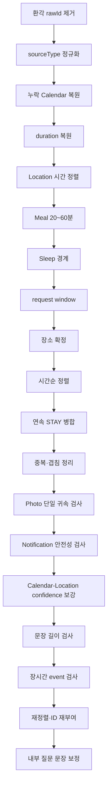

# 결정론적 Timeline Repair와 도구

## 왜 결정론적 확정 계층이 필요한가

LLM은 같은 입력에도 조금씩 다른 결과를 낼 수 있고, schema가 맞아도 도메인 계약이 맞는 것은 아니다. 존재하지 않는 `rawId`를 인용하거나, event가 request window를 벗어나거나, 같은 사진을 여러 event에 연결하거나, ID를 중복해서 줄 수 있다.

Laimory는 이런 문제를 prompt만으로 막지 않는다. 의미 판단은 LLM이 하되 다음처럼 기계적으로 판정할 수 있는 규칙은 코드가 매번 확정한다.

- 입력에 있는 source만 인용했는가
- source type label이 실제 입력과 같은가
- 시간 범위와 정렬이 맞는가
- 필수 Calendar가 누락됐는가
- 수면·식사·장소 경계를 지켰는가
- 병합 후 사진과 Notification이 안전한가
- 최종 ID가 시간순으로 다시 부여됐는가

## `repair_draft` 전체 순서

실행 순서는 단순 나열이 아니라 앞 단계 결과를 뒤 단계가 전제로 사용하는 dependency graph다.

### 1. 환각 source 제거

`filter_draft_sources`는 event가 인용한 `rawId`가 현재 request에 실제로 존재하는지 검사한다. 없는 reference는 제거하고 유효 reference가 하나도 남지 않은 event도 제거한다. LLM이 만든 source를 이후 guard가 사실로 오인하지 않게 가장 먼저 실행한다.

### 2. source type 정정

LLM이 올바른 `rawId`에 잘못된 `sourceType` label을 붙일 수 있다. 이후 guard가 type별 source 목록에서 원본을 찾으므로 실제 입력의 type으로 먼저 정정한다. HEALTH item은 metric에 따라 SLEEP 또는 ACTIVITY source type으로 해석된다.

### 3. 누락 Calendar 복원

유효한 Calendar item이 최종 draft에서 통째로 빠졌다면 코드가 event로 복원한다. 명시적으로 등록된 일정의 누락은 품질 저하가 크기 때문이다. 여기서 복원해야 새 event도 뒤의 시간, window, 장소, 병합 검사를 동일하게 통과한다.

### 4. duration 복원

지속시간이 0인데 source에 구간이 있는 event는 source span으로 복원한다. 반대로 Notification처럼 순간이어야 하는 사건에 잘못 붙은 duration은 시작 시각으로 되돌린다.

### 5. Location 근거 시간에 정렬

STAY/MOVEMENT 근거만 가진 event는 자신이 참조한 location source 구간 밖의 시간을 주장하지 않도록 맞춘다. 다른 source가 함께 있으면 Calendar나 Photo 등 그 source의 시간 의미를 존중해 location 구간만으로 전체를 덮어쓰지 않는다.

### 6. Meal duration

긴 체류 전체를 식사로 잡는 문제를 막기 위해 MEAL은 20~60분 범위로 제한한다. 식사의 의미 판단은 LLM이 하지만 상식적인 duration 범위는 전용 guard가 확정한다.

### 7. Sleep boundary

알려진 기상 이전의 일반 event를 제거하고 수면 구간에 걸친 event를 clamp한다. 경계를 알 수 없을 때는 임의 시각을 만들지 않는다.

### 8. request window 적용

접수 request의 window가 정본이다. 완전히 밖인 event는 제거하고 경계에 걸친 구간은 clamp한다. 입력 조회 응답의 window가 다르더라도 runner가 접수 window로 덮어쓴다.

### 9. 장소 확정

`placeLabel`은 source의 place/address로 확정하고 근거 없는 address는 제거한다. Photo vision이 실제 이미지에서 읽은 상호명은 Photo에 구조화 place field가 없어도 제한적으로 보존할 수 있다.

장소를 겹침 판정 전에 확정하는 이유는 같은 event인지 비교할 때 event type, 시간과 함께 장소가 중요한 key이기 때문이다.

### 10. 정렬과 STAY 병합

먼저 시간순으로 정렬한 뒤 이동 없이 이어진 같은 장소의 순수 STAY event를 합친다. Calendar, Photo, Notification 같은 다른 의미가 섞인 사건을 긴 체류 하나에 흡수하지 않는다.

### 11. 중복과 겹침

같은 종류·장소이고 시간이 겹치는 명백한 중복은 병합할 수 있다. 포함 관계나 서로 다른 사건의 부분 겹침은 무조건 자르지 않고 warning으로 남길 수 있다. 코드가 의미를 모르는 상태에서 시간만 맞추려고 실제 사건을 훼손하지 않는다.

### 12. Photo와 Notification 최종 검사

병합·삭제가 끝난 뒤 사진이 정확히 하나의 event에 귀속됐는지 검사한다. 앞에서 검사하면 병합으로 새로 생긴 중복을 놓친다.

Notification도 Timeline/Repair가 문장을 다시 조립한 뒤 민감정보나 근거 없는 관계명이 생길 수 있어 final draft에서 다시 검사한다.

### 13. confidence 보강

Calendar location과 STAY place/address가 일치하면 서로 독립된 source가 같은 장소를 지지하므로 confidence를 올린다.

### 14. 길이와 장시간 event warning

모든 병합과 문장 수정이 끝난 결과를 기준으로 title/description 길이와 duration을 검사한다.

- description 120자 초과: LOW warning
- 비캘린더 일반 event 3시간 초과: LOW warning
- Calendar, Sleep, Movement, Meal은 장시간 검사 제외

장시간 event는 코드가 임의로 분할하거나 자르지 않는다. 어디에서 사건이 나뉘는지는 의미 판단이기 때문이다. Repair Agent가 warning을 보고 `update_event`, `delete_event`, 상류 재실행으로 개선할 수 있다.

두 guard는 Repair 반복마다 자기 이전 warning을 지우고 현재 draft를 다시 계산한다. 수정이 끝났는데 stale warning이 남는 것을 막는다.

### 15. 재정렬과 ID 확정

병합·삭제로 event 구성이 바뀌었으므로 다시 정렬하고 `event-001`, `event-002` 형식의 `clientEventId`를 시간순으로 재부여한다. 제거된 event를 가리키던 내부 question reference도 정리한다.

## Fragment 최종 검사

`repair_draft`가 끝난 뒤 `verify_fragment_usage`가 최종 event의 근거가 fragment뿐인지 검사한다. 병합·삭제 전에 검사하면 최종 근거 구성을 알 수 없기 때문에 confirm 끝에서 실행한다. fragment-only event를 무조건 삭제하지 않고 warning으로 드러내어 근거가 약함을 숨기지 않는다.

## Repair Agent 반복

Repair Agent는 최초 confirm을 반드시 실행한다. 설정의 `repair_max_iterations`가 0이면 LLM 개선 없이 이 결정론 확정본을 바로 반환한다.

반복이 활성화되면 다음 상태를 유지한다.

- 확정된 현재 draft
- Agent 이름별 마지막 Event Agent 결과
- Agent 이름별 Event Agent 인스턴스
- Timeline Agent 인스턴스
- 지금까지의 tool result log
- 마지막 confirm 성공본 deep copy

LLM은 확정된 draft만 본다. 매 반복의 마지막에 confirm을 다시 실행하므로 다음 분석은 source, 시간, 정렬, ID가 코드 규칙을 통과한 상태에서 시작한다.

## Repair 도구 카탈로그

### 조회 도구

| 도구 | 용도 | draft 변경 |
|---|---|---|
| `lookup_source(rawId)` | 축약 source index만으로 부족할 때 실제 원본 한 건 조회 | 없음 |

### 편집 도구

| 도구 | 용도 | 주의 |
|---|---|---|
| `update_event(clientEventId, fields)` | event type, title, description, 시간, 장소, confidence, sourceRefs 등 지정 필드만 수정 | 허용 필드와 Pydantic 계약을 통과해야 함 |
| `delete_event(clientEventId)` | 근거가 없거나 사실이 아닌 event 삭제 | 다음 confirm에서 ID가 다시 부여됨 |

`update_event`가 수정할 수 있는 필드는 `eventType`, `title`, `description`, `address`, `placeLabel`, `tags`, `startTime`, `endTime`, `confidence`, `inferenceLevel`, `sourceRefs`, `uncertainty`다. 최종 question은 Repair 뒤 별도 Question Agent가 생성하므로 여기서 다루지 않는다.

### 결정론 service 재적용 도구

| 도구 | 재사용하는 코드 |
|---|---|
| `repair_durations()` | source span 기반 duration 복원 |
| `align_location_events()` | Location-only event 시간 정렬 |
| `enforce_meal_duration()` | MEAL 20~60분 |
| `enforce_sleep_boundary()` | 기상 이전 제거·수면 겹침 clamp |
| `resolve_places()` | 장소명 확정·근거 없는 주소 제거 |
| `ensure_calendar_events()` | 누락 Calendar 복원 |
| `merge_stay_events()` | 정렬 후 연속 순수 STAY 병합 |
| `resolve_overlaps()` | 중복 병합·모순 warning |
| `reinforce_calendar_location()` | Calendar/Stay 장소 일치 confidence 보강 |
| `check_photo_assignment()` | 누락·중복 사진 귀속 조회, 자동 수정은 하지 않음 |

이 도구들은 로직을 복제하지 않고 `repair_draft`가 사용하는 service를 그대로 호출한다. Repair가 event를 수정하거나 상류 Agent를 재실행해 기존 확정이 깨졌을 때 필요한 부분을 즉시 다시 확인할 수 있다. 어차피 반복 끝에는 전체 confirm이 다시 실행되므로 부분 재적용은 분석과 피드백을 위한 것이다.

### 상류 재실행 도구

| 도구 | 동작 | 주의 |
|---|---|---|
| `rerun_event_agent(agent)` | 특정 Event Agent 결과만 새 결과로 교체 | draft에는 아직 반영되지 않음 |
| `rerun_timeline_agent()` | 현재 Agent 결과 전체를 merge해 Timeline draft 재생성 | 기존 draft 직접 수정은 사라짐 |

특정 source 해석이 근본적으로 틀렸을 때만 Event Agent 재실행을 사용한다. 이어서 Timeline Agent를 재실행해야 새 Candidate/Fragment가 draft에 반영된다.

## 항상 실행되는 규칙과 선택 도구의 차이

정렬, request window, source 무결성, 최종 ID는 Repair tool로 노출하지 않는다. “LLM이 문제를 발견하고 해당 도구를 선택해야만” 실행되는 구조라면 호출하지 않는 순간 불변식이 깨진다. 이 규칙들은 confirm 전체에서 항상 실행한다.

도구 catalog는 LLM이 의미 문제를 해결하는 제한된 능력이다. arbitrary code나 임의 HTTP 요청을 실행할 수 없고 등록된 함수와 허용 인자만 사용한다.

## 실패 복구

- 등록되지 않은 도구: `ok=false`, error code와 사용 가능 목록 기록
- 인자 오류·없는 event/source: `RepairToolError`, `ok=false`
- service 예외: 다음 tool을 계속 실행하고 실패 결과를 log에 추가
- analyze LLM 실패 또는 `RepairPlan` 파싱 실패: 마지막 confirm 성공본 복원
- confirm 코드 실패: 해당 반복은 확정되지 않았으므로 이전 `last_good` 복원

도구 인자 값에는 title 같은 사용자 콘텐츠가 들어갈 수 있어 operational log에는 argument name만 남긴다. 상세 input/output은 Langfuse content policy 아래에서만 관측한다.

## 주요 코드

- `app/services/draft_repair.py`
- `app/agents/repair/repair_agent.py`
- `app/agents/repair/tools.py`
- `app/services/source_integrity.py`
- `app/services/*_guard.py`
- `app/services/draft_edit.py`

