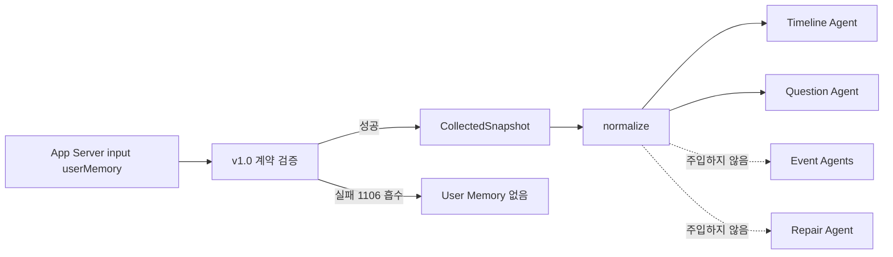
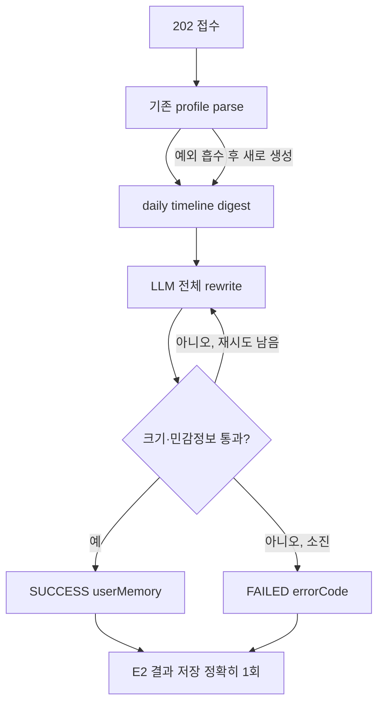

# User Memory 설계와 갱신

## User Memory란 무엇인가

User Memory는 사용자의 모든 과거 사건을 쌓아두는 장기 로그가 아니다. Timeline과 질문을 만들 때 사용자를 더 잘 이해하도록 돕는 **고정 크기의 압축 프로필**이다.

담아야 하는 것은 “어느 날 몇 시에 무엇을 했다”가 아니라 일정 기간 유효한 사용자 특성과 현재 맥락이다.

- 기본 profile과 생애 단계
- 현재 삶의 맥락
- 중요한 관계의 유형과 의미
- 반복되는 성향·가치·선호
- 생활 routine과 현재 관심사
- 반복되는 감정 pattern
- 어떤 기억을 남기고 싶어 하는지

사건 데이터가 아니므로 `rawId`를 갖지 않고 `sourceRefs`에 들어가지 않는다.

## v1.0 스키마

User Memory는 `extra="forbid"`인 고정 스키마다. 최상위 자유 필드를 무제한 허용하지 않고 확장성은 `customAttributes` 안으로 제한한다.

| 필드 | 의미 | 최대 길이 |
|---|---|---:|
| `basicProfile` | 연령대, 신분, 직업·역할, 생애 단계 | 200자 |
| `lifeContext` | 최근 삶의 시기와 상황 | 200자 |
| `relationships` | 중요한 관계의 유형과 의미 | 200자 |
| `personality` | 반복되는 행동·사고·소통 특성 | 200자 |
| `values` | 중요하게 여기는 가치와 판단 기준 | 200자 |
| `preferences` | 좋아하거나 피하는 대상·환경·경험 | 200자 |
| `routines` | 반복되는 생활 구조와 주요 활동 | 200자 |
| `currentFocus` | 현재 에너지를 쓰는 목표·과제·고민 | 200자 |
| `emotionalPatterns` | 반복되는 감정 반응·스트레스·안정 조건 | 200자 |
| `memoryStyle` | 하루에서 무엇을 어떻게 기억하고 싶은지 | 200자 |
| `customAttributes` | 고정 필드로 담기 어려운 지속 특성 | 최대 5개, 값당 150자 |
| `schemaVersion` | 현재 `1.0`만 허용 | 서버 확정 |
| `updatedAt` | 마지막 갱신 시각 | 서버 확정 |

필드가 비어 있는 것은 실패가 아니다. 근거가 부족하면 빈 문자열을 유지하는 것이 추측으로 채우는 것보다 낫다.

## Prompt projection

Timeline Agent, Question Agent, User Memory 갱신 Agent가 기존 profile을 읽을 때 모두 같은 `user_memory_to_text()` 경로를 사용한다.

projection 규칙은 다음과 같다.

- 빈 자연어 필드 제외
- 빈 `customAttributes` 제외
- `schemaVersion`, `updatedAt` 제외
- 선언된 필드 순서 유지
- 채워진 값이 하나도 없으면 `정보 없음`
- UTF-8 JSON 문자열로 직렬화

같은 profile이 Agent마다 다른 문자열로 보이면 어떤 정보가 판단 근거였는지 재현하기 어렵고 cache/diff도 의미를 잃는다. 따라서 Agent별로 필요한 필드만 임의 선택하지 않는다.

## 소비 경계

### Timeline Agent에서의 사용

사용자의 생활 장소명, 관계 호칭, 문체와 중요도 선택을 돕는다. 하지만 User Memory만으로 오늘 사건의 발생, 일정 참석, 장소, 이동 목적, 사람의 실명이나 정확한 관계를 확정하지 않는다. 오늘 source와 충돌하면 source가 우선한다.

### Question Agent에서의 사용

무엇을 물을지에 대한 새로운 사건 사실이 아니라 어떻게 물을지 결정하는 자료다. `memoryStyle`, `emotionalPatterns`, `preferences`, `personality`를 질문의 결과 말투에 참고한다. profile에만 있는 프로젝트명이나 관계를 오늘 event의 사실처럼 질문에 끌어오지 않는다.

### Event Agent에 넣지 않는 이유

Event Agent는 자기 source의 사실 보고가 임무다. 다섯 Agent가 같은 profile을 읽으면 같은 보조 context 하나가 다섯 개의 독립 근거로 반복되고, Timeline이 source consensus로 오인할 수 있다.

### Repair Agent에 넣지 않는 이유

Repair는 이미 User Memory를 본 Timeline 문장과 오늘 source를 대조한다. 반복 개선에 profile을 다시 주입하면 source보다 profile에 맞추어 사건을 재작성할 위험이 있다.

## 계약 위반을 흡수하는 이유

App Server input의 `userMemory`는 즉시 `UserMemory` model로 엄격 선언하지 않고 원본 dict로 느슨하게 받는다. 별도 `parse_user_memory()`에서 검증하고 실패하면 error code 1106을 기록한 뒤 User Memory 없이 Timeline을 계속한다.

보조 context 하나의 schema 오류로 하루 source 전체를 버리지 않기 위해서다. 갱신 task에서도 읽지 못하는 기존 profile은 실패시키지 않고 없는 셈 치고 새로 만든다. 그렇지 않으면 같은 깨진 profile을 매일 읽으며 영구적으로 갱신할 수 없게 된다.

ValidationError 문자열에는 걸린 실제 값이 포함될 수 있어 원문 exception을 운영 로그에 남기지 않는다. 오류 field 이름, type, count만 기록한다.

## 갱신은 append가 아니라 전체 rewrite

새 daily timeline이 들어올 때 기존 profile 뒤에 문장을 계속 붙이지 않는다. 기존 값과 새 근거를 합쳐 중복을 제거하고, 오래된 단기 정보를 버리고, 최신 상태 하나를 다시 만든다. 결과는 기존 profile 전체를 대체한다.

append 방식은 profile이 무한히 커지고 과거와 현재가 충돌하며 같은 표현이 반복된다. rewrite 방식은 크기 예산 안에서 현재 사용자를 설명하는 정보만 유지한다.

## 가장 중요한 근거 출처 규칙

Daily timeline event의 문장 출처는 서로 다르다.

- `title`: 이 시스템의 AI가 작성
- `subtitle`: 이 시스템의 AI가 작성
- `question`: 이 시스템의 AI가 작성
- `memo`: 사용자가 직접 작성

AI가 쓴 문장에서 성격·가치관·취향을 뽑으면 모델이 자기 문장을 다시 읽어 사용자를 만들어내는 feedback loop가 생긴다. 그렇게 생긴 profile은 다음 Timeline 문장을 만들고, 그 문장이 다시 profile 근거로 들어가며 편향이 스스로 강화된다.

그래서 필드별 근거를 다음처럼 제한한다.

| 필드군 | 허용 근거 |
|---|---|
| `routines`, `lifeContext`, `currentFocus` | event의 시간대·종류·여러 날의 반복 구조 |
| `basicProfile` | event 구조 + memo, 명확한 변경 근거가 있을 때만 |
| `relationships` | memo 우선, event는 보조 |
| `personality`, `values`, `preferences`, `emotionalPatterns`, `memoryStyle` | **memo만** |

memo가 하나도 없는 batch에서는 성향 계열 다섯 필드를 그대로 두는 것이 정상 성공이다. 생활 구조 계열만 event pattern으로 갱신할 수 있다.

## 갱신 입력 digest

접수 body의 `dailyTimelines`는 최대 5일이다. 그 안의 event가 많거나 본문이 길다고 요청 전체를 거절하지 않고 prompt 예산에 맞게 줄인다.

### 날짜별 event 예산

하루마다 최대 20개 event를 남긴다. 전체 100개 상한 하나로 정렬하지 않고 날짜별 quota를 적용한다. 한 날에 event가 몰렸다고 다른 날이 통째로 사라지지 않게 하기 위해서다.

### 우선순위

1. memo가 있는 event를 먼저 보존
2. 같은 조건이면 최근 event 우선
3. 최종 payload는 날짜 오름차순, 시간 오름차순으로 재정렬

memo는 성향 계열 필드의 유일한 사용자 발화 근거이므로 가장 늦게 버린다.

### projection과 절단

- 정확한 분은 버리고 `hour`만 제공
- `eventType` 제공
- title/subtitle/question 같은 AI 문장은 최대 255자
- memo는 최대 500자
- 빈 문자열은 제외
- prompt payload에 넣은 절단 표시 `…`는 남기지 않음

무엇을 얼마나 버렸는지는 `droppedDailyTimelineCount`, `droppedEventCount`, `memoCount` 등의 정수 통계로 운영 이벤트에 남긴다. 본문은 남기지 않는다.

## 갱신 생성과 확정

User Memory Agent는 낮은 temperature로 Pydantic structured output을 생성한다. LLM은 의미를 맡는다.

- 어떤 기존 정보를 유지할지
- 새 정보를 어떻게 병합할지
- 무엇이 오래됐는지
- 어떤 표현을 일반화하고 압축할지

코드는 셀 수 있는 것을 맡는다.

- 필드별 길이
- customAttributes 개수와 길이
- 전체 직렬화 크기
- 민감정보 pattern
- 재요청 횟수
- `schemaVersion`, `updatedAt`

## 전체 크기와 민감정보

이 프로젝트는 provider별 tokenizer에 의존하지 않는다. OpenAI, Gemini, Bedrock을 바꿔도 저장 가능 여부가 달라지지 않게 prompt projection의 직렬화 문자 수 1,200자를 전체 상한으로 사용한다. “1,000 token” 요구를 provider 독립적인 문자 수로 환산한 프로젝트 규칙이며 보편 표준은 아니다.

민감정보 검사는 전화번호, 카드·계좌번호, token/API key 등 금지 pattern을 찾는다. 위반이 있으면 코드는 문장을 자르거나 마스킹한 profile을 바로 저장하지 않는다. 의미가 잘린 문장은 뜻이 달라질 수 있기 때문이다.

대신 어느 필드가 어떤 규칙을 어겼는지 값 없이 알려 User Memory Agent에 전체 rewrite를 다시 요청한다. 최초 1회와 repair 2회로 최대 3번 생성한다. 끝까지 통과하지 못하면 error code 1304로 실패하고 기존 profile을 유지한다.

`schemaVersion="1.0"`과 `updatedAt`은 LLM 출력이 아니라 서버가 최종 확정한다.

## 결과 통보 1회 계약

User Memory task에는 callback이 없다. 성공 결과는 전체 `userMemory`를, 실패 결과는 catalog의 정수 `errorCode`와 안전 메시지를 같은 result endpoint로 보낸다. 실패 결과에 부분 profile을 싣지 않는다.

결과 전송 자체가 실패하면 error code 1305다. 이 경우 App Server에 알릴 다른 경로가 없으므로 operational event의 `resultSent=false`가 가장 중요한 진단 값이다.

## 관측과 privacy

운영 로그와 일반 trace metadata에는 User Memory 본문을 남기지 않는다. 비식별 summary만 사용한다.

- schema version
- 채워진 자연어 필드 수
- custom attribute 수
- byte/문자 크기와 hash summary
- daily timeline 수, event 수, memo 수

Langfuse generation prompt에는 실제 값이 필요하지만 content capture policy가 이를 통제한다. 운영 기본 `NONE`에서는 본문 대신 길이/hash summary를 남기고, local/dev의 `SANITIZED`에서는 redaction을 거친 제한된 본문을 볼 수 있다.

## 주요 코드

- `app/schemas/user_memory.py`
- `app/schemas/user_memory_update.py`
- `app/agents/parsing.py::user_memory_to_text`
- `app/agents/user_memory/user_memory_agent.py`
- `app/services/user_memory_limits.py`
- `app/services/user_memory_repair.py`
- `app/services/user_memory_runner.py`

