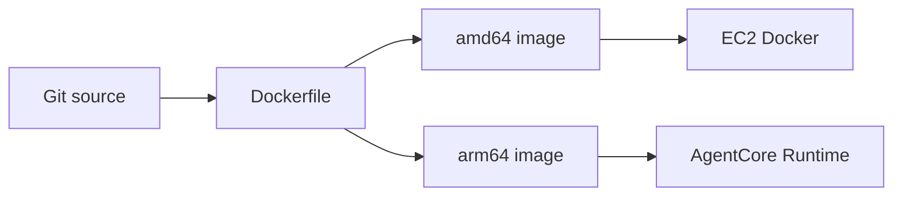
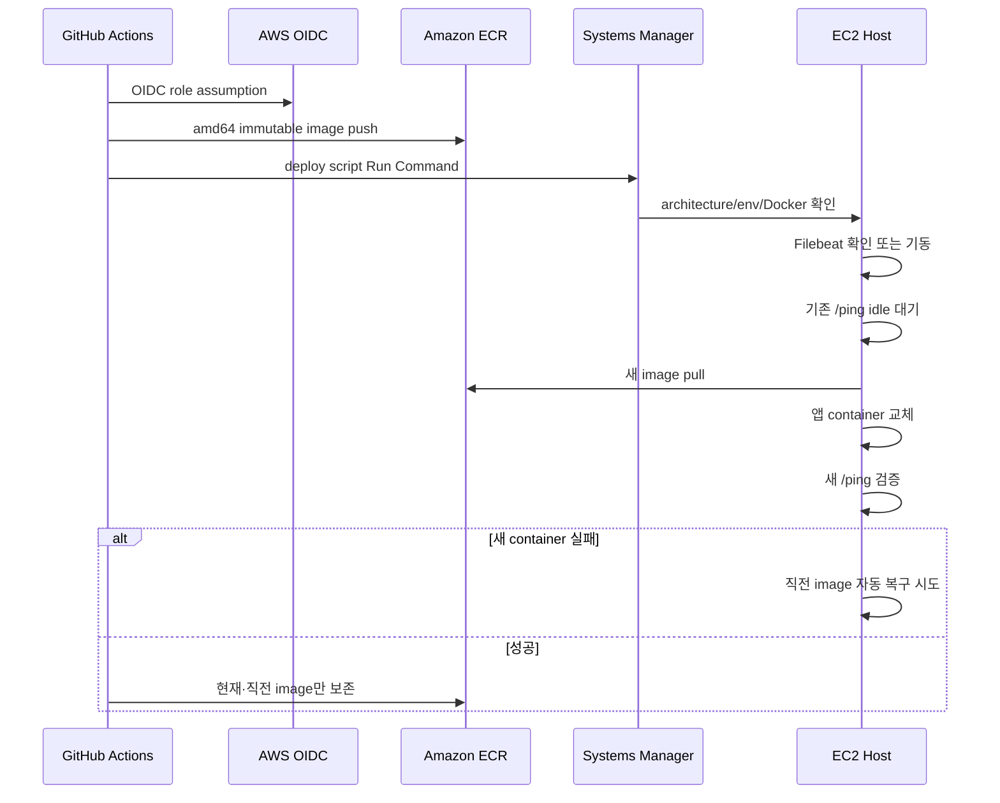

# AI 배포와 Runtime 구조

## 상태 요약

| 항목 | 현재 상태 | 향후 방향 |
|---|---|---|
| `dev` 자동 배포 | EC2 단일 컨테이너 | AgentCore를 기본 배포 대상으로 전환 예정 |
| EC2 architecture | `linux/amd64` | 전환 후에도 rollback 기간 동안 유지 가능 |
| AgentCore architecture | `linux/arm64` | 기본 runtime 후보 |
| AgentCore workflow | 수동 `workflow_dispatch` | 전환 시 자동/승인 정책 재설계 필요 |
| image source | 하나의 Dockerfile | 유지 가능 |
| health | 8080 `GET /ping` | AgentCore endpoint에서도 같은 계약 사용 |

현재 workflow 주석과 동작상 AgentCore는 수동 복구 경로다. 프로젝트 계획상 앞으로 AgentCore를 사용할 예정이지만 현재 코드가 이미 자동 전환을 완료한 것으로 기록하면 안 된다.

## 공통 Docker image

하나의 Dockerfile을 두 platform에서 사용한다.

### Builder

- `python:3.14-slim`
- pinned uv binary 사용
- `uv sync --locked --no-dev`
- `.venv`를 dependency layer로 생성
- app source 변경만으로 dependency install layer를 다시 만들지 않음

### Runtime

- `python:3.14-slim`
- `.venv`, `app/`, version 확인용 `pyproject.toml`만 복사
- uid/gid 10001 non-root
- app path 쓰기 권한 없음
- stdout unbuffered
- 8080 Uvicorn single worker

`.dockerignore`는 deny-all 뒤 앱 실행에 필요한 파일만 허용한다. `.env`, docs, tests, IDE/cache, data가 build context로 들어가지 않도록 해 secret 유입과 image 비대를 줄인다.

### Image 기본 환경변수

Image는 운영에 안전한 최소 기본값을 가진다.

- `APP_ENV=prod`
- `LOG_LEVEL=INFO`
- `LOG_FORMAT=json`
- `LLM_PROVIDER=bedrock`
- `PROMPT_VERSION=v1`

model ID, App Server URL, Langfuse key 같은 환경별 값은 image에 굽지 않는다. EC2 env file이나 AgentCore environment variables가 제공한다.

## 현재 EC2 자동 배포

`deploy-ec2.yml`은 `dev` branch에 app/image/deploy 관련 path가 push되거나 수동 실행될 때 동작한다.

### 인증과 secret

GitHub Actions는 장기 AWS access key가 아니라 OIDC로 deploy role을 assume한다. EC2 host는 ECR pull과 Bedrock 호출에 instance role을 사용한다. runtime 환경변수와 Filebeat의 Elasticsearch 연결 정보는 GitHub source가 아니라 `/opt/laimory-ai` 아래 host 파일에 둔다.

### Immutable tag

EC2 image tag에는 commit short SHA, workflow run ID, attempt가 포함된다. 같은 commit workflow를 재실행해도 기존 tag를 덮어쓰지 않아 배포 이력과 rollback 지점을 보존한다.

### Idle 대기

배포 script는 기존 container의 `/ping`을 본다.

- `Healthy`: 교체 가능
- `HealthyBusy`: 10초 간격으로 최대 20분 대기
- 알 수 없는 응답: 강제 교체하지 않고 중단

AI 작업은 FastAPI BackgroundTasks이고 durable migration이 없으므로 busy container를 강제 종료하면 작업이 사라진다.

### Health와 rollback

새 container가 제한 시간 안에 `Healthy` 또는 `HealthyBusy`가 아니면 로그를 남기고 직전 image로 자동 복구한다. 배포 성공 후에만 ECR에서 현재 image와 실제 직전 image를 제외한 오래된 image를 정리한다. 실패 전에 rollback 후보를 지우지 않는다.

### Filebeat와 앱 배포의 관계

배포 전에 Filebeat container를 확인·기동한다. 설정이나 env가 없거나 Filebeat가 실패해도 앱 배포는 계속한다. 가용성과 관측을 분리한 결정이지만, 앱은 정상인데 운영 이벤트가 Elasticsearch에 도착하지 않는 상태가 가능하다. workflow summary의 `FILEBEAT_STATUS`를 별도로 확인해야 한다.

## 현재 AgentCore 수동 경로

`deploy-agentcore.yml`은 자동 branch trigger가 없고 `workflow_dispatch`만 지원한다.

### Build

- QEMU/binfmt로 x86 GitHub runner에서 arm64 build
- immutable `sha-<commit>` tag
- 최신을 가리키는 이동 `dev` tag도 push
- provenance 비활성화로 Runtime이 해석하기 어려운 manifest list 방지

### Runtime update

AgentCore `UpdateAgentRuntime`은 patch가 아니라 전체 설정 교체다. workflow는 현재 Runtime을 읽고 다음 값을 보존한 채 container URI만 바꾼다.

- role ARN
- network configuration
- protocol configuration
- environment variables

현재 설정 응답에는 secret environment가 포함될 수 있으므로 로그에 출력하지 않는다.

새 Runtime version이 READY가 된 뒤 endpoint를 새 version으로 전환하고 endpoint READY까지 기다린다.

### Rollback

rollback workflow는 image를 다시 build하지 않는다. 기존 Runtime version 목록에서 target을 고르고 endpoint를 해당 version으로 전환한다. deploy와 rollback은 같은 concurrency group을 사용해 동시에 endpoint를 변경하지 않는다.

## `/invocations` adapter

AgentCore는 `POST /invocations`와 `GET /ping` 계약을 사용한다. `/invocations`는 별도 비즈니스 pipeline을 구현하지 않고 `/v1/timeline`과 같은 request model과 처리에 위임한다. EC2와 AgentCore가 같은 image를 사용해도 결과 의미가 달라지지 않게 한다.

## AgentCore 기본 전환 시 확인할 사항

향후 AgentCore를 기본 배포 대상으로 바꿀 때 workflow trigger만 바꾸면 끝나지 않는다.

### Traffic과 rollout

- `dev` push가 AgentCore를 자동 update할지, 승인 environment를 둘지 결정
- 새 Runtime READY와 endpoint cutover를 release gate로 사용
- endpoint version 전환 실패 시 자동 rollback 기준 결정
- EC2와 AgentCore가 동시에 callback/result를 처리하지 않도록 traffic ownership 확정

### Background task 수명

- 202 응답 뒤 BackgroundTasks가 AgentCore instance lifecycle에서 충분히 보장되는지 검증
- scale-in 또는 runtime replacement 중 inflight task가 어떻게 처리되는지 검증
- 현재 `HealthyBusy` 기반 idle 대기와 동등한 drain 전략 마련
- 필요하면 durable queue 도입을 별도 설계

### 관측

- EC2 Filebeat sidecar는 AgentCore에 그대로 존재하지 않음
- AgentCore stdout/CloudWatch 경로에서 `event.dataset=laimory.api` 운영 이벤트를 Elasticsearch로 어떻게 전달할지 결정
- Langfuse outbound network와 credential 설정 검증
- Runtime version, image SHA, provider/model을 trace와 operational event에서 함께 식별

### IAM과 network

- AgentCore execution role의 Bedrock model invoke 권한
- ECR image 접근
- App Server API outbound network와 DNS/TLS
- Langfuse endpoint outbound
- secret을 source나 workflow log에 노출하지 않는 environment 관리

### Architecture와 image

- arm64 dependency wheel 가용성
- Photo image 처리 library 동작
- 실제 arm64 smoke test
- 8080 port, `/ping`, `/invocations` 계약 유지

## Single worker 불변식

Uvicorn worker를 늘리지 않는다. `inflight`가 process-local이므로 worker가 여러 개면 `/ping`을 처리한 process가 다른 worker의 background task를 알 수 없다. AgentCore가 replica를 늘리는 것도 동일한 전역 busy 의미를 자동 제공하지 않는다. 배포 drain을 `/ping` 하나에 의존할 것인지 전환 전에 재평가해야 한다.

## 주요 파일

- `Dockerfile`
- `.dockerignore`
- `.github/workflows/deploy-ec2.yml`
- `.github/workflows/deploy-agentcore.yml`
- `.github/workflows/rollback-agentcore.yml`
- `scripts/deploy-ec2.sh`
- `scripts/prune_ecr_images.py`
- `docs/deploy-ec2.md`
- `docs/deploy-agentcore.md`

