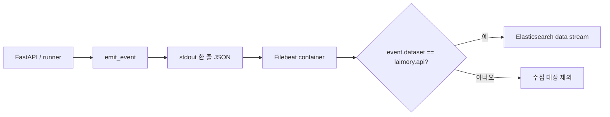
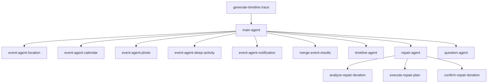

# 관측성: Filebeat·Elasticsearch·Langfuse

## 세 가지 관측 경계

Laimory는 모든 로그를 한 저장소에 무차별 전송하지 않는다.

| 경계 | 목적 | 저장 경로 | 사용자 본문 |
|---|---|---|---|
| 일반/local 진단 로그 | 예외 원문, 개발 debugging, stage 세부 | container stdout | redaction 후 local 운영 정책에 의존 |
| 운영 이벤트 | API/task/dependency의 집계 가능한 결과 | stdout JSON → Filebeat → Elasticsearch | 금지 |
| Langfuse trace | Agent tree, generation, token, latency, prompt 품질 분석 | Langfuse SDK | content policy에 따라 `NONE` 또는 `SANITIZED` |

같은 stdout에서 출발하더라도 Elasticsearch에 들어가는 것은 명시적인 운영 이벤트뿐이다. 일반 diagnostic log를 추가했다고 자동으로 Elasticsearch 수집 범위가 넓어지지 않는다.

## Logging format

`LOG_FORMAT`은 두 형태를 지원한다.

- `rich`: local 개발 console
- `json`: 운영 한 줄 JSON

JSON formatter는 traceback의 여러 줄을 하나의 구조화 record 안에 넣는다. Uvicorn logger도 앱 formatter를 사용하고 기본 access log는 request middleware의 구조화 이벤트가 대체한다.

Container stdout은 unbuffered라 Filebeat 수집 지연을 줄인다.

## Elasticsearch 수집 경로

`emit_event`만 `event.dataset=laimory.api` 표식을 붙일 수 있다. Filebeat 설정은 container log의 JSON을 decode하고 이 표식이 없는 record를 drop한다.

이 구조는 다음을 보장한다.

- debug log가 dashboard cardinality를 오염시키지 않음
- exception 원문과 prompt가 Elasticsearch에 자동 축적되지 않음
- 집계 field 의미를 allowlist로 관리
- 앱이 Elasticsearch SDK나 HTTP client에 직접 의존하지 않음

정적 테스트는 앱 코드에서 직접 Elasticsearch 호출과 허용되지 않은 `httpx` 사용을 검사한다.

## 운영 이벤트 종류와 cardinality

운영 이벤트는 “몇 번 남기는가” 자체가 계약이다.

### HTTP request

요청 하나당 response start 시점에 한 건을 남긴다. method, route, status, duration, error code 같은 allowlist field를 사용한다. Request body와 사용자 title/place는 싣지 않는다.

### Server lifecycle

server 시작과 종료를 각각 운영 이벤트로 남긴다. version과 environment를 통해 어느 배포본의 수명인지 식별한다.

### Timeline task

background task 하나당 완료 이벤트 한 건을 남긴다. 최종 status, duration, event/warning count, error code, 결과 저장·callback 상태처럼 운영 판단에 필요한 정수·boolean을 사용한다.

### User Memory task

`usermemory.task.completed` 한 건으로 닫는다. 가장 먼저 볼 값은 `resultSent`다. callback이 없으므로 `false`는 App Server가 성공과 실패 어느 쪽도 받지 못했다는 뜻이다.

함께 보는 field:

- `hasExistingMemory`
- `dailyTimelineCount`
- `eventCount`
- `memoCount`
- `droppedDailyTimelineCount`
- `droppedEventCount`
- `repairAttempts`
- `schemaVersion`
- `filledFieldCount`
- `customAttributeCount`
- `serializedChars`

본문은 포함하지 않는다.

### App Server dependency

논리 request 하나당 완료 이벤트 한 건을 남기고 개별 retry는 별도 retry event로 남긴다. timeout/5xx 재시도가 여러 번 있어도 logical request 성공률과 retry 횟수를 각각 분석할 수 있다.

## Field allowlist

운영 이벤트 action마다 허용 field가 정해져 있다. allowlist 밖 값은 이벤트에 싣지 않고 field 이름만 local DEBUG로 알린다.

운영 이벤트에 넣지 않는 값:

- Timeline title/description/question
- User Memory 자연어 필드
- 장소명과 전체 주소
- notification 원문
- photo filename과 presigned URL
- prompt와 LLM response
- `taskToken`
- API key, AWS credential, Langfuse secret
- exception 원문과 traceback

## ErrorCode 연결

`ErrorCode`는 외부 실패를 식별하는 정수 catalog다. 같은 실패는 다음 경계에서 같은 code를 사용한다.

- HTTP error response
- Timeline callback
- User Memory FAILED result
- operational event
- local `report_error`
- 가능한 Langfuse observation metadata

외부 `error` 문자열은 catalog의 안전 메시지만 사용한다. 원본 exception은 local diagnostic에만 남고, credential이나 사용자 본문이 섞일 가능성이 있는 Pydantic error는 값 없이 field/type/count로 요약한다.

예약된 과거 code를 새 오류에 재사용하지 않는다. dashboard, App Server와 사용자 지원이 정수 code 의미에 의존하기 때문이다.

## Langfuse trace 구조

Langfuse는 FastAPI 운영 집계가 아니라 AI 실행 내부를 본다.

### Task trace

| Task | trace name | tag | metadata feature |
|---|---|---|---|
| Timeline | `generate-timeline` | `timeline` | `timeline` |
| User Memory | `update-user-memory` | `user-memory` | `user-memory` |

두 작업은 같은 trace에 넣지 않는다. 서로 다른 입력, timeout, 결과 의미를 가지므로 latency와 token을 분리해 분석해야 한다.

`session_id`는 `taskId`다. App Server가 taskId를 재사용하면 서로 다른 trace가 같은 session으로 묶일 수 있으므로 taskId uniqueness가 중요하다.

### Timeline Agent tree

LLM generation name은 execution stage에 따라 달라진다.

- `infer-{agent}-events`
- `generate-timeline-draft`
- `analyze-timeline-repair`
- `generate-event-questions`
- `update-user-memory-profile`
- `describe-photo-images`

모든 generation이 `call-llm` 같은 이름으로 보이면 어느 기능의 latency와 token이 늘었는지 알 수 없다. 새 `ExecutionStage`를 추가하면 generation name mapping과 테스트도 함께 갱신해야 한다.

### 기록되는 진단

- provider와 model
- Agent/version 또는 release
- prompt version
- duration
- input/output token 및 SDK가 제공하는 세부 token bucket
- event/candidate/fragment/warning/question count
- structured output 또는 tool plan
- error code와 observation level

SDK가 제공하지 않은 token 종류는 0으로 추측하지 않고 비워 둔다.

## Content capture policy

Langfuse는 설정이 활성이고 public/secret key가 모두 있을 때만 client를 만든다. sampling은 `LANGFUSE_SAMPLE_RATE`로 정한다.

본문 정책은 다음 두 값이다.

### `NONE`

사용자 본문을 외부로 보내지 않는다. duration, token, count, error code 같은 diagnostics는 유지하고 payload는 byte 길이와 hash summary로 접는다. production 기본 방향이다.

### `SANITIZED`

마스킹과 payload 상한을 적용한 본문을 보낸다. local/dev에서 prompt와 중간 산출물을 debugging할 때 사용한다.

명시적 `LANGFUSE_CONTENT_CAPTURE`가 있으면 environment 기본값보다 우선한다. 값을 지정하지 않으면 local/dev는 `SANITIZED`, 그 밖은 `NONE`이다. dev에서 본문이 보이지 않으면 오래된 `NONE` 환경변수가 남아 있는지 확인해야 한다.

## Redaction

공용 redaction은 로그와 Langfuse export 경계에서 적용한다.

- credential/token pattern 마스킹
- URL과 사용자 식별 정보 제한
- 최대 payload byte 초과 시 preview + byte/hash summary
- export 직전 OpenTelemetry attribute 재검사
- `userMemory` key는 자연어 본문 대신 schema/필드 수/크기 summary
- `dailyTimelines` key는 날짜별 본문 대신 timeline/event/memo count summary

User Memory 문장은 일반 secret regex에 걸리지 않을 수 있으므로 값의 모양이 아니라 key 이름 자체로 접는다. 호출부가 snapshot 전체를 실수로 trace metadata에 넣더라도 profile과 memo가 새지 않게 한다.

Prompt generation input에는 모델 호출을 위해 실제 값이 필요하다. 이 경계는 content capture policy가 통제한다.

## 관측 실패 격리

관측은 제품 결과보다 우선하지 않는다.

- Langfuse client 생성 실패: no-op
- span/observation 시작·종료 실패: main task 계속
- Langfuse flush 실패: 결과 유지
- operational event 조립/handler 실패: task 결과 유지
- Filebeat 실패: 앱 배포와 서비스는 계속

장점은 관측 시스템 장애가 Timeline 생성을 막지 않는다는 것이다. 단점은 서비스는 성공하지만 trace나 operational event가 없는 상태가 가능하다는 것이다. 따라서 관측 경로 자체의 health를 별도로 감시해야 한다.

## EC2와 AgentCore의 차이

현재 EC2는 별도 Filebeat container가 Docker stdout을 읽는다. AgentCore로 기본 배포를 전환하면 동일 sidecar 방식이 자동으로 존재한다고 가정할 수 없다.

전환 전에 결정할 것:

- AgentCore stdout이 도착하는 CloudWatch log group
- `event.dataset=laimory.api`만 Elasticsearch로 전달하는 pipeline
- Filebeat 대신 CloudWatch subscription, Lambda, Firehose 또는 다른 collector를 쓸지
- at-least-once 전달에 따른 중복 event 처리
- Runtime version과 endpoint version을 operational field에 추가할지

Langfuse는 앱 SDK가 직접 outbound 호출하므로 AgentCore network와 secret만 허용되면 구조를 유지할 수 있다.

## 주요 코드와 설정

- `app/core/logging.py`
- `app/core/operational_logging.py`
- `app/core/langfuse_tracing.py`
- `app/core/redaction.py`
- `app/core/error_codes.py`
- `app/core/exceptions.py`
- `docs/observability/filebeat.example.yml`
- `scripts/deploy-ec2.sh`
- `docs/operational-logging.md`
- `docs/langfuse-tracing.md`

