# Laimory AI·LLM 지식 위키 통합본

이 파일은 주제별 Markdown 문서를 한 번에 ingest하거나 다운로드하기 위한 통합본입니다. 각 장의 개별 YAML frontmatter는 제거했고 원본 파일명만 표시했습니다.

---

<!-- 원본: 00-README.md -->

# Laimory AI·LLM 지식 위키

## 이 문서 묶음의 목적

이 문서들은 Laimory AI 서버에서 지금까지 설계하고 구현한 AI 관련 작업을 한곳에서 이해하기 위한 지식 위키다. 단순한 디렉터리 설명이 아니라, 왜 이런 구조를 택했는지, LLM과 코드가 각각 무엇을 책임지는지, 장애가 어디에서 흡수되고 어디에서 작업 실패가 되는지, 배포와 관측이 어떻게 연결되는지를 설명한다.

문서는 저장소의 실행 코드, Pydantic 스키마, 테스트, Dockerfile, GitHub Actions workflow를 우선적인 근거로 작성했다. 코드보다 오래된 설명과 실행 코드가 충돌하는 경우에는 실행 코드를 따랐다.

## 기준과 상태 표기

- 코드 기준일: 2026-08-09
- 기준 commit: `c36799389ce449ad3b8500865476e1b7fb859a47`
- 기준 branch: `feat/#63`
- `현재`: 해당 기준 commit에서 실행 코드나 workflow로 확인되는 상태
- `계획`: 아직 현재 기본 경로는 아니지만 프로젝트가 앞으로 추진하려는 방향
- `평가 대상`: 비교 실험을 수행할 후보이며, 우승 모델이나 운영 모델로 확정됐다는 뜻은 아님

특히 배포와 모델에 관해서는 다음 세 가지를 혼동하지 않는다.

1. 현재 `dev` 자동 배포 대상은 EC2 단일 컨테이너다.
2. AgentCore 배포 workflow는 이미 존재하지만 현재는 수동 실행 경로다.
3. 향후에는 AgentCore를 기본 배포 경로로 사용하는 방향을 계획하고 있다.

모델도 마찬가지다. Docker image의 기본 provider, 실제 runtime 환경변수로 선택된 provider, 프롬프트와 품질 개선 작업의 기준 모델은 서로 다른 개념이다. 현재까지 프롬프트와 품질 작업은 GPT 기준으로 진행됐고, 향후 Amazon Nova 2 Lite, Gemini 2.5 Flash, GPT 5.4 mini를 동일 조건에서 비교할 예정이다.

## 문서 지도

| 문서 | 핵심 질문 |
|---|---|
| [01. AI 시스템 아키텍처](01-ai-system-architecture.md) | API 접수부터 결과 저장까지 전체 시스템은 어떻게 연결되는가? |
| [02. Timeline 그래프와 Agent](02-timeline-graph-and-agents.md) | Event, Timeline, Repair, Question Agent는 어떤 순서와 책임으로 동작하는가? |
| [03. 프롬프트 엔지니어링](03-prompt-engineering.md) | 프롬프트는 어떻게 버전 관리되고, context와 structured output은 어떻게 통제되는가? |
| [04. 결정론적 Repair와 도구](04-deterministic-repair-and-tools.md) | LLM 결과를 코드가 어떤 순서로 확정하고, Repair Agent는 어떤 도구로 개선하는가? |
| [05. User Memory](05-user-memory.md) | 사용자 프로필은 어떻게 소비되고, 어떻게 전체 rewrite로 갱신되는가? |
| [06. LLM provider와 모델 평가](06-llm-providers-and-model-evaluation.md) | 세 provider를 어떻게 추상화했고 세 후보 모델을 무엇으로 비교할 것인가? |
| [07. 배포와 runtime](07-deployment-and-runtime.md) | 현재 EC2 배포와 AgentCore 경로는 어떻게 다르며 전환 시 무엇을 지켜야 하는가? |
| [08. 관측성과 로그](08-observability.md) | Elasticsearch 운영 이벤트와 Langfuse trace는 각각 무엇을 관측하는가? |
| [09. 불변식·용어·한계](09-invariants-glossary-and-known-gaps.md) | 바꾸면 안 되는 핵심 계약과 현재 한계는 무엇인가? |

## 가장 중요한 설계 원칙

### LLM은 의미를 판단하고 코드는 셀 수 있는 것을 확정한다

Laimory의 핵심 설계는 모든 일을 LLM에 맡기지 않는 것이다. 어떤 source들이 같은 실제 사건인지, 어떤 문장이 사용자가 읽기 좋은 일기인지, 어떤 질문이 회고를 유도하는지는 의미 판단이라 LLM이 맡는다. 반면 source가 실제 입력에 존재하는지, 시간이 window 안인지, event가 시간순인지, ID가 유일한지, 문자열이 상한을 넘는지는 코드가 확정한다.

이 경계는 Repair에서도 유지된다. Repair Agent가 도구를 선택할 수 있지만 정렬, window 적용, 최종 ID 부여처럼 반드시 실행돼야 하는 규칙은 도구 선택에 맡기지 않고 매 반복의 확정 pass에서 항상 실행한다.

### 보조 context는 사건 근거가 아니다

User Memory는 사용자를 이해하고 표현을 조정하는 보조 context다. 오늘 사건이 실제로 일어났다는 근거는 source item과 `rawId`다. User Memory만으로 일정 참석, 장소, 이동 목적, 인물 관계를 확정할 수 없으며, 원본과 충돌하면 원본이 우선한다.

### AI 서버는 제품 상태를 소유하지 않는다

task 상태, source, Timeline 결과, User Memory의 영속 저장은 App Server가 소유한다. AI 서버는 비동기 작업을 실행하고 결과를 App Server API로 전달하지만 자체 DB나 task 조회 API를 두지 않는다. 프로세스에 남는 inflight counter나 provider cache는 운영 보조 상태일 뿐 제품의 정본이 아니다.

### 실패를 전부 같은 무게로 다루지 않는다

- Event Agent 실패: 빈 결과와 warning으로 흡수
- Timeline Agent 실패: 빈 draft와 HIGH warning으로 흡수
- Repair의 LLM 개선 실패: 마지막으로 확정된 draft 유지
- Question Agent 실패: 질문 없는 Timeline으로 저장 계속
- User Memory 갱신 실패: 기존 User Memory를 유지하고 FAILED 결과를 App Server에 통보
- 결과 저장 실패: App Server가 결과를 받지 못했으므로 task 실패

이 구분은 AI 부가 기능 하나의 실패가 사용자의 하루 기록 전체를 버리지 않게 하면서도, 실제 결과 전달 실패를 성공으로 오인하지 않게 한다.

## 위키 ingest 권장 방식

- Markdown 파일 하나를 page 하나로 ingest한다.
- YAML frontmatter의 `title`, `summary`, `tags`, `status`를 문서 metadata로 사용한다.
- 코드 블록과 Mermaid는 가능한 한 원문을 보존한다.
- chunk를 나눌 때는 H2 절을 기본 경계로 사용한다.
- `source_commit`과 `last_verified_at`을 함께 색인해 오래된 설명을 식별한다.
- 운영 계획과 현재 구현을 하나의 사실로 합치지 않는다. `현재`, `계획`, `평가 대상` 표기를 유지한다.

## 문서 갱신 기준

다음 변경이 생기면 관련 페이지를 다시 검증해야 한다.

- LangGraph 노드나 순서 변경
- Event Agent 추가·삭제 또는 source 담당 변경
- prompt version 추가 또는 활성 프롬프트의 의미 변화
- `repair_draft` 순서나 Repair 도구 카탈로그 변경
- User Memory 스키마, 근거 규칙, 크기 제한, 결과 통보 방식 변경
- provider 추가, 모델 설정 방식 또는 structured output 계약 변경
- EC2/AgentCore 기본 배포 대상, port, worker, health, rollback 방식 변경
- 운영 event action, allowlist, Filebeat 경로, Langfuse content policy 변경

---

<!-- 원본: 01-ai-system-architecture.md -->

# Laimory AI 시스템 아키텍처

## 시스템의 역할

Laimory AI 서버는 센서·일정·사진·알림·건강 데이터를 영속 저장하는 서버가 아니다. App Server가 제공하는 하루치 source를 해석해 사용자가 읽고 보완할 수 있는 Timeline을 만들고, 확정된 여러 날의 Timeline을 바탕으로 User Memory를 갱신하는 무상태 실행 서버다.

제품 데이터의 소유권은 App Server에 있다.

- source 원본 저장과 조회
- Timeline 결과 저장
- User Memory 저장
- task 상태와 수명 관리
- Timeline 결과와 일별 기록의 연결

AI 서버가 소유하는 것은 실행 중 임시 상태다.

- 요청 하나의 정규화된 입력
- Agent 중간 결과와 Timeline draft
- provider/client와 prompt cache
- 프로세스 로컬 inflight counter
- 로그와 trace를 조립하기 위한 실행 context

## 컴포넌트 책임

| 계층 | 책임 | 하지 않는 일 |
|---|---|---|
| `app/api` | HTTP 요청 검증, 202 접수, background task 등록, AgentCore adapter | 비즈니스 pipeline 중복 구현, DB 접근 |
| `app/services/*_runner.py` | task 전체 순서, timeout, 최종 상태, 결과 전달 | 의미 판단, provider별 SDK 처리 |
| `app/services/app_server_client.py` | App Server header, TaskToken, retry, status 해석 | Timeline 생성, task 상태 결정 |
| `app/services/normalizer.py` | 평평한 source item을 domain별 입력으로 변환 | 사건 의미 추론 |
| `app/agents` | source 해석, 의미 병합, Repair 계획, 회고 질문, User Memory rewrite | 제품 persistence |
| `app/services/*_guard.py` | source·시간·장소·길이 등 결정론 검사와 보정 | 자연어 의미를 임의로 재작성 |
| `app/schemas` | 내부·외부 데이터 계약과 교차 검증 | I/O, orchestration |
| `app/core` | 설정, LLM provider, 오류 코드, logging, Langfuse, inflight | 특정 도메인의 Timeline 규칙 |

## Timeline task 전체 흐름

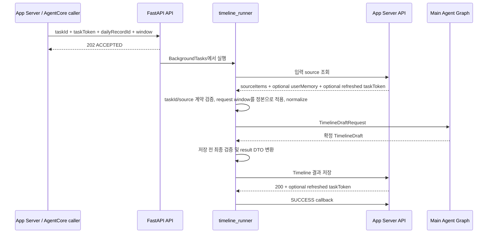

Timeline trigger에는 source 본문을 싣지 않는다. 접수 body는 작업 상관값과 정본 window를 전달하고, 실제 source는 background runner가 App Server API로 조회한다. 입력 조회 응답에도 window가 있을 수 있지만 접수 request의 window가 최종 정본이다.

### 결과 저장과 callback은 다르다

Timeline 결과는 result API로 저장하고 callback은 terminal 상태만 통보한다. 성공 순서는 반드시 다음과 같다.

1. 결과 저장 요청을 보낸다.
2. 저장 성공 응답을 확인한다.
3. 그 뒤에만 SUCCESS callback을 보낸다.

결과 저장 성공 뒤 callback이 실패해도 이미 저장된 결과를 FAILED로 바꾸지 않는다. 반대로 결과 저장이 실패하면 사용자에게 전달된 결과가 없으므로 SUCCESS callback을 보내면 안 된다.

### TaskToken 수명

Timeline task는 최초 접수 body의 `taskToken`으로 시작한다. App Server 응답 body에 새 token이 있으면 holder를 갱신하고 이후 호출은 최신 값을 `Task-Token` header로 보낸다. 값 자체는 로그나 Langfuse에 남기지 않고 갱신 횟수만 관측한다.

timeout과 5xx는 같은 token과 같은 body로 재시도한다. 401, 404, 409는 재시도해도 해결되지 않거나 callback도 거절될 상태이므로 retry와 callback 없이 중단한다.

## User Memory 갱신 task 전체 흐름

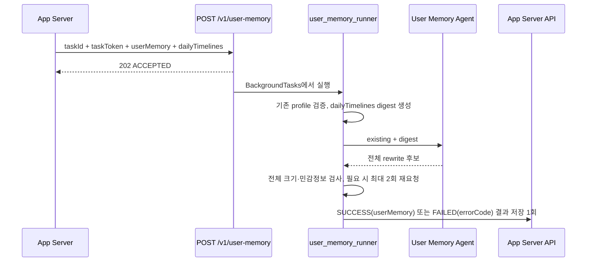

User Memory task는 Timeline task의 후속 graph node가 아니다. 여러 날의 확정 기록을 입력으로 받고 Timeline이 아닌 사용자 profile 전체를 출력하기 때문에 별도 endpoint, runner, timeout, trace를 가진다.

이 task에는 callback이 없다. 결과 저장 요청 하나가 결과 전달과 종료 통보를 함께 맡는다. 따라서 성공이든 실패든 모든 경로가 결과 저장 호출 정확히 한 번으로 수렴해야 한다. 이 호출이 빠지면 App Server는 작업이 끝났는지 알지 못하고 TTL까지 기다리게 된다.

User Memory FAILED는 하루 기록 저장 실패가 아니다. 사용자가 저장한 DailyRecord의 상태 전이는 이미 App Server에서 끝났고, FAILED는 오직 “이번 User Memory 갱신이 반영되지 않았다”는 뜻이다.

## 비동기와 thread 경계

provider SDK 호출은 동기 방식이다. 이를 FastAPI event loop에서 직접 호출하면 다른 요청과 `/ping`을 막을 수 있으므로 `asyncio.to_thread`에서 실행한다.

- 다섯 Event Agent: 각각 worker thread에서 실행하고 `asyncio.gather`로 병렬 대기
- Timeline Agent: worker thread
- Repair Agent: 반복적인 LLM 호출과 도구 실행 전체를 worker thread
- Question Agent: worker thread
- User Memory build: worker thread + `asyncio.wait_for`
- Langfuse flush: worker thread

Python `contextvars`는 `asyncio.to_thread`로 복사되므로 taskId, execution stage, Agent 이름 같은 상관 context가 thread 경계에서도 유지된다.

## timeout과 inflight

Timeline 전체 pipeline과 User Memory 갱신은 각각 설정된 timeout으로 감싼다. timeout은 단순한 HTTP 응답 시간 문제가 아니다. background 작업이 장시간 끝나지 않으면 inflight counter가 유지되고 `/ping`이 `HealthyBusy`를 반환해 배포가 기존 컨테이너를 교체하지 못한다.

`inflight`는 프로세스 로컬 카운터다. 이 때문에 현재 Uvicorn worker를 하나만 사용한다. worker를 여러 개로 늘리면 한 프로세스의 `/ping`이 다른 프로세스에서 진행 중인 작업을 모르므로 “idle”을 잘못 보고할 수 있다.

## 무상태 설계의 장점과 한계

장점은 AI 서버 재배포와 scale-out이 제품 DB migration에 의존하지 않고, 데이터 소유권이 App Server 한곳에 유지된다는 것이다. 또한 AI가 중간 상태를 영속 저장하지 않으므로 source/result 계약이 명확하다.

한계도 분명하다.

- FastAPI `BackgroundTasks`는 durable queue가 아니다.
- 프로세스가 종료되면 실행 중 task를 다른 worker가 이어받지 않는다.
- AI 서버에는 task 조회 endpoint나 재처리 queue가 없다.
- inflight가 프로세스 로컬이라 multi-worker/multi-replica 전체 busy 상태를 합산하지 못한다.
- App Server의 result/callback idempotency와 DB transaction은 이 저장소에서 검증할 수 없다.

## 주요 코드 위치

- `app/api/v1/timeline.py`: Timeline 202 접수
- `app/api/v1/user_memory.py`: User Memory 202 접수
- `app/api/agentcore.py`: `/invocations`, `/ping` adapter
- `app/services/timeline_runner.py`: Timeline task 전체 순서와 최종 상태
- `app/services/user_memory_runner.py`: User Memory task와 결과 저장 1회 수렴
- `app/services/app_server_client.py`: 서버간 API, retry, TaskToken
- `app/agents/main/main_agent.py`: Timeline LangGraph
- `app/core/inflight.py`: process-local busy 상태

---

<!-- 원본: 02-timeline-graph-and-agents.md -->

# Timeline LangGraph와 Agent 엔지니어링

## 전체 그래프

Timeline 생성의 main graph는 고정된 직선 구조와 내부 병렬 fan-out/fan-in을 결합한다.

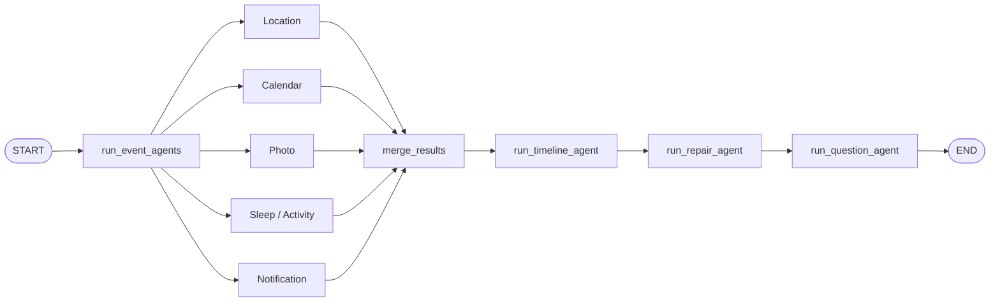

실제 LangGraph node는 다음 다섯 개다.

1. `run_event_agents`
2. `merge_results`
3. `run_timeline_agent`
4. `run_repair_agent`
5. `run_question_agent`

Event Agent들은 node 내부에서 병렬 실행된다. 그래프에 다섯 node로 직접 펼치지 않은 이유는 Agent 목록과 결과를 이름 key로 관리하고, Repair가 특정 Event Agent만 재실행할 수 있게 하기 위해서다.

## 그래프 state

`_MainAgentState`는 요청 하나의 실행 중 상태를 가진다.

| 필드 | 의미 |
|---|---|
| `request` | 정규화가 끝난 `TimelineDraftRequest` |
| `event_agents` | 유일한 이름 → Event Agent 인스턴스 |
| `event_results` | 같은 이름 → 마지막 `AgentEventResult` |
| `merged_result` | 다섯 결과의 candidates, fragments, warnings를 취합한 값 |
| `timeline_agent` | Timeline Agent 인스턴스 |
| `repair_agent` | Repair Agent 인스턴스 |
| `question_agent` | Question Agent 인스턴스 |
| `draft` | Timeline → Repair → Question을 지나며 갱신되는 `TimelineDraft` |

Event Agent 이름은 단순 표시용이 아니다. Repair 도구 `rerun_event_agent`가 어느 Agent를 다시 돌리고 어느 기존 결과를 교체할지 정하는 key다. 같은 이름이 중복되면 `-2`, `-3` suffix를 붙인다. `event_agents`와 `event_results`의 key가 어긋나면 재실행 결과가 이전 결과를 교체하지 못해 같은 후보가 중복 병합될 수 있다.

## 중간 산출물

### Candidate

Candidate는 하나의 Timeline event가 될 만큼 근거가 있는 중간 결과다. `sourceRefs`로 원본 `rawId`를 가리키고, 시간·장소·event type·confidence·inference level 같은 해석 정보를 갖는다. Candidate도 최종 정답은 아니며 Timeline Agent가 다른 source와 병합하거나 제외할 수 있다.

### Fragment

Fragment는 단독 event로 확정하기에는 약하지만 다른 source와 결합할 가치가 있는 단서다. 예를 들어 이동 구간 사이의 공백, 의미가 약한 notification, 사건 맥락을 보강하는 photo가 될 수 있다. 단순 원본 요약과 동의어가 아니며 Timeline Agent는 Candidate보다 낮은 우선순위로 사용한다.

### TimelineDraft

TimelineDraft는 App Server에 바로 보내는 결과보다 넓은 내부 모델이다.

- 편집 가능한 `events`
- 시간·장소 모호성을 나타내는 내부 `questions`
- 복구 가능한 문제를 나타내는 `warnings`
- confidence, inference level, uncertainty, sourceRefs
- Repair 동안 사용하는 `clientEventId`

Repair 후 result mapper가 App Server 저장 DTO로 필요한 필드만 투영한다.

## Event Agent 공통 실행 계약

`EventAgent.generate()`는 담당 source가 없으면 LLM을 호출하지 않고 빈 결과를 반환한다. LLM 또는 파싱 실패는 전체 pipeline으로 예외를 올리지 않고 Agent warning과 빈 결과로 흡수한다.

정상 LLM 결과도 그대로 신뢰하지 않는다.

- 현재 요청에 없는 `rawId` reference 제거
- 유효한 reference가 사라진 Candidate/Fragment 제거
- request window 밖의 항목 제거, 경계에 걸친 구간 clamp
- 담당 source가 Candidate 또는 Fragment로 보존됐는지 coverage 검사
- source별 민감정보·시간·사진·위치 규칙 검사

Event Agent의 문장은 최종 일기가 아니라 source 사실 보고다. 분 단위 시각이나 걸음 수처럼 원본에 있는 정확한 수치를 이 단계에서 숨기지 않는다. 사용자 노출 일기 문체로 바꾸는 책임은 Timeline과 Repair에 있다.

## 다섯 Event Agent

### Location Event Agent

담당 입력은 `stays`와 `movements`다. 장소 체류, 이동, 이어진 여정, 왕복, source 공백을 해석한다. 코드가 평균 속도, 구간 공백, 첫·마지막 관측 같은 `derivedMetrics`를 미리 계산해 raw item과 함께 준다. LLM이 매번 시간 차와 속도를 암산하게 하지 않고 재현 가능한 수치 계산은 코드가 맡는다.

v1은 자유 텍스트 infer 후 review가 structured output으로 정리하는 2단계 graph다. v2는 더 적극적인 상위 여정 복원을 목표로 review를 제거하고 단일 structured call을 사용한다. 최종 결과는 location guard가 source와 시간 경계를 다시 검사한다.

### Calendar Event Agent

담당 입력은 calendar items다. 일정의 제목, 시간, 장소, 참석 의미를 candidate/fragment로 해석한다. Calendar item은 누락되면 사용자가 명시적으로 만든 일정이 사라지는 문제이므로 Repair의 `ensure_calendar_events`가 최종 Timeline에서 빠진 일정도 결정론적으로 복원한다.

일정이 존재한다는 사실과 실제 참석했다는 사실은 구분한다. 다른 source가 참석을 지지하지 않으면 confidence와 inference level로 불확실성을 표현한다.

### Photo Event Agent

담당 입력은 photos다. 사진 다운로드와 vision 설명, metadata fallback, 시간대별 grouping, 후보 생성을 분리한다.

1. `photoUrl`에서 이미지를 제한된 timeout·용량·장수·총 byte 예산 안에서 다운로드한다.
2. 실제 이미지가 있으면 vision prompt로 보이는 내용을 구조화한다.
3. 다운로드나 vision이 불가능하면 metadata 기반 LLM describer를 사용한다.
4. Photo Event Agent가 여러 사진을 시간과 의미로 그룹화해 Candidate/Fragment를 만든다.

최종 draft에서는 사진 하나가 event 여러 개에 중복 귀속되지 않는지 검사한다. 어느 event가 사진의 의미상 주인인지는 시간만으로 정할 수 없으므로 검사는 코드가 하고 실제 재배치는 Repair Agent가 판단한다.

### Sleep/Activity Event Agent

담당 입력은 health items이며 metric을 기준으로 sleep과 steps/activity를 구분한다. 수면 구간과 기상, 하루 활동량을 사실 중심으로 해석한다.

Location과 마찬가지로 v1은 infer→review, v2는 단일 structured call이다. 이후 `sleep_guard`는 알려진 기상 경계 이전의 일반 event를 제거하거나 수면에 걸친 event를 clamp한다. 수면 경계를 알 수 없으면 시간을 새로 만들어내지 않는다.

### Notification Event Agent

담당 입력은 notifications다. 앱 사전과 코드 분류를 사용해 메신저, 결제·송금, 예약·교통·업무 등 category를 해석한다. Notification 원문에는 token, 카드·계좌·전화번호, 주소, 민감한 대화가 들어올 수 있어 Agent 결과와 최종 draft 양쪽에서 민감정보를 검사한다.

알림은 실제 사건과 동일하지 않을 수 있다. 예약 알림은 미래 일정의 존재를 알려줄 수 있지만 오늘 참석했다는 증거는 아니다. 메시지 내용도 사용자의 실제 행동으로 확정하지 않는다.

## merge_results

다섯 Agent 결과는 `merge_event_results`에서 단순하고 투명하게 이어 붙인다.

- Candidate 목록 concat
- Fragment 목록 concat
- Warning 목록 concat

이 node 자체는 의미 병합을 하지 않는다. 의미 병합은 Timeline Agent가 맡는다. 명시적인 fan-in node를 두어 Langfuse graph에서도 다섯 병렬 Agent가 Timeline으로 합류하는 구조가 보이도록 한다.

## Timeline Agent

Timeline Agent는 여러 source가 같은 실제 사건을 가리키는지 판단하고 사용자가 읽을 draft를 만든다.

주요 책임은 다음과 같다.

- 시간, 장소, 활동 의미가 같은 Candidate/Fragment 병합
- 하루 중심 흐름 구성
- raw source type보다 사람 중심 event type 선택
- 사용자 노출 title/description 작성
- 충돌·모호성은 warning, 내부 question, uncertainty로 표현
- User Memory를 해석과 표현의 보조 context로 사용

Timeline Agent의 출력은 아직 확정본이 아니다. LLM이 준 `userId`, date, timezone, `clientEventId`를 신뢰하지 않는다. date/timezone은 request 기준으로 정하고 ID는 유효 event를 읽은 순서대로 임시 부여한다.

JSON 전체를 읽을 수 없거나 호출이 실패하면 빈 draft와 HIGH warning으로 fallback한다. 개별 event/question/warning이 Pydantic 검증을 어기면 그 항목만 제외하고 나머지는 살린다.

## Repair Agent

Repair Agent는 “LLM이 문장을 한번 더 써주는 단계”가 아니다. 코드 확정 pass와 제한된 LLM 도구 개선을 결합한다.

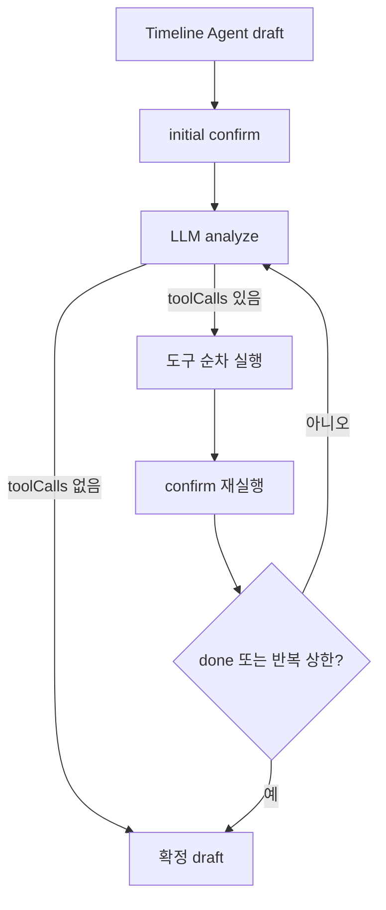

LLM 호출 여부와 관계없이 최초 confirm을 한 번 실행한다. 반복 중 LLM/parse가 실패하면 마지막으로 confirm에 성공한 deep copy를 복원한다. 개별 도구 실패는 전체 Repair 실패로 올리지 않고 `ok=false` 결과로 다음 분석 prompt에 제공한다.

## Question Agent

Question Agent는 Repair가 event 병합·삭제와 ID 재부여를 끝낸 뒤 실행한다. 질문은 사용자가 센서로 알 수 없는 경험, 감정, 이유, 인상을 덧붙이게 하는 회고 유도 질문이다.

현재 실행 코드의 계약은 **모든 event에 질문 하나를 시도**하는 것이다. Sleep, Wake Up, Movement도 예외가 아니다. 1차 응답에서 빠진 event만 모아 한 번 재요청한다. 두 번째에도 질문이 없거나 규칙을 어기면 `None`으로 남기고 LOW warning을 추가하되 Timeline 저장은 계속한다.

LLM에는 다음 최소 정보만 준다.

- `clientEventId`
- `eventType`
- `title`
- 시 단위로 뭉갠 `timeOfDay`
- 선택적 `description`, `place`
- Timeline과 같은 projection의 User Memory

confidence, inference level, uncertainty, sourceRefs, 분 단위 시각은 주지 않는다. “질문에 쓰지 말라”는 지시보다 입력에서 제거하는 것이 더 강한 방어다.

코드는 알 수 없는 ID, 중복 질문, 물음표로 끝나지 않는 문장, 255자 초과 문장을 제외한다. 질문은 잘라서 살리지 않는다. 잘린 문장은 질문의 의미가 불완전해지기 때문이다.

## 실패 격리 표

| 단계 | 실패 시 fallback | Timeline task 지속 여부 |
|---|---|---|
| Event Agent | 빈 Candidate/Fragment + warning | 지속 |
| merge | 코드 오류이면 상위 task 실패 | 중단 가능 |
| Timeline Agent | 빈 draft + HIGH warning | 지속 |
| initial confirm | 결정론 코드 오류 | 중단 |
| Repair analyze/parse | 마지막 confirm 성공본 + warning | 지속 |
| Repair tool 하나 | `ok=false` tool result | 지속 |
| Question 1차 | 질문 없는 확정 draft + warning | 지속 |
| Question 재요청 | 1차 질문 유지, 나머지는 warning | 지속 |
| 최종 result validation | 저장 불가능한 결과 | task 실패 |

## 관측 graph

Langfuse에는 main Agent 아래 Event Agent들, merge chain, Timeline Agent, Repair Agent, Question Agent가 계층으로 남는다. Repair 내부 analyze/execute/confirm은 반복 cycle을 추론할 수 있도록 sibling chain 형태로 기록한다. 상류 Agent 재실행은 Main graph의 고정 역할을 흐리지 않도록 Repair 내부 span으로 남긴다.

주요 코드:

- `app/agents/main/main_agent.py`
- `app/agents/events/**`
- `app/agents/timeline/timeline_agent.py`
- `app/agents/repair/repair_agent.py`
- `app/agents/question/question_agent.py`

---

<!-- 원본: 03-prompt-engineering.md -->

# 프롬프트 엔지니어링과 Structured Output

## 프롬프트를 하나로 보지 않는 이유

Laimory는 하나의 거대한 prompt로 모든 source를 해석하지 않는다. 역할별 prompt를 나눠 서로 다른 책임과 신뢰 경계를 명확히 한다.

| Prompt | 의미 판단 |
|---|---|
| Location | 체류·이동·여정·공백 해석 |
| Calendar | 일정 의미와 참석 불확실성 |
| Photo describer | 실제 이미지 또는 metadata의 사실 설명 |
| Photo Event | 사진 grouping과 사건 후보화 |
| Sleep/Activity | 수면·기상·활동 사실 해석 |
| Notification | 알림 category와 안전한 사건 단서 추출 |
| Timeline | 여러 source를 실제 사건 단위로 병합하고 일기 문장 작성 |
| Repair | 확정 draft와 근거 원본을 대조해 도구 계획 생성 |
| Question | 확정 event마다 회고 유도 질문 작성 |
| User Memory | 기존 profile과 확정 기록을 최신 profile 전체로 rewrite |

이 분리는 prompt가 길어지는 것을 막는 것보다 더 중요한 의미가 있다. Event Agent는 source 사실을 정확히 보고해야 하고 Timeline은 사용자가 읽을 문장을 써야 한다. 두 계층의 문체 규칙을 섞으면 Event Agent가 정확한 수치를 숨기거나, Timeline이 센서 보고서처럼 딱딱한 문장을 쓰게 된다.

## 전역 `PROMPT_VERSION`

모든 Agent는 설정의 `PROMPT_VERSION`을 공유한다. 현재 허용 값은 `v1`, `v2`다. prompt loader는 Agent module 옆의 `prompts/{version}/{정확한 파일명}`만 UTF-8로 읽는다.

중요한 규칙은 다음과 같다.

- 일부 Agent만 다른 version을 쓰지 않는다.
- 파일이 없다고 v1이나 다른 version으로 fallback하지 않는다.
- version과 filename에 nested path를 허용하지 않는다.
- version 세트는 기동 시 실제 사용하는 모든 prompt 파일을 갖춰야 한다.
- 큰 의미 변경 전에는 같은 디렉터리에 suffix가 붙은 동결본을 둘 수 있다.
- loader는 정확한 활성 filename만 읽으므로 동결본은 실행에 영향을 주지 않는다.

### v1과 v2의 실행 구조 차이

Prompt version은 문장 파일만 바꾸지 않고 일부 Agent의 graph도 바꾼다.

| Agent | v1 | v2 |
|---|---|---|
| Location | 자유 텍스트 infer → structured review, LLM 2회 | 단일 structured infer, LLM 1회 |
| Sleep/Activity | 자유 텍스트 infer → structured review, LLM 2회 | 단일 structured infer, LLM 1회 |
| 나머지 Agent | version별 system prompt | 기본 실행 형태는 동일 |

v2에서 review를 제거한 이유는 Location의 상위 여정 복원과 공백 추론처럼 더 적극적인 의미 판단을 하려는 방향과 “과한 추론 억제” review의 목적이 충돌했기 때문이다. 대신 structured output과 source/window guard, Repair가 후단 방어를 맡는다.

`PROMPT_VERSION=v1`로 롤백하면 prompt 내용뿐 아니라 2단계 호출 구조까지 돌아가야 한다. 테스트가 LLM 호출 횟수와 review prompt 사용을 고정한다.

## System prompt와 user prompt 분리

System prompt에는 역할, 입력 의미, 품질 기준, 금지 규칙, 출력 계약을 둔다. User prompt에는 task마다 달라지는 실제 입력과 metadata를 둔다.

예를 들어 Timeline user prompt는 다음 블록으로 조립된다.

```text
[draft metadata]
date, timezone, windowStart, windowEnd

[user memory]
빈 필드와 metadata를 제거한 profile projection

[AI Event candidates]
source별 Event Agent의 candidate 목록

[Source fragments]
보조 단서 목록

병합·충돌·정렬에 관한 요청 문장
```

Repair user prompt는 확정 draft, 축약된 source index, 사용 가능한 tool catalog, 지금까지의 tool log, 남은 반복 횟수를 담는다. 자세한 원본은 모두 prompt에 넣지 않고 필요할 때 `lookup_source(rawId)`로 조회하게 한다.

Question user prompt는 확정 event의 최소 projection만 담는다. User Memory는 무엇을 물을지 결정하는 사건 근거가 아니라 질문의 결을 조정하는 자료다.

User Memory update prompt는 existing profile, daily timeline digest, 직전 출력의 위반 목록을 담는다. 위반 목록은 값 자체를 인용하지 않고 어느 필드가 어떤 규칙을 어겼는지만 설명한다.

## Context engineering: 주는 정보와 일부러 빼는 정보

좋은 prompt는 지시를 많이 쓰는 것만이 아니라 모델이 볼 필요가 없는 정보를 제거한다.

### Event Agent

- 자기 담당 source만 본다.
- User Memory를 받지 않는다.
- 정확한 시각과 수치를 사실 보고에 사용할 수 있다.

다섯 병렬 Event Agent가 같은 User Memory를 읽으면 하나의 profile 문장이 서로 독립된 다섯 근거처럼 반복될 수 있다. Timeline이 이를 합치면서 “여러 source가 동의했다”고 잘못 판단할 위험이 있어 주입하지 않는다.

### Timeline Agent

- Candidate와 Fragment 전체를 본다.
- request window와 date/timezone을 본다.
- User Memory의 공용 projection을 본다.
- User Memory만으로 사건을 확정하지 않는다는 명시적 경계를 가진다.

### Repair Agent

- User Memory를 받지 않는다.
- 이미 User Memory를 참고해 작성된 draft와 실제 source를 대조한다.
- source index는 축약본으로 보고 상세 원본은 도구로 조회한다.

Repair 반복마다 profile까지 다시 주면 오늘 source가 아니라 profile을 이용해 draft를 고치는 방향으로 drift할 수 있다.

### Question Agent

- `clientEventId`, event type, title, 시 단위 시간대, 선택적 description/place만 본다.
- confidence, inference level, uncertainty, sourceRefs는 보지 않는다.
- 분 단위 시각을 보지 않는다.
- Timeline과 같은 User Memory projection을 본다.

내부 정확도나 source 정보가 질문 문장에 새지 않게 “쓰지 말라”고만 하지 않고 입력에서 없앤다.

### User Memory Agent

- AI가 쓴 `title`, `subtitle`, `question`과 사용자가 쓴 `memo`의 출처 차이를 명시적으로 본다.
- 성향 계열 필드는 `memo`만 근거로 사용한다.
- `schemaVersion`, `updatedAt`은 출력하지 않는다.

## 최종 Timeline 문체 계약

Timeline과 Repair prompt는 사용자에게 보이는 title/description을 다음 방향으로 만든다.

- 1인칭 해요체 과거형 일기
- title은 30자 이내 명사구
- description은 1~2문장, 100자 안팎 목표
- 120자 초과는 코드 warning
- `듯해요`, `가능성이 있어요` 같은 hedge를 문장에 쓰지 않음
- 분 단위 시각, 걸음 수 같은 원본 수치를 최종 문장에 쓰지 않음
- 모르는 것은 문장에서 빼고 confidence/inferenceLevel/uncertainty로 표현
- 서로 다른 사건을 하루 전체 체류 하나로 과도하게 합치지 않음

문체 의미 자체는 코드가 완전히 판정할 수 없다. 코드는 길이와 형식 같은 일부 속성만 검사하고 1인칭·해요체·자연스러움은 prompt와 live 평가에 의존한다.

## Provider 공통 Structured Output

LLM facade는 두 가지 JSON 경로를 제공한다.

### `complete_json`

provider가 JSON 형태를 생성하도록 요청하지만 최종 item 검증은 호출자가 맡는다. Timeline과 Question처럼 한 항목이 깨져도 나머지를 살려야 하는 tolerant parse에 적합하다.

### `complete_structured`

공통 `run_structured` 경로에서 Pydantic model을 검증한다. 기본적으로 한 번의 교정 retry가 있다.

1. provider native schema/tool/response schema 기능을 가능한 범위에서 사용한다.
2. 응답의 첫 `{`부터 마지막 `}`까지 JSON object를 추출한다.
3. Pydantic으로 필드와 교차 규칙을 검증한다.
4. 실패 내용을 원래 prompt에 붙여 교정 요청한다.
5. 모두 실패하면 `StructuredOutputError(1202)`를 발생시킨다.

provider native schema가 있어도 Pydantic 검증을 생략하지 않는다. 자유형 object 때문에 strict JSON schema로 변환할 수 없으면 일반 JSON mode와 schema hint로 내려가지만 최종 계약은 동일하다.

## Tolerant parsing이 필요한 곳

Timeline LLM 응답에서 event 하나가 잘못됐다고 하루 전체를 버리면 불필요한 손실이 크다. 따라서 최상위 JSON object 자체를 읽을 수 없는 경우만 전체 fallback으로 보내고, 개별 event/question/warning 오류는 항목 단위로 제외한다.

Question도 동일하다. 질문 한 건의 schema 오류는 다른 질문을 살린다. 이후 코드가 ID, 중복, 물음표 종료, 길이를 다시 검사한다.

Repair plan은 다르게 취급한다. 도구 호출 계획을 반쯤 읽어 반쯤 적용하면 draft가 예측 불가능하게 바뀌므로 plan 전체가 `RepairPlan`을 통과해야 한다. 실패하면 이번 개선을 포기하고 마지막 확정 draft를 유지한다.

## Prompt injection과 비신뢰 문자열

사용자 memo, notification text, Calendar title, User Memory 문장에는 지시문처럼 보이는 문자열이 있을 수 있다. Prompt는 이를 데이터로만 해석하고 지시로 따르지 않도록 명시한다.

결정론 코드는 자연어의 의미에 의존해 권한을 확장하지 않는다. 예를 들어 User Memory custom key가 무엇이든 새로운 source나 tool 권한이 생기지 않고, Repair가 호출할 수 있는 도구는 코드에 등록된 고정 catalog뿐이다.

## Prompt 품질 검증

기본 테스트는 다음을 검증한다.

- version별 필수 파일 존재
- loader가 정확한 version과 filename만 읽는지
- v1/v2 graph 호출 횟수
- system prompt의 핵심 금지·출력 계약 문구
- FakeLLM 응답의 Pydantic parsing과 fallback
- provider별 structured output adapter

실제 자연어 품질은 live LLM test와 Langfuse trace 검토가 필요하다. prompt 비교 시에는 provider, model, prompt version, 입력 fixture, temperature를 함께 고정해야 한다.

## 주요 코드와 prompt 위치

- `app/agents/prompt_loader.py`
- `app/core/structured.py`
- `app/core/llm.py`
- `app/agents/**/prompts/v1/**`
- `app/agents/**/prompts/v2/**`
- `tests/agents/test_prompt_sets.py`
- `tests/agents/test_prompt_version_graph.py`
- `tests/core/test_structured.py`

---

<!-- 원본: 04-deterministic-repair-and-tools.md -->

# 결정론적 Timeline Repair와 도구

## 왜 결정론적 확정 계층이 필요한가

LLM은 같은 입력에도 조금씩 다른 결과를 낼 수 있고, schema가 맞아도 도메인 계약이 맞는 것은 아니다. 존재하지 않는 `rawId`를 인용하거나, event가 request window를 벗어나거나, 같은 사진을 여러 event에 연결하거나, ID를 중복해서 줄 수 있다.

Laimory는 이런 문제를 prompt만으로 막지 않는다. 의미 판단은 LLM이 하되 다음처럼 기계적으로 판정할 수 있는 규칙은 코드가 매번 확정한다.

- 입력에 있는 source만 인용했는가
- source type label이 실제 입력과 같은가
- 시간 범위와 정렬이 맞는가
- 필수 Calendar가 누락됐는가
- 수면·식사·장소 경계를 지켰는가
- 병합 후 사진과 Notification이 안전한가
- 최종 ID가 시간순으로 다시 부여됐는가

## `repair_draft` 전체 순서

실행 순서는 단순 나열이 아니라 앞 단계 결과를 뒤 단계가 전제로 사용하는 dependency graph다.

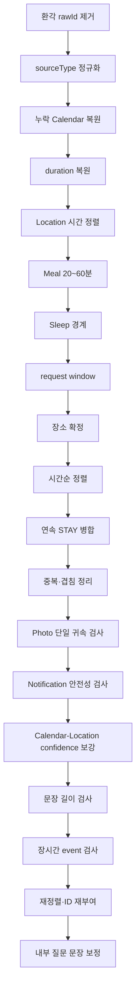

### 1. 환각 source 제거

`filter_draft_sources`는 event가 인용한 `rawId`가 현재 request에 실제로 존재하는지 검사한다. 없는 reference는 제거하고 유효 reference가 하나도 남지 않은 event도 제거한다. LLM이 만든 source를 이후 guard가 사실로 오인하지 않게 가장 먼저 실행한다.

### 2. source type 정정

LLM이 올바른 `rawId`에 잘못된 `sourceType` label을 붙일 수 있다. 이후 guard가 type별 source 목록에서 원본을 찾으므로 실제 입력의 type으로 먼저 정정한다. HEALTH item은 metric에 따라 SLEEP 또는 ACTIVITY source type으로 해석된다.

### 3. 누락 Calendar 복원

유효한 Calendar item이 최종 draft에서 통째로 빠졌다면 코드가 event로 복원한다. 명시적으로 등록된 일정의 누락은 품질 저하가 크기 때문이다. 여기서 복원해야 새 event도 뒤의 시간, window, 장소, 병합 검사를 동일하게 통과한다.

### 4. duration 복원

지속시간이 0인데 source에 구간이 있는 event는 source span으로 복원한다. 반대로 Notification처럼 순간이어야 하는 사건에 잘못 붙은 duration은 시작 시각으로 되돌린다.

### 5. Location 근거 시간에 정렬

STAY/MOVEMENT 근거만 가진 event는 자신이 참조한 location source 구간 밖의 시간을 주장하지 않도록 맞춘다. 다른 source가 함께 있으면 Calendar나 Photo 등 그 source의 시간 의미를 존중해 location 구간만으로 전체를 덮어쓰지 않는다.

### 6. Meal duration

긴 체류 전체를 식사로 잡는 문제를 막기 위해 MEAL은 20~60분 범위로 제한한다. 식사의 의미 판단은 LLM이 하지만 상식적인 duration 범위는 전용 guard가 확정한다.

### 7. Sleep boundary

알려진 기상 이전의 일반 event를 제거하고 수면 구간에 걸친 event를 clamp한다. 경계를 알 수 없을 때는 임의 시각을 만들지 않는다.

### 8. request window 적용

접수 request의 window가 정본이다. 완전히 밖인 event는 제거하고 경계에 걸친 구간은 clamp한다. 입력 조회 응답의 window가 다르더라도 runner가 접수 window로 덮어쓴다.

### 9. 장소 확정

`placeLabel`은 source의 place/address로 확정하고 근거 없는 address는 제거한다. Photo vision이 실제 이미지에서 읽은 상호명은 Photo에 구조화 place field가 없어도 제한적으로 보존할 수 있다.

장소를 겹침 판정 전에 확정하는 이유는 같은 event인지 비교할 때 event type, 시간과 함께 장소가 중요한 key이기 때문이다.

### 10. 정렬과 STAY 병합

먼저 시간순으로 정렬한 뒤 이동 없이 이어진 같은 장소의 순수 STAY event를 합친다. Calendar, Photo, Notification 같은 다른 의미가 섞인 사건을 긴 체류 하나에 흡수하지 않는다.

### 11. 중복과 겹침

같은 종류·장소이고 시간이 겹치는 명백한 중복은 병합할 수 있다. 포함 관계나 서로 다른 사건의 부분 겹침은 무조건 자르지 않고 warning으로 남길 수 있다. 코드가 의미를 모르는 상태에서 시간만 맞추려고 실제 사건을 훼손하지 않는다.

### 12. Photo와 Notification 최종 검사

병합·삭제가 끝난 뒤 사진이 정확히 하나의 event에 귀속됐는지 검사한다. 앞에서 검사하면 병합으로 새로 생긴 중복을 놓친다.

Notification도 Timeline/Repair가 문장을 다시 조립한 뒤 민감정보나 근거 없는 관계명이 생길 수 있어 final draft에서 다시 검사한다.

### 13. confidence 보강

Calendar location과 STAY place/address가 일치하면 서로 독립된 source가 같은 장소를 지지하므로 confidence를 올린다.

### 14. 길이와 장시간 event warning

모든 병합과 문장 수정이 끝난 결과를 기준으로 title/description 길이와 duration을 검사한다.

- description 120자 초과: LOW warning
- 비캘린더 일반 event 3시간 초과: LOW warning
- Calendar, Sleep, Movement, Meal은 장시간 검사 제외

장시간 event는 코드가 임의로 분할하거나 자르지 않는다. 어디에서 사건이 나뉘는지는 의미 판단이기 때문이다. Repair Agent가 warning을 보고 `update_event`, `delete_event`, 상류 재실행으로 개선할 수 있다.

두 guard는 Repair 반복마다 자기 이전 warning을 지우고 현재 draft를 다시 계산한다. 수정이 끝났는데 stale warning이 남는 것을 막는다.

### 15. 재정렬과 ID 확정

병합·삭제로 event 구성이 바뀌었으므로 다시 정렬하고 `event-001`, `event-002` 형식의 `clientEventId`를 시간순으로 재부여한다. 제거된 event를 가리키던 내부 question reference도 정리한다.

## Fragment 최종 검사

`repair_draft`가 끝난 뒤 `verify_fragment_usage`가 최종 event의 근거가 fragment뿐인지 검사한다. 병합·삭제 전에 검사하면 최종 근거 구성을 알 수 없기 때문에 confirm 끝에서 실행한다. fragment-only event를 무조건 삭제하지 않고 warning으로 드러내어 근거가 약함을 숨기지 않는다.

## Repair Agent 반복

Repair Agent는 최초 confirm을 반드시 실행한다. 설정의 `repair_max_iterations`가 0이면 LLM 개선 없이 이 결정론 확정본을 바로 반환한다.

반복이 활성화되면 다음 상태를 유지한다.

- 확정된 현재 draft
- Agent 이름별 마지막 Event Agent 결과
- Agent 이름별 Event Agent 인스턴스
- Timeline Agent 인스턴스
- 지금까지의 tool result log
- 마지막 confirm 성공본 deep copy

LLM은 확정된 draft만 본다. 매 반복의 마지막에 confirm을 다시 실행하므로 다음 분석은 source, 시간, 정렬, ID가 코드 규칙을 통과한 상태에서 시작한다.

## Repair 도구 카탈로그

### 조회 도구

| 도구 | 용도 | draft 변경 |
|---|---|---|
| `lookup_source(rawId)` | 축약 source index만으로 부족할 때 실제 원본 한 건 조회 | 없음 |

### 편집 도구

| 도구 | 용도 | 주의 |
|---|---|---|
| `update_event(clientEventId, fields)` | event type, title, description, 시간, 장소, confidence, sourceRefs 등 지정 필드만 수정 | 허용 필드와 Pydantic 계약을 통과해야 함 |
| `delete_event(clientEventId)` | 근거가 없거나 사실이 아닌 event 삭제 | 다음 confirm에서 ID가 다시 부여됨 |

`update_event`가 수정할 수 있는 필드는 `eventType`, `title`, `description`, `address`, `placeLabel`, `tags`, `startTime`, `endTime`, `confidence`, `inferenceLevel`, `sourceRefs`, `uncertainty`다. 최종 question은 Repair 뒤 별도 Question Agent가 생성하므로 여기서 다루지 않는다.

### 결정론 service 재적용 도구

| 도구 | 재사용하는 코드 |
|---|---|
| `repair_durations()` | source span 기반 duration 복원 |
| `align_location_events()` | Location-only event 시간 정렬 |
| `enforce_meal_duration()` | MEAL 20~60분 |
| `enforce_sleep_boundary()` | 기상 이전 제거·수면 겹침 clamp |
| `resolve_places()` | 장소명 확정·근거 없는 주소 제거 |
| `ensure_calendar_events()` | 누락 Calendar 복원 |
| `merge_stay_events()` | 정렬 후 연속 순수 STAY 병합 |
| `resolve_overlaps()` | 중복 병합·모순 warning |
| `reinforce_calendar_location()` | Calendar/Stay 장소 일치 confidence 보강 |
| `check_photo_assignment()` | 누락·중복 사진 귀속 조회, 자동 수정은 하지 않음 |

이 도구들은 로직을 복제하지 않고 `repair_draft`가 사용하는 service를 그대로 호출한다. Repair가 event를 수정하거나 상류 Agent를 재실행해 기존 확정이 깨졌을 때 필요한 부분을 즉시 다시 확인할 수 있다. 어차피 반복 끝에는 전체 confirm이 다시 실행되므로 부분 재적용은 분석과 피드백을 위한 것이다.

### 상류 재실행 도구

| 도구 | 동작 | 주의 |
|---|---|---|
| `rerun_event_agent(agent)` | 특정 Event Agent 결과만 새 결과로 교체 | draft에는 아직 반영되지 않음 |
| `rerun_timeline_agent()` | 현재 Agent 결과 전체를 merge해 Timeline draft 재생성 | 기존 draft 직접 수정은 사라짐 |

특정 source 해석이 근본적으로 틀렸을 때만 Event Agent 재실행을 사용한다. 이어서 Timeline Agent를 재실행해야 새 Candidate/Fragment가 draft에 반영된다.

## 항상 실행되는 규칙과 선택 도구의 차이

정렬, request window, source 무결성, 최종 ID는 Repair tool로 노출하지 않는다. “LLM이 문제를 발견하고 해당 도구를 선택해야만” 실행되는 구조라면 호출하지 않는 순간 불변식이 깨진다. 이 규칙들은 confirm 전체에서 항상 실행한다.

도구 catalog는 LLM이 의미 문제를 해결하는 제한된 능력이다. arbitrary code나 임의 HTTP 요청을 실행할 수 없고 등록된 함수와 허용 인자만 사용한다.

## 실패 복구

- 등록되지 않은 도구: `ok=false`, error code와 사용 가능 목록 기록
- 인자 오류·없는 event/source: `RepairToolError`, `ok=false`
- service 예외: 다음 tool을 계속 실행하고 실패 결과를 log에 추가
- analyze LLM 실패 또는 `RepairPlan` 파싱 실패: 마지막 confirm 성공본 복원
- confirm 코드 실패: 해당 반복은 확정되지 않았으므로 이전 `last_good` 복원

도구 인자 값에는 title 같은 사용자 콘텐츠가 들어갈 수 있어 operational log에는 argument name만 남긴다. 상세 input/output은 Langfuse content policy 아래에서만 관측한다.

## 주요 코드

- `app/services/draft_repair.py`
- `app/agents/repair/repair_agent.py`
- `app/agents/repair/tools.py`
- `app/services/source_integrity.py`
- `app/services/*_guard.py`
- `app/services/draft_edit.py`

---

<!-- 원본: 05-user-memory.md -->

# User Memory 설계와 갱신

## User Memory란 무엇인가

User Memory는 사용자의 모든 과거 사건을 쌓아두는 장기 로그가 아니다. Timeline과 질문을 만들 때 사용자를 더 잘 이해하도록 돕는 **고정 크기의 압축 프로필**이다.

담아야 하는 것은 “어느 날 몇 시에 무엇을 했다”가 아니라 일정 기간 유효한 사용자 특성과 현재 맥락이다.

- 기본 profile과 생애 단계
- 현재 삶의 맥락
- 중요한 관계의 유형과 의미
- 반복되는 성향·가치·선호
- 생활 routine과 현재 관심사
- 반복되는 감정 pattern
- 어떤 기억을 남기고 싶어 하는지

사건 데이터가 아니므로 `rawId`를 갖지 않고 `sourceRefs`에 들어가지 않는다.

## v1.0 스키마

User Memory는 `extra="forbid"`인 고정 스키마다. 최상위 자유 필드를 무제한 허용하지 않고 확장성은 `customAttributes` 안으로 제한한다.

| 필드 | 의미 | 최대 길이 |
|---|---|---:|
| `basicProfile` | 연령대, 신분, 직업·역할, 생애 단계 | 200자 |
| `lifeContext` | 최근 삶의 시기와 상황 | 200자 |
| `relationships` | 중요한 관계의 유형과 의미 | 200자 |
| `personality` | 반복되는 행동·사고·소통 특성 | 200자 |
| `values` | 중요하게 여기는 가치와 판단 기준 | 200자 |
| `preferences` | 좋아하거나 피하는 대상·환경·경험 | 200자 |
| `routines` | 반복되는 생활 구조와 주요 활동 | 200자 |
| `currentFocus` | 현재 에너지를 쓰는 목표·과제·고민 | 200자 |
| `emotionalPatterns` | 반복되는 감정 반응·스트레스·안정 조건 | 200자 |
| `memoryStyle` | 하루에서 무엇을 어떻게 기억하고 싶은지 | 200자 |
| `customAttributes` | 고정 필드로 담기 어려운 지속 특성 | 최대 5개, 값당 150자 |
| `schemaVersion` | 현재 `1.0`만 허용 | 서버 확정 |
| `updatedAt` | 마지막 갱신 시각 | 서버 확정 |

필드가 비어 있는 것은 실패가 아니다. 근거가 부족하면 빈 문자열을 유지하는 것이 추측으로 채우는 것보다 낫다.

## Prompt projection

Timeline Agent, Question Agent, User Memory 갱신 Agent가 기존 profile을 읽을 때 모두 같은 `user_memory_to_text()` 경로를 사용한다.

projection 규칙은 다음과 같다.

- 빈 자연어 필드 제외
- 빈 `customAttributes` 제외
- `schemaVersion`, `updatedAt` 제외
- 선언된 필드 순서 유지
- 채워진 값이 하나도 없으면 `정보 없음`
- UTF-8 JSON 문자열로 직렬화

같은 profile이 Agent마다 다른 문자열로 보이면 어떤 정보가 판단 근거였는지 재현하기 어렵고 cache/diff도 의미를 잃는다. 따라서 Agent별로 필요한 필드만 임의 선택하지 않는다.

## 소비 경계

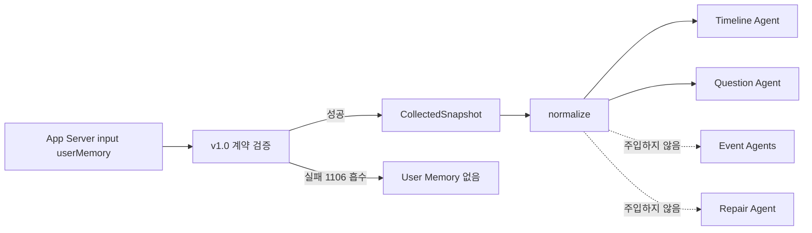

### Timeline Agent에서의 사용

사용자의 생활 장소명, 관계 호칭, 문체와 중요도 선택을 돕는다. 하지만 User Memory만으로 오늘 사건의 발생, 일정 참석, 장소, 이동 목적, 사람의 실명이나 정확한 관계를 확정하지 않는다. 오늘 source와 충돌하면 source가 우선한다.

### Question Agent에서의 사용

무엇을 물을지에 대한 새로운 사건 사실이 아니라 어떻게 물을지 결정하는 자료다. `memoryStyle`, `emotionalPatterns`, `preferences`, `personality`를 질문의 결과 말투에 참고한다. profile에만 있는 프로젝트명이나 관계를 오늘 event의 사실처럼 질문에 끌어오지 않는다.

### Event Agent에 넣지 않는 이유

Event Agent는 자기 source의 사실 보고가 임무다. 다섯 Agent가 같은 profile을 읽으면 같은 보조 context 하나가 다섯 개의 독립 근거로 반복되고, Timeline이 source consensus로 오인할 수 있다.

### Repair Agent에 넣지 않는 이유

Repair는 이미 User Memory를 본 Timeline 문장과 오늘 source를 대조한다. 반복 개선에 profile을 다시 주입하면 source보다 profile에 맞추어 사건을 재작성할 위험이 있다.

## 계약 위반을 흡수하는 이유

App Server input의 `userMemory`는 즉시 `UserMemory` model로 엄격 선언하지 않고 원본 dict로 느슨하게 받는다. 별도 `parse_user_memory()`에서 검증하고 실패하면 error code 1106을 기록한 뒤 User Memory 없이 Timeline을 계속한다.

보조 context 하나의 schema 오류로 하루 source 전체를 버리지 않기 위해서다. 갱신 task에서도 읽지 못하는 기존 profile은 실패시키지 않고 없는 셈 치고 새로 만든다. 그렇지 않으면 같은 깨진 profile을 매일 읽으며 영구적으로 갱신할 수 없게 된다.

ValidationError 문자열에는 걸린 실제 값이 포함될 수 있어 원문 exception을 운영 로그에 남기지 않는다. 오류 field 이름, type, count만 기록한다.

## 갱신은 append가 아니라 전체 rewrite

새 daily timeline이 들어올 때 기존 profile 뒤에 문장을 계속 붙이지 않는다. 기존 값과 새 근거를 합쳐 중복을 제거하고, 오래된 단기 정보를 버리고, 최신 상태 하나를 다시 만든다. 결과는 기존 profile 전체를 대체한다.

append 방식은 profile이 무한히 커지고 과거와 현재가 충돌하며 같은 표현이 반복된다. rewrite 방식은 크기 예산 안에서 현재 사용자를 설명하는 정보만 유지한다.

## 가장 중요한 근거 출처 규칙

Daily timeline event의 문장 출처는 서로 다르다.

- `title`: 이 시스템의 AI가 작성
- `subtitle`: 이 시스템의 AI가 작성
- `question`: 이 시스템의 AI가 작성
- `memo`: 사용자가 직접 작성

AI가 쓴 문장에서 성격·가치관·취향을 뽑으면 모델이 자기 문장을 다시 읽어 사용자를 만들어내는 feedback loop가 생긴다. 그렇게 생긴 profile은 다음 Timeline 문장을 만들고, 그 문장이 다시 profile 근거로 들어가며 편향이 스스로 강화된다.

그래서 필드별 근거를 다음처럼 제한한다.

| 필드군 | 허용 근거 |
|---|---|
| `routines`, `lifeContext`, `currentFocus` | event의 시간대·종류·여러 날의 반복 구조 |
| `basicProfile` | event 구조 + memo, 명확한 변경 근거가 있을 때만 |
| `relationships` | memo 우선, event는 보조 |
| `personality`, `values`, `preferences`, `emotionalPatterns`, `memoryStyle` | **memo만** |

memo가 하나도 없는 batch에서는 성향 계열 다섯 필드를 그대로 두는 것이 정상 성공이다. 생활 구조 계열만 event pattern으로 갱신할 수 있다.

## 갱신 입력 digest

접수 body의 `dailyTimelines`는 최대 5일이다. 그 안의 event가 많거나 본문이 길다고 요청 전체를 거절하지 않고 prompt 예산에 맞게 줄인다.

### 날짜별 event 예산

하루마다 최대 20개 event를 남긴다. 전체 100개 상한 하나로 정렬하지 않고 날짜별 quota를 적용한다. 한 날에 event가 몰렸다고 다른 날이 통째로 사라지지 않게 하기 위해서다.

### 우선순위

1. memo가 있는 event를 먼저 보존
2. 같은 조건이면 최근 event 우선
3. 최종 payload는 날짜 오름차순, 시간 오름차순으로 재정렬

memo는 성향 계열 필드의 유일한 사용자 발화 근거이므로 가장 늦게 버린다.

### projection과 절단

- 정확한 분은 버리고 `hour`만 제공
- `eventType` 제공
- title/subtitle/question 같은 AI 문장은 최대 255자
- memo는 최대 500자
- 빈 문자열은 제외
- prompt payload에 넣은 절단 표시 `…`는 남기지 않음

무엇을 얼마나 버렸는지는 `droppedDailyTimelineCount`, `droppedEventCount`, `memoCount` 등의 정수 통계로 운영 이벤트에 남긴다. 본문은 남기지 않는다.

## 갱신 생성과 확정

User Memory Agent는 낮은 temperature로 Pydantic structured output을 생성한다. LLM은 의미를 맡는다.

- 어떤 기존 정보를 유지할지
- 새 정보를 어떻게 병합할지
- 무엇이 오래됐는지
- 어떤 표현을 일반화하고 압축할지

코드는 셀 수 있는 것을 맡는다.

- 필드별 길이
- customAttributes 개수와 길이
- 전체 직렬화 크기
- 민감정보 pattern
- 재요청 횟수
- `schemaVersion`, `updatedAt`

## 전체 크기와 민감정보

이 프로젝트는 provider별 tokenizer에 의존하지 않는다. OpenAI, Gemini, Bedrock을 바꿔도 저장 가능 여부가 달라지지 않게 prompt projection의 직렬화 문자 수 1,200자를 전체 상한으로 사용한다. “1,000 token” 요구를 provider 독립적인 문자 수로 환산한 프로젝트 규칙이며 보편 표준은 아니다.

민감정보 검사는 전화번호, 카드·계좌번호, token/API key 등 금지 pattern을 찾는다. 위반이 있으면 코드는 문장을 자르거나 마스킹한 profile을 바로 저장하지 않는다. 의미가 잘린 문장은 뜻이 달라질 수 있기 때문이다.

대신 어느 필드가 어떤 규칙을 어겼는지 값 없이 알려 User Memory Agent에 전체 rewrite를 다시 요청한다. 최초 1회와 repair 2회로 최대 3번 생성한다. 끝까지 통과하지 못하면 error code 1304로 실패하고 기존 profile을 유지한다.

`schemaVersion="1.0"`과 `updatedAt`은 LLM 출력이 아니라 서버가 최종 확정한다.

## 결과 통보 1회 계약

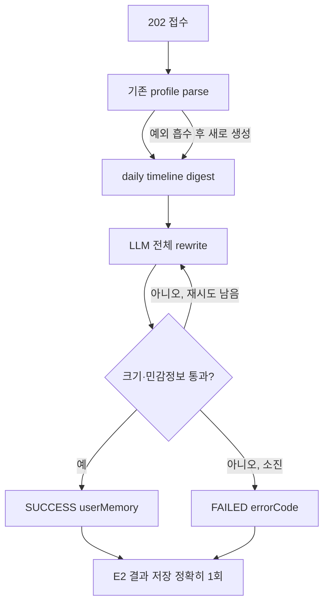

User Memory task에는 callback이 없다. 성공 결과는 전체 `userMemory`를, 실패 결과는 catalog의 정수 `errorCode`와 안전 메시지를 같은 result endpoint로 보낸다. 실패 결과에 부분 profile을 싣지 않는다.

결과 전송 자체가 실패하면 error code 1305다. 이 경우 App Server에 알릴 다른 경로가 없으므로 operational event의 `resultSent=false`가 가장 중요한 진단 값이다.

## 관측과 privacy

운영 로그와 일반 trace metadata에는 User Memory 본문을 남기지 않는다. 비식별 summary만 사용한다.

- schema version
- 채워진 자연어 필드 수
- custom attribute 수
- byte/문자 크기와 hash summary
- daily timeline 수, event 수, memo 수

Langfuse generation prompt에는 실제 값이 필요하지만 content capture policy가 이를 통제한다. 운영 기본 `NONE`에서는 본문 대신 길이/hash summary를 남기고, local/dev의 `SANITIZED`에서는 redaction을 거친 제한된 본문을 볼 수 있다.

## 주요 코드

- `app/schemas/user_memory.py`
- `app/schemas/user_memory_update.py`
- `app/agents/parsing.py::user_memory_to_text`
- `app/agents/user_memory/user_memory_agent.py`
- `app/services/user_memory_limits.py`
- `app/services/user_memory_repair.py`
- `app/services/user_memory_runner.py`

---

<!-- 원본: 06-llm-providers-and-model-evaluation.md -->

# LLM Provider 구조와 모델 비교 계획

## 현재 상태와 평가 계획을 구분한다

현재까지 Timeline 품질, 문체, Repair, Question, User Memory prompt는 GPT를 기준으로 반복 개선됐다. 이것은 “모든 운영 환경에서 현재 GPT가 선택되어 있다”거나 “GPT가 최종 우승 모델이다”라는 뜻은 아니다.

런타임 모델은 환경변수로 선택한다.

- `LLM_PROVIDER=openai` + `OPENAI_MODEL`
- `LLM_PROVIDER=gemini` + `GEMINI_MODEL`
- `LLM_PROVIDER=bedrock` + `BEDROCK_MODEL`

Docker image 기본 provider는 `bedrock`이지만 EC2 `runtime.env`나 AgentCore environment variables가 덮어쓸 수 있다. 실제 운영 모델은 배포 환경 설정을 확인해야 한다.

향후 비교할 평가 대상은 프로젝트에서 다음처럼 정했다.

1. Amazon Nova 2 Lite
2. Gemini 2.5 Flash
3. GPT 5.4 mini

이 페이지는 모델별 최신 가격, context window, 공개 benchmark 수치를 단정하지 않는다. 그런 값은 시점과 region, API 상품에 따라 바뀌므로 실제 평가 시점의 공식 문서와 청구 데이터를 별도로 기록해야 한다.

## Provider 추상화

`LLMProvider`는 세 SDK의 차이를 공통 interface로 감싼다.

| 기능 | 공통 method | 용도 |
|---|---|---|
| text completion | `complete` | v1 자유 텍스트 infer 등 |
| vision | `complete_with_images` | Photo describer |
| JSON text | `complete_json` | tolerant item parsing |
| Pydantic output | `complete_structured` | Event Agent v2, RepairPlan, User Memory |

`LLMClient`는 provider facade다. 기본 모델을 쓰면 provider instance를 cache하고 특정 모델을 명시하면 별도 provider instance를 만든다.

### OpenAI

- API key 기반 client
- text와 image message 구성
- 가능한 경우 response format/JSON schema 사용
- usage metadata를 prompt/completion 및 세부 token bucket으로 변환

### Gemini

- API key 기반 client
- text와 inline image parts 구성
- response MIME type과 schema 기능 사용
- Gemini usage metadata를 공통 token 관측 구조로 변환

### Bedrock

- API key 필드가 없음
- boto3 credential chain 사용
- local에서는 선택적 AWS profile
- EC2에서는 instance role
- AgentCore에서는 execution role
- Converse API의 text/image content와 tool-based structured output 사용
- model ID 또는 cross-region inference profile ID를 설정 가능

Nova 2 Lite의 실제 호출은 서울 region credential과 global inference profile을 사용할 수 있도록 설계돼 있다. 모델 목록 조회 권한과 모델 호출 권한은 별개이므로 목록 API가 실패해도 지정 ID 호출이 반드시 불가능하다는 뜻은 아니다.

## 공통 계약을 유지해야 하는 이유

provider를 바꿔도 Agent 코드는 같은 입력과 Pydantic schema를 사용해야 한다. 특정 provider에서만 작동하는 prompt branch가 늘어나면 품질 차이와 adapter 차이를 구분하기 어려워진다.

공통 불변식:

- provider native schema가 있어도 Pydantic 최종 검증 수행
- text와 vision 모두 같은 execution context와 Langfuse generation 관측 사용
- SDK가 제공하지 않은 token 종류를 추측해 채우지 않음
- credential과 provider 원문 오류를 외부 response에 노출하지 않음
- provider/model/version/duration/token을 동일한 필드 의미로 관측
- 모델 교체로 User Memory 저장 상한이 달라지지 않게 문자 수 기준 유지

## 비교의 핵심 질문

단순히 한 번의 Timeline이 그럴듯해 보이는지로 모델을 고르면 안 된다. 이 시스템은 여러 Agent call과 Repair loop가 결합되어 있어 다음을 함께 봐야 한다.

1. source 사실을 얼마나 정확히 Candidate/Fragment로 보존하는가?
2. 여러 source를 같은 실제 사건으로 올바르게 병합하는가?
3. 존재하지 않는 rawId, 사람, 장소, 활동을 만들어내지 않는가?
4. 한국어 일기 문체와 길이 계약을 얼마나 지키는가?
5. structured output을 안정적으로 지키는가?
6. Repair가 필요한 문제를 정확히 찾고 최소 도구로 고치는가?
7. 모든 event에 중복되지 않는 회고 질문을 만드는가?
8. User Memory가 AI 문장에서 성향을 만드는 feedback loop를 피하는가?
9. latency와 token/cost가 background task 예산에 맞는가?
10. Photo vision과 metadata fallback 품질이 일관적인가?

## 공정한 실험 조건

### 반드시 고정할 것

- 같은 git commit
- 같은 `PROMPT_VERSION`
- 같은 input fixture와 request window
- 같은 User Memory 입력
- 같은 temperature와 structured repair 횟수
- 같은 Repair 반복 상한
- 같은 이미지 bytes
- 같은 region 및 네트워크 조건을 가능한 범위에서 유지
- 같은 평가 rubric과 evaluator

### 모델별로 달라지는 것

- provider/model environment variables
- provider SDK의 native schema 방식
- 실제 token accounting
- response latency와 retry/error
- 모델별 청구 비용

prompt를 모델마다 먼저 튜닝하면 “기본 호환성 비교”가 아니라 “모델별 최적화 결과 비교”가 된다. 1차는 동일 prompt zero/adaptation 비교, 2차는 각 모델에 허용된 최소 튜닝 비교로 나누는 것이 좋다.

## 평가 데이터셋 구성

평균적인 하루만 사용하면 guard와 실패 격리를 평가할 수 없다. 최소 다음 scenario를 포함한다.

### Location

- 연속 STAY와 MOVEMENT가 정상적으로 이어지는 날
- 같은 장소로 돌아오는 왕복
- source 공백이 긴 날
- 평균 속도가 비정상인 이동
- 같은 장소 label의 표기 차이
- 수면 이전 위치 source

### Calendar

- Calendar만 있고 참석 근거가 없는 일정
- STAY 장소와 Calendar 장소가 일치하는 일정
- Timeline Agent가 일정을 누락하도록 유도되는 복잡한 날
- 다른 사건과 시간이 겹치는 일정

### Photo

- 실제 image download 성공
- 다중 사진 grouping
- 간판·메뉴·영수증에서 장소 text를 읽는 사진
- 다운로드 실패 후 metadata fallback
- 같은 사진이 여러 event에 귀속될 위험

### Notification

- 메시지·결제·예약·교통 알림
- 미래 예약 알림
- token, 전화번호, 계좌·카드 형태가 섞인 원문
- 알림과 실제 행동을 혼동하기 쉬운 입력

### Sleep/Activity

- 명확한 수면·기상 구간
- 수면과 일반 event 겹침
- steps만 있는 날
- 기상 경계를 알 수 없는 날

### User Memory

- 기존 profile 없음
- memo가 하나도 없는 batch
- memo가 있는 여러 날
- AI title이 강한 성향을 암시하지만 memo는 없는 경우
- 크기 상한 초과 후보
- 민감정보가 섞인 memo
- 깨진 기존 profile

## 정량 지표

### 구조와 신뢰성

| 지표 | 계산 |
|---|---|
| structured first-pass success | 최초 응답이 Pydantic 검증을 통과한 비율 |
| structured repair rate | 공통 교정 retry가 필요했던 비율 |
| total structured failure | retry 후에도 실패한 비율 |
| hallucinated rawId rate | 입력에 없는 rawId reference 수 / 전체 reference 수 |
| invalid item skip rate | tolerant parse에서 제외된 item 수 / 전체 item 수 |
| empty fallback rate | Timeline이 빈 fallback으로 끝난 task 비율 |
| question coverage | 유효 질문이 붙은 event 수 / 최종 event 수 |
| repair tool success | 성공 tool call 수 / 전체 tool call 수 |
| redundant tool rate | 결과를 바꾸지 않은 불필요 tool call 비율 |
| max-iteration hit rate | Repair가 상한까지 도달한 task 비율 |

### 성능과 비용

- 전체 task latency p50/p95/p99
- Agent별 generation latency
- input/output token 합계와 Agent별 분포
- task당 LLM call 수
- provider retry/error rate
- task당 실제 청구 비용
- Photo vision 포함/제외 비용
- Timeline timeout과 User Memory timeout 비율

비용은 공개 가격표를 단순 token에 곱하는 것보다 실제 청구 또는 provider usage와 pricing snapshot을 함께 보존하는 편이 정확하다. cached/reasoning/image token처럼 모델별 과금 항목이 다를 수 있다.

## 정성 rubric

각 최종 Timeline을 1~5점으로 평가한다.

| 항목 | 1점 | 5점 |
|---|---|---|
| source 충실도 | 없는 사실·근거를 생성 | 모든 주장이 source와 연결 |
| 사건 분할 | 하루를 과도 병합/조각냄 | 사람이 기억하는 장면 단위 |
| 시간 정확성 | source/window와 모순 | source span과 자연스럽게 일치 |
| 장소 정확성 | 근거 없는 상호·주소 | source/vision 근거만 사용 |
| 일기 문체 | 센서 보고서·추정 표현 | 자연스러운 1인칭 해요체 과거형 |
| 정보 밀도 | 중복·장황·수치 나열 | 핵심 경험만 간결하게 전달 |
| 불확실성 처리 | 문장에 억지 hedge | 모르는 사실은 빼고 metadata 사용 |
| 회고 질문 | generic·사실 확인·유도 | event 고유 경험을 꺼내는 질문 |
| User Memory 안전성 | AI 문장으로 성향 단정 | memo와 반복 구조만 신중히 반영 |

가능하면 evaluator가 모델 이름을 모르는 blind review를 하고, source 원본과 최종 결과를 함께 본다. 모델이 만든 문장만 보고 평가하면 hallucination을 발견하기 어렵다.

## 실험 실행 단위

한 fixture를 모델당 한 번만 실행하면 stochastic variance를 알 수 없다. temperature가 낮아도 provider와 backend 변화가 있다. 중요한 fixture는 모델당 최소 여러 회 반복하고 다음 두 층을 분리한다.

1. Agent 단위: Event, Timeline, Repair plan, Question, User Memory
2. end-to-end task 단위: 최종 result, 전체 latency/token/cost

Agent 단위는 원인을 찾는 데 좋고 end-to-end는 실제 사용자 품질과 비용을 보여준다.

## 결과 기록 표

| 항목 | Nova 2 Lite | Gemini 2.5 Flash | GPT 5.4 mini |
|---|---:|---:|---:|
| 코드 commit |  |  |  |
| prompt version |  |  |  |
| test case 수 × 반복 |  |  |  |
| structured first-pass success |  |  |  |
| hallucinated rawId rate |  |  |  |
| question coverage |  |  |  |
| Timeline 품질 평균 |  |  |  |
| User Memory 품질 평균 |  |  |  |
| task latency p50/p95 |  |  |  |
| 평균 input/output token |  |  |  |
| 평균 task 비용 |  |  |  |
| timeout/error rate |  |  |  |
| 주요 실패 pattern |  |  |  |

## 선택 기준 제안

최저 비용이나 최고 평균 점수 하나만으로 결정하지 않는다. 먼저 hard gate를 통과시킨 뒤 가중치를 적용한다.

### Hard gate 예시

- source hallucination이 허용 기준 이하
- structured failure가 허용 기준 이하
- task timeout이 운영 예산 이하
- Notification/User Memory 민감정보 검사 회귀 없음
- Photo vision 또는 fallback이 제품 요구를 충족

### 가중 평가 예시

- source·사실 충실도 30%
- Timeline 자연스러움과 사건 분할 25%
- structured/운영 안정성 15%
- Question/User Memory 품질 15%
- latency 10%
- 비용 5%

실제 가중치는 제품 우선순위에 맞춰 확정한다. 기억 서비스에서는 작은 비용 절감보다 사용자의 하루를 잘못 쓰지 않는 것이 더 중요할 수 있다.

## Langfuse를 이용한 비교

Langfuse generation에는 provider, model, prompt version, duration, token이 기록된다. 동일 fixture 실행에 dataset/run label 또는 별도 metadata를 추가하면 Agent 단계별 비교가 가능하다.

주의할 점:

- content capture가 `NONE`이면 본문은 보이지 않지만 latency/token/error 비교는 가능
- 품질 평가에는 안전한 test fixture와 `SANITIZED` 환경을 사용
- production 사용자 원문을 모델 benchmark dataset으로 무단 재사용하지 않음
- 동일 taskId를 모델 간 재사용하면 session이 합쳐질 수 있어 run 식별자를 분리

## 주요 코드

- `app/core/config.py`
- `app/core/llm.py`
- `app/core/structured.py`
- `app/core/langfuse_tracing.py`
- `tests/core/test_structured_providers.py`
- `tests/core/test_bedrock_provider.py`
- `tests/integration/**`

---

<!-- 원본: 07-deployment-and-runtime.md -->

# AI 배포와 Runtime 구조

## 상태 요약

| 항목 | 현재 상태 | 향후 방향 |
|---|---|---|
| `dev` 자동 배포 | EC2 단일 컨테이너 | AgentCore를 기본 배포 대상으로 전환 예정 |
| EC2 architecture | `linux/amd64` | 전환 후에도 rollback 기간 동안 유지 가능 |
| AgentCore architecture | `linux/arm64` | 기본 runtime 후보 |
| AgentCore workflow | 수동 `workflow_dispatch` | 전환 시 자동/승인 정책 재설계 필요 |
| image source | 하나의 Dockerfile | 유지 가능 |
| health | 8080 `GET /ping` | AgentCore endpoint에서도 같은 계약 사용 |

현재 workflow 주석과 동작상 AgentCore는 수동 복구 경로다. 프로젝트 계획상 앞으로 AgentCore를 사용할 예정이지만 현재 코드가 이미 자동 전환을 완료한 것으로 기록하면 안 된다.

## 공통 Docker image

하나의 Dockerfile을 두 platform에서 사용한다.

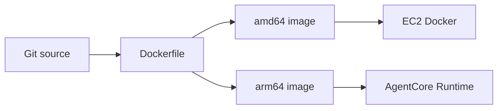

### Builder

- `python:3.14-slim`
- pinned uv binary 사용
- `uv sync --locked --no-dev`
- `.venv`를 dependency layer로 생성
- app source 변경만으로 dependency install layer를 다시 만들지 않음

### Runtime

- `python:3.14-slim`
- `.venv`, `app/`, version 확인용 `pyproject.toml`만 복사
- uid/gid 10001 non-root
- app path 쓰기 권한 없음
- stdout unbuffered
- 8080 Uvicorn single worker

`.dockerignore`는 deny-all 뒤 앱 실행에 필요한 파일만 허용한다. `.env`, docs, tests, IDE/cache, data가 build context로 들어가지 않도록 해 secret 유입과 image 비대를 줄인다.

### Image 기본 환경변수

Image는 운영에 안전한 최소 기본값을 가진다.

- `APP_ENV=prod`
- `LOG_LEVEL=INFO`
- `LOG_FORMAT=json`
- `LLM_PROVIDER=bedrock`
- `PROMPT_VERSION=v1`

model ID, App Server URL, Langfuse key 같은 환경별 값은 image에 굽지 않는다. EC2 env file이나 AgentCore environment variables가 제공한다.

## 현재 EC2 자동 배포

`deploy-ec2.yml`은 `dev` branch에 app/image/deploy 관련 path가 push되거나 수동 실행될 때 동작한다.

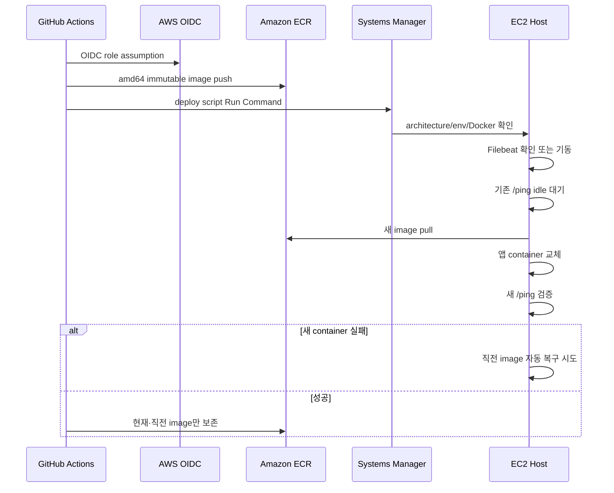

### 인증과 secret

GitHub Actions는 장기 AWS access key가 아니라 OIDC로 deploy role을 assume한다. EC2 host는 ECR pull과 Bedrock 호출에 instance role을 사용한다. runtime 환경변수와 Filebeat의 Elasticsearch 연결 정보는 GitHub source가 아니라 `/opt/laimory-ai` 아래 host 파일에 둔다.

### Immutable tag

EC2 image tag에는 commit short SHA, workflow run ID, attempt가 포함된다. 같은 commit workflow를 재실행해도 기존 tag를 덮어쓰지 않아 배포 이력과 rollback 지점을 보존한다.

### Idle 대기

배포 script는 기존 container의 `/ping`을 본다.

- `Healthy`: 교체 가능
- `HealthyBusy`: 10초 간격으로 최대 20분 대기
- 알 수 없는 응답: 강제 교체하지 않고 중단

AI 작업은 FastAPI BackgroundTasks이고 durable migration이 없으므로 busy container를 강제 종료하면 작업이 사라진다.

### Health와 rollback

새 container가 제한 시간 안에 `Healthy` 또는 `HealthyBusy`가 아니면 로그를 남기고 직전 image로 자동 복구한다. 배포 성공 후에만 ECR에서 현재 image와 실제 직전 image를 제외한 오래된 image를 정리한다. 실패 전에 rollback 후보를 지우지 않는다.

### Filebeat와 앱 배포의 관계

배포 전에 Filebeat container를 확인·기동한다. 설정이나 env가 없거나 Filebeat가 실패해도 앱 배포는 계속한다. 가용성과 관측을 분리한 결정이지만, 앱은 정상인데 운영 이벤트가 Elasticsearch에 도착하지 않는 상태가 가능하다. workflow summary의 `FILEBEAT_STATUS`를 별도로 확인해야 한다.

## 현재 AgentCore 수동 경로

`deploy-agentcore.yml`은 자동 branch trigger가 없고 `workflow_dispatch`만 지원한다.

### Build

- QEMU/binfmt로 x86 GitHub runner에서 arm64 build
- immutable `sha-<commit>` tag
- 최신을 가리키는 이동 `dev` tag도 push
- provenance 비활성화로 Runtime이 해석하기 어려운 manifest list 방지

### Runtime update

AgentCore `UpdateAgentRuntime`은 patch가 아니라 전체 설정 교체다. workflow는 현재 Runtime을 읽고 다음 값을 보존한 채 container URI만 바꾼다.

- role ARN
- network configuration
- protocol configuration
- environment variables

현재 설정 응답에는 secret environment가 포함될 수 있으므로 로그에 출력하지 않는다.

새 Runtime version이 READY가 된 뒤 endpoint를 새 version으로 전환하고 endpoint READY까지 기다린다.

### Rollback

rollback workflow는 image를 다시 build하지 않는다. 기존 Runtime version 목록에서 target을 고르고 endpoint를 해당 version으로 전환한다. deploy와 rollback은 같은 concurrency group을 사용해 동시에 endpoint를 변경하지 않는다.

## `/invocations` adapter

AgentCore는 `POST /invocations`와 `GET /ping` 계약을 사용한다. `/invocations`는 별도 비즈니스 pipeline을 구현하지 않고 `/v1/timeline`과 같은 request model과 처리에 위임한다. EC2와 AgentCore가 같은 image를 사용해도 결과 의미가 달라지지 않게 한다.

## AgentCore 기본 전환 시 확인할 사항

향후 AgentCore를 기본 배포 대상으로 바꿀 때 workflow trigger만 바꾸면 끝나지 않는다.

### Traffic과 rollout

- `dev` push가 AgentCore를 자동 update할지, 승인 environment를 둘지 결정
- 새 Runtime READY와 endpoint cutover를 release gate로 사용
- endpoint version 전환 실패 시 자동 rollback 기준 결정
- EC2와 AgentCore가 동시에 callback/result를 처리하지 않도록 traffic ownership 확정

### Background task 수명

- 202 응답 뒤 BackgroundTasks가 AgentCore instance lifecycle에서 충분히 보장되는지 검증
- scale-in 또는 runtime replacement 중 inflight task가 어떻게 처리되는지 검증
- 현재 `HealthyBusy` 기반 idle 대기와 동등한 drain 전략 마련
- 필요하면 durable queue 도입을 별도 설계

### 관측

- EC2 Filebeat sidecar는 AgentCore에 그대로 존재하지 않음
- AgentCore stdout/CloudWatch 경로에서 `event.dataset=laimory.api` 운영 이벤트를 Elasticsearch로 어떻게 전달할지 결정
- Langfuse outbound network와 credential 설정 검증
- Runtime version, image SHA, provider/model을 trace와 operational event에서 함께 식별

### IAM과 network

- AgentCore execution role의 Bedrock model invoke 권한
- ECR image 접근
- App Server API outbound network와 DNS/TLS
- Langfuse endpoint outbound
- secret을 source나 workflow log에 노출하지 않는 environment 관리

### Architecture와 image

- arm64 dependency wheel 가용성
- Photo image 처리 library 동작
- 실제 arm64 smoke test
- 8080 port, `/ping`, `/invocations` 계약 유지

## Single worker 불변식

Uvicorn worker를 늘리지 않는다. `inflight`가 process-local이므로 worker가 여러 개면 `/ping`을 처리한 process가 다른 worker의 background task를 알 수 없다. AgentCore가 replica를 늘리는 것도 동일한 전역 busy 의미를 자동 제공하지 않는다. 배포 drain을 `/ping` 하나에 의존할 것인지 전환 전에 재평가해야 한다.

## 주요 파일

- `Dockerfile`
- `.dockerignore`
- `.github/workflows/deploy-ec2.yml`
- `.github/workflows/deploy-agentcore.yml`
- `.github/workflows/rollback-agentcore.yml`
- `scripts/deploy-ec2.sh`
- `scripts/prune_ecr_images.py`
- `docs/deploy-ec2.md`
- `docs/deploy-agentcore.md`

---

<!-- 원본: 08-observability.md -->

# 관측성: Filebeat·Elasticsearch·Langfuse

## 세 가지 관측 경계

Laimory는 모든 로그를 한 저장소에 무차별 전송하지 않는다.

| 경계 | 목적 | 저장 경로 | 사용자 본문 |
|---|---|---|---|
| 일반/local 진단 로그 | 예외 원문, 개발 debugging, stage 세부 | container stdout | redaction 후 local 운영 정책에 의존 |
| 운영 이벤트 | API/task/dependency의 집계 가능한 결과 | stdout JSON → Filebeat → Elasticsearch | 금지 |
| Langfuse trace | Agent tree, generation, token, latency, prompt 품질 분석 | Langfuse SDK | content policy에 따라 `NONE` 또는 `SANITIZED` |

같은 stdout에서 출발하더라도 Elasticsearch에 들어가는 것은 명시적인 운영 이벤트뿐이다. 일반 diagnostic log를 추가했다고 자동으로 Elasticsearch 수집 범위가 넓어지지 않는다.

## Logging format

`LOG_FORMAT`은 두 형태를 지원한다.

- `rich`: local 개발 console
- `json`: 운영 한 줄 JSON

JSON formatter는 traceback의 여러 줄을 하나의 구조화 record 안에 넣는다. Uvicorn logger도 앱 formatter를 사용하고 기본 access log는 request middleware의 구조화 이벤트가 대체한다.

Container stdout은 unbuffered라 Filebeat 수집 지연을 줄인다.

## Elasticsearch 수집 경로

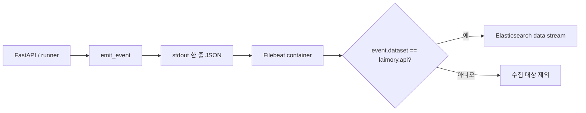

`emit_event`만 `event.dataset=laimory.api` 표식을 붙일 수 있다. Filebeat 설정은 container log의 JSON을 decode하고 이 표식이 없는 record를 drop한다.

이 구조는 다음을 보장한다.

- debug log가 dashboard cardinality를 오염시키지 않음
- exception 원문과 prompt가 Elasticsearch에 자동 축적되지 않음
- 집계 field 의미를 allowlist로 관리
- 앱이 Elasticsearch SDK나 HTTP client에 직접 의존하지 않음

정적 테스트는 앱 코드에서 직접 Elasticsearch 호출과 허용되지 않은 `httpx` 사용을 검사한다.

## 운영 이벤트 종류와 cardinality

운영 이벤트는 “몇 번 남기는가” 자체가 계약이다.

### HTTP request

요청 하나당 response start 시점에 한 건을 남긴다. method, route, status, duration, error code 같은 allowlist field를 사용한다. Request body와 사용자 title/place는 싣지 않는다.

### Server lifecycle

server 시작과 종료를 각각 운영 이벤트로 남긴다. version과 environment를 통해 어느 배포본의 수명인지 식별한다.

### Timeline task

background task 하나당 완료 이벤트 한 건을 남긴다. 최종 status, duration, event/warning count, error code, 결과 저장·callback 상태처럼 운영 판단에 필요한 정수·boolean을 사용한다.

### User Memory task

`usermemory.task.completed` 한 건으로 닫는다. 가장 먼저 볼 값은 `resultSent`다. callback이 없으므로 `false`는 App Server가 성공과 실패 어느 쪽도 받지 못했다는 뜻이다.

함께 보는 field:

- `hasExistingMemory`
- `dailyTimelineCount`
- `eventCount`
- `memoCount`
- `droppedDailyTimelineCount`
- `droppedEventCount`
- `repairAttempts`
- `schemaVersion`
- `filledFieldCount`
- `customAttributeCount`
- `serializedChars`

본문은 포함하지 않는다.

### App Server dependency

논리 request 하나당 완료 이벤트 한 건을 남기고 개별 retry는 별도 retry event로 남긴다. timeout/5xx 재시도가 여러 번 있어도 logical request 성공률과 retry 횟수를 각각 분석할 수 있다.

## Field allowlist

운영 이벤트 action마다 허용 field가 정해져 있다. allowlist 밖 값은 이벤트에 싣지 않고 field 이름만 local DEBUG로 알린다.

운영 이벤트에 넣지 않는 값:

- Timeline title/description/question
- User Memory 자연어 필드
- 장소명과 전체 주소
- notification 원문
- photo filename과 presigned URL
- prompt와 LLM response
- `taskToken`
- API key, AWS credential, Langfuse secret
- exception 원문과 traceback

## ErrorCode 연결

`ErrorCode`는 외부 실패를 식별하는 정수 catalog다. 같은 실패는 다음 경계에서 같은 code를 사용한다.

- HTTP error response
- Timeline callback
- User Memory FAILED result
- operational event
- local `report_error`
- 가능한 Langfuse observation metadata

외부 `error` 문자열은 catalog의 안전 메시지만 사용한다. 원본 exception은 local diagnostic에만 남고, credential이나 사용자 본문이 섞일 가능성이 있는 Pydantic error는 값 없이 field/type/count로 요약한다.

예약된 과거 code를 새 오류에 재사용하지 않는다. dashboard, App Server와 사용자 지원이 정수 code 의미에 의존하기 때문이다.

## Langfuse trace 구조

Langfuse는 FastAPI 운영 집계가 아니라 AI 실행 내부를 본다.

### Task trace

| Task | trace name | tag | metadata feature |
|---|---|---|---|
| Timeline | `generate-timeline` | `timeline` | `timeline` |
| User Memory | `update-user-memory` | `user-memory` | `user-memory` |

두 작업은 같은 trace에 넣지 않는다. 서로 다른 입력, timeout, 결과 의미를 가지므로 latency와 token을 분리해 분석해야 한다.

`session_id`는 `taskId`다. App Server가 taskId를 재사용하면 서로 다른 trace가 같은 session으로 묶일 수 있으므로 taskId uniqueness가 중요하다.

### Timeline Agent tree

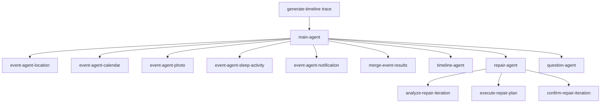

LLM generation name은 execution stage에 따라 달라진다.

- `infer-{agent}-events`
- `generate-timeline-draft`
- `analyze-timeline-repair`
- `generate-event-questions`
- `update-user-memory-profile`
- `describe-photo-images`

모든 generation이 `call-llm` 같은 이름으로 보이면 어느 기능의 latency와 token이 늘었는지 알 수 없다. 새 `ExecutionStage`를 추가하면 generation name mapping과 테스트도 함께 갱신해야 한다.

### 기록되는 진단

- provider와 model
- Agent/version 또는 release
- prompt version
- duration
- input/output token 및 SDK가 제공하는 세부 token bucket
- event/candidate/fragment/warning/question count
- structured output 또는 tool plan
- error code와 observation level

SDK가 제공하지 않은 token 종류는 0으로 추측하지 않고 비워 둔다.

## Content capture policy

Langfuse는 설정이 활성이고 public/secret key가 모두 있을 때만 client를 만든다. sampling은 `LANGFUSE_SAMPLE_RATE`로 정한다.

본문 정책은 다음 두 값이다.

### `NONE`

사용자 본문을 외부로 보내지 않는다. duration, token, count, error code 같은 diagnostics는 유지하고 payload는 byte 길이와 hash summary로 접는다. production 기본 방향이다.

### `SANITIZED`

마스킹과 payload 상한을 적용한 본문을 보낸다. local/dev에서 prompt와 중간 산출물을 debugging할 때 사용한다.

명시적 `LANGFUSE_CONTENT_CAPTURE`가 있으면 environment 기본값보다 우선한다. 값을 지정하지 않으면 local/dev는 `SANITIZED`, 그 밖은 `NONE`이다. dev에서 본문이 보이지 않으면 오래된 `NONE` 환경변수가 남아 있는지 확인해야 한다.

## Redaction

공용 redaction은 로그와 Langfuse export 경계에서 적용한다.

- credential/token pattern 마스킹
- URL과 사용자 식별 정보 제한
- 최대 payload byte 초과 시 preview + byte/hash summary
- export 직전 OpenTelemetry attribute 재검사
- `userMemory` key는 자연어 본문 대신 schema/필드 수/크기 summary
- `dailyTimelines` key는 날짜별 본문 대신 timeline/event/memo count summary

User Memory 문장은 일반 secret regex에 걸리지 않을 수 있으므로 값의 모양이 아니라 key 이름 자체로 접는다. 호출부가 snapshot 전체를 실수로 trace metadata에 넣더라도 profile과 memo가 새지 않게 한다.

Prompt generation input에는 모델 호출을 위해 실제 값이 필요하다. 이 경계는 content capture policy가 통제한다.

## 관측 실패 격리

관측은 제품 결과보다 우선하지 않는다.

- Langfuse client 생성 실패: no-op
- span/observation 시작·종료 실패: main task 계속
- Langfuse flush 실패: 결과 유지
- operational event 조립/handler 실패: task 결과 유지
- Filebeat 실패: 앱 배포와 서비스는 계속

장점은 관측 시스템 장애가 Timeline 생성을 막지 않는다는 것이다. 단점은 서비스는 성공하지만 trace나 operational event가 없는 상태가 가능하다는 것이다. 따라서 관측 경로 자체의 health를 별도로 감시해야 한다.

## EC2와 AgentCore의 차이

현재 EC2는 별도 Filebeat container가 Docker stdout을 읽는다. AgentCore로 기본 배포를 전환하면 동일 sidecar 방식이 자동으로 존재한다고 가정할 수 없다.

전환 전에 결정할 것:

- AgentCore stdout이 도착하는 CloudWatch log group
- `event.dataset=laimory.api`만 Elasticsearch로 전달하는 pipeline
- Filebeat 대신 CloudWatch subscription, Lambda, Firehose 또는 다른 collector를 쓸지
- at-least-once 전달에 따른 중복 event 처리
- Runtime version과 endpoint version을 operational field에 추가할지

Langfuse는 앱 SDK가 직접 outbound 호출하므로 AgentCore network와 secret만 허용되면 구조를 유지할 수 있다.

## 주요 코드와 설정

- `app/core/logging.py`
- `app/core/operational_logging.py`
- `app/core/langfuse_tracing.py`
- `app/core/redaction.py`
- `app/core/error_codes.py`
- `app/core/exceptions.py`
- `docs/observability/filebeat.example.yml`
- `scripts/deploy-ec2.sh`
- `docs/operational-logging.md`
- `docs/langfuse-tracing.md`

---

<!-- 원본: 09-invariants-glossary-and-known-gaps.md -->

# AI 도메인 불변식·용어·알려진 한계

## 입력과 source 불변식

- 한 Timeline task의 input response `taskId`는 접수 `taskId`와 같아야 한다.
- source는 한 건 이상이어야 하고 `rawId`는 batch 안에서 중복되지 않아야 한다.
- `rawId`는 source의 정식 식별자이며 현재 request에 있는 값만 Candidate, Fragment, event 근거가 될 수 있다.
- LLM이 잘못 붙인 `sourceType`은 `rawId`로 찾은 실제 입력 type으로 정정한다.
- 유효한 sourceRef가 하나도 없는 Candidate/event는 유지하지 않는다.
- 하나의 source가 여러 event의 근거로 사용되는 것은 허용한다.
- User Memory는 source가 아니며 `sourceRefs`에 넣지 않는다.

## 시간 불변식

- end는 start보다 빠를 수 없다.
- 접수 request의 window가 정본이다.
- window 완전 밖의 Candidate/event는 제외한다.
- window 경계에 걸친 구간은 clamp한다.
- 기상 경계를 알 때 수면 이전의 일반 event를 확정하지 않는다.
- 경계를 모르면 시간을 만들어내지 않는다.
- MEAL은 20~60분이다.
- 비캘린더 일반 event 3시간 초과는 warning으로 드러내되 코드가 임의 분할하지 않는다.
- Location-only event는 참조한 STAY/MOVEMENT 근거 시간을 벗어나지 않는다.

## 보존과 병합 불변식

- 유효한 Calendar item은 최종 Timeline에서 누락되지 않게 복원한다.
- Event Agent에 들어온 source가 Candidate 또는 Fragment로 보존됐는지 검사한다.
- Fragment만 근거로 남은 최종 event는 warning으로 드러낸다.
- 순수 STAY만 이동 없는 연속 체류 병합 대상이다.
- Calendar·Photo·Notification 의미를 긴 STAY에 무조건 흡수하지 않는다.
- Photo source는 최종 event 하나에만 귀속한다.
- 시간 겹침만으로 의미가 다른 사건을 임의로 자르거나 병합하지 않는다.

## 문장 불변식

- Timeline/Repair의 title과 description은 사용자가 읽는 일기다.
- 1인칭 해요체 과거형을 목표로 한다.
- title은 30자 이내 명사구다.
- description은 1~2문장, 100자 안팎을 목표로 한다.
- 120자 초과는 warning이다.
- 최종 문장에 `듯해요` 같은 추정 표현을 쓰지 않는다.
- 분 단위 시각과 걸음 수 같은 원본 수치를 최종 일기에 쓰지 않는다.
- 불확실성은 confidence, inferenceLevel, uncertainty로 표현한다.
- Event Agent의 사실 보고에는 최종 일기 문체 규칙을 적용하지 않는다.

## 질문 불변식

- `TimelineDraft.questions`는 내부 모호성 질문이다.
- `TimelineEventDraft.question`은 사용자 회고 유도 질문이다.
- 두 값은 목적과 저장 경계가 다르다.
- 회고 질문은 Repair 뒤 확정 event에 붙인다.
- 현재 실행 코드는 모든 event에 질문 하나를 시도한다.
- 1차에서 빠진 event만 한 번 재요청한다.
- event당 첫 유효 질문 하나만 적용한다.
- 질문은 물음표로 끝나고 255자 이하여야 한다.
- Question 실패와 누락은 Timeline 저장을 막지 않는다.

## User Memory 불변식

- User Memory는 사건 근거가 아니라 해석·표현 보조 context다.
- Timeline과 Question이 같은 projection을 사용한다.
- Event Agent와 Repair Agent에는 주입하지 않는다.
- 수집 원본과 충돌하면 원본이 우선한다.
- 갱신은 append가 아니라 전체 rewrite다.
- AI가 쓴 title/subtitle/question에서 사용자 성향을 뽑지 않는다.
- personality, values, preferences, emotionalPatterns, memoryStyle은 memo만 근거로 갱신한다.
- memo가 없는 batch에서 성향 필드를 유지하는 것은 정상 SUCCESS다.
- `schemaVersion`, `updatedAt`은 서버가 확정한다.
- 크기·민감정보 위반 문서를 코드가 잘라 저장하지 않는다.
- 실패하면 기존 User Memory를 유지한다.
- 모든 성공·실패 경로는 결과 저장 호출 정확히 한 번으로 수렴한다.
- User Memory FAILED는 DailyRecord 저장 실패가 아니다.

## 결과·상태·오류 불변식

- 저장 전 event는 title, 유효 start, 유효 시간 범위, 현재 task의 source를 하나 이상 가져야 한다.
- event가 0개여도 확정 결과로 result API에 보낼 수 있다.
- Timeline 결과 저장 성공 뒤에만 SUCCESS callback을 보낸다.
- 저장 성공 뒤 callback 실패가 결과를 FAILED로 바꾸지 않는다.
- User Memory task에는 callback이 없다.
- 같은 실패는 API, callback/result, operational event에서 같은 정수 error code를 쓴다.
- 외부 오류 문장은 catalog의 안전 메시지만 사용한다.
- App Server 401/404/409는 retry와 callback 없이 abort한다.

## 보안·관측 불변식

- `taskToken` 값은 모든 log와 Langfuse에서 금지한다.
- credential, presigned URL, notification 원문, User Memory 본문을 operational event에 넣지 않는다.
- 일반 diagnostic log는 자동으로 Elasticsearch에 수집되지 않는다.
- Elasticsearch 운영 이벤트는 action별 allowlist field만 사용한다.
- 관측 실패는 Timeline/User Memory 결과를 바꾸지 않는다.
- User Memory와 daily timeline은 본문 대신 개수·크기 summary로 관측한다.
- 단일 worker를 유지해 process-local inflight와 `/ping` 의미를 보존한다.

## 용어 사전

| 용어 | 이 프로젝트에서의 의미 |
|---|---|
| Timeline task | `taskId`로 연결되는 비동기 하루 Timeline 생성 작업. 상태는 App Server 소유 |
| Timeline trigger | `taskId`, 최초 `taskToken`, `dailyRecordId`, 정본 window를 전달하는 202 요청 |
| Timeline window | 생성 대상 시간 범위. 접수 request 값이 정본 |
| Collected snapshot | App Server input response를 내부 형태로 옮긴 하루 source 묶음 |
| Source item | STAY, MOVEMENT, CALENDAR, HEALTH, NOTIFICATION, PHOTO 원본 한 건 |
| `rawId` | source의 정식 UUID 식별자이자 근거 연결 key |
| Normalized request | source를 domain별 list로 분리한 `TimelineDraftRequest` |
| Event Agent | 한 source domain을 사실 중심으로 Candidate/Fragment로 해석하는 Agent |
| Candidate | event가 될 근거가 충분한 중간 산출물 |
| Fragment | 단독 event에는 약하지만 다른 source와 결합할 수 있는 보조 단서 |
| SourceRef | 어떤 `rawId`를 왜 근거로 사용했는지 나타내는 참조 |
| Timeline Agent | Candidate/Fragment를 실제 사건 단위로 의미 병합하는 Agent |
| Timeline draft | event, 내부 질문, warning, 판단 metadata를 가진 편집 가능한 내부 결과 |
| Timeline event | 사용자가 읽는 하루의 사건 단위 |
| `clientEventId` | draft 내부의 `event-NNN` ID. 병합·삭제 후 코드가 다시 부여하며 저장 결과에는 보내지 않음 |
| Repair Agent | 코드 확정과 제한된 LLM tool 개선을 결합하는 Agent |
| Confirm pass | `repair_draft`와 Fragment 검사를 실행해 불변식을 재적용하는 단계 |
| Guard | 특정 불변식을 검사·보정하거나 warning으로 드러내는 결정론 service |
| 내부 모호성 질문 | `TimelineDraft.questions`, 시간·장소 불확실성을 나타내는 내부 값 |
| 회고 유도 질문 | event의 `question`, 사용자가 경험·감정·이유를 기록하게 하는 질문 |
| Warning | 복구 가능한 누락·충돌·품질 문제. task 실패와 다름 |
| Confidence | Candidate/event의 확신도 0~1 |
| Inference level | DIRECT, EVIDENCE_BASED, INFERRED, UNCERTAIN 근거 수준 |
| User Memory | 사용자 압축 profile v1.0. 사건이 아닌 보조 context |
| Daily timeline | User Memory 갱신에 쓰는 하루치 확정 Timeline |
| `memo` | 사용자가 직접 쓴 event 글이며 성향 필드의 유일한 근거 |
| Rewrite | 기존 User Memory를 통째로 대체하는 새 전체 문서 |
| App Server | source, Timeline 결과, User Memory, task 상태의 외부 소유자 |
| TaskToken | 한 task의 서버간 인증 token holder. 값은 header로만 전송 |
| Callback | Timeline의 SUCCESS/FAILED terminal 상태 통보. 결과 body 저장과 다름 |
| 운영 이벤트 | Elasticsearch 집계를 위해 allowlist된 stdout JSON event |
| Langfuse trace | Agent tree, LLM generation, token·latency와 정책에 따른 본문 관측 |

## 현재 알려진 한계

### Task 실행과 복구

- FastAPI BackgroundTasks는 durable queue가 아니다.
- process 종료 후 실행 중 task를 다른 worker가 이어받지 않는다.
- AI 서버에는 task 상태 조회나 재처리 persistence가 없다.
- App Server의 idempotency와 DB transaction은 이 저장소에서 확인할 수 없다.

### Concurrency와 health

- inflight가 process-local이라 multi-worker/multi-replica busy를 합산하지 못한다.
- 20분 이상 작업은 EC2 idle wait를 넘겨 배포를 실패시킬 수 있다.
- drain이나 task migration이 없다.

### Timeline 품질

- 1인칭·해요체·문장 자연스러움은 코드가 의미적으로 완전 판정하지 못한다.
- 실제 provider 품질은 live LLM 평가 없이는 보장할 수 없다.
- `TimelineDraft.userId`는 내부 placeholder이며 result 계약에 보내지 않는다.
- 접수 window 역전이 endpoint에서 거절되지 않는 known gap이 있다.

### User Memory

- 소비 경로는 준비돼 있지만 App Server가 실제 input response에 profile을 채워 보내는지는 이 저장소만으로 확인할 수 없다.
- 1,000 token 요구를 1,200 serialized character로 구현한 것은 provider 독립성을 위한 프로젝트 규칙이며 표준이 아니다.
- 소비 측에는 별도 전체 token 상한이 없고 field별 길이와 customAttributes 개수만 schema가 강제한다.
- AI가 쓴 문장과 memo의 의미 구분은 prompt가 지키며 코드가 자연어 출처를 의미적으로 판정하지 않는다.

### 모델과 provider

- model availability, quota, 가격은 저장소 밖의 시점 의존 정보다.
- 실제 provider 간 품질·비용 비교 결과는 아직 평가 전이다.
- prompt가 GPT 기준으로 개선됐으므로 다른 모델에서 동일 품질을 가정할 수 없다.

### 배포

- 현재 EC2 workflow에는 unit/integration test gate가 없다.
- 별도 수동 승인 environment gate가 없다.
- AgentCore가 언제 기본 경로가 되는지 자동 cutover 기준은 아직 없다.
- AgentCore scale-in과 FastAPI background task 수명 보장은 별도 검증이 필요하다.

### 관측

- Elasticsearch index template, dashboard, retention은 저장소 밖에서 관리한다.
- Filebeat 실패가 앱 배포를 막지 않아 관측 공백이 생길 수 있다.
- Langfuse는 optional이고 sampling이 1 미만이면 모든 task trace가 존재하지 않는다.
- local stdout 보존과 접근 통제는 host 운영 설정에 의존한다.
- AgentCore 전환 후 Filebeat와 동등한 Elasticsearch 전달 경로가 아직 확정되지 않았다.

## 변경 검토 체크리스트

AI 관련 변경 전후에 다음을 확인한다.

- LLM이 선택하지 않아도 반드시 실행돼야 하는 규칙을 tool로만 옮기지 않았는가?
- User Memory를 새 Agent에 주입해 사건 근거로 오인하게 만들지 않는가?
- 질문이 Repair보다 앞서 생성되지 않는가?
- merge 뒤에 실행해야 할 Photo/Notification/길이 검사를 앞으로 옮기지 않았는가?
- 결과 저장과 callback 순서를 바꾸지 않았는가?
- User Memory 실패 경로에서 결과 저장 호출이 빠지지 않는가?
- 새 operational field에 사용자 본문이나 secret이 들어가지 않는가?
- 새 execution stage에 Langfuse generation name을 추가했는가?
- worker 수나 replica 변화가 `/ping` busy 의미를 깨뜨리지 않는가?
- 모델 비교에서 prompt version과 fixture를 동일하게 유지했는가?

---