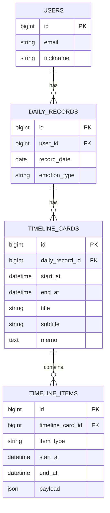
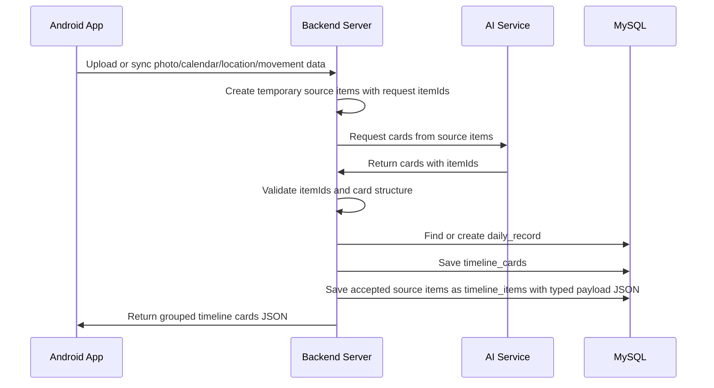
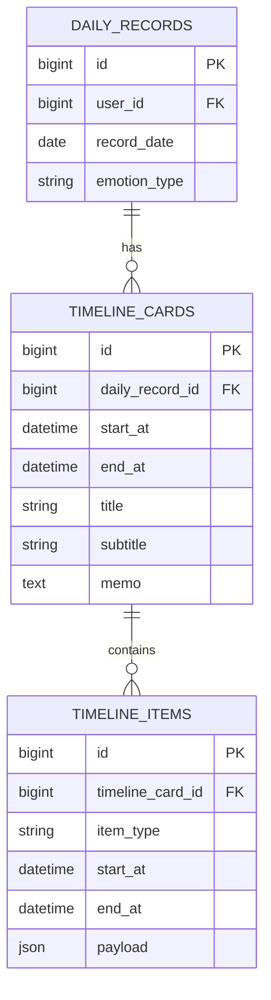
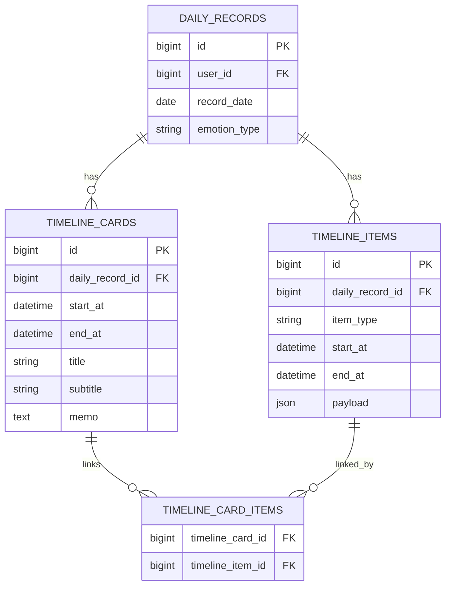

# Timeline Card Grouping And Typed Payload Design

## Context

Laimory's timeline is not just a flat list of independent events.

Some cards contain a single event, while other cards are grouped around a time range. For example, a calendar event from 13:00 to 16:00 may include photos, location data, and movement data from that same period.

Because users can write a memo on the grouped card, the card itself must be persisted. The source events inside the card should remain as separate timeline items.

The difficult design question is how to store heterogeneous `timeline_items` such as:

```text
PHOTO
CALENDAR
LOCATION
MOVEMENT

Future:
PAYMENT
CALL
MESSAGE
APP_USAGE
HEALTH
MUSIC
```

## Current Decision

Use this MVP structure:

```text
daily_records
timeline_cards
timeline_items
```

Use JSON in the DB for `timeline_items.payload`, but do not treat it as an untyped `Map<String, Object>` in Java.

`timeline_items` are not the raw archive of every source item received from Android. They are the accepted events that the AI placed into persisted timeline cards.

Before persistence, Android/source data is handled as temporary source items. After AI card generation and server validation, only source items included in valid cards are saved as `timeline_items`.

Instead:

```text
DB storage:
timeline_items.payload JSON

Java application model:
sealed interface TimelineItemPayload
record PhotoPayload(...)
record CalendarPayload(...)
record LocationPayload(...)
record MovementPayload(...)
```

This keeps DB schema flexible while preserving type safety in application code.

## MVP ERD



## Table Meanings

```text
daily_records
= one daily record for a user and date
= stores the representative emotion for the whole day

timeline_cards
= the persisted card unit shown to the user
= stores card title, subtitle, and user memo

timeline_items
= source events inside a card
= accepted source events inside a card
= stores common time fields and typed JSON payload
= each item belongs to exactly one timeline card
```

## Why Payload JSON Is Still Acceptable

The DB does not need a new table every time a new source type is introduced.

The important rule is:

```text
Frequently searched, filtered, sorted, or joined values should become normal columns.
Flexible, sparse, source-specific payload values can stay in JSON.
```

For the MVP, timeline grouping and display primarily need:

```text
timeline_card_id
item_type
start_at
end_at
payload
```

The backend usually reads timeline items as a bundle for one card or one day. It does not initially need to search deeply inside every payload field.

Because only AI-accepted source items become `timeline_items`, the system does not need to preserve every raw source item in this table.

## Why Not Map<String, Object>

Do not model `payload` as a raw map in Java:

```java
Map<String, Object> payload;
```

Problems:

```text
payload.get("lat") typo is not caught by the compiler
payload.get("latitude") may be String in one place and Double in another
required fields are implicit
renaming a payload key is easy to miss
switching by item type still requires manual casting
test coverage has to catch mistakes that the type system could catch
```

This is the main human-error risk.

The problem is not JSON itself. The problem is untyped JSON.

## Typed Payload Model

Use Java 21 sealed interface and records.

```java
public sealed interface TimelineItemPayload
        permits PhotoPayload, CalendarPayload, LocationPayload, MovementPayload {

    TimelineItemType itemType();
}

public record PhotoPayload(
        String photoUri,
        Double latitude,
        Double longitude
) implements TimelineItemPayload {
    @Override
    public TimelineItemType itemType() {
        return TimelineItemType.PHOTO;
    }
}

public record CalendarPayload(
        String title,
        String calendarName,
        String locationText,
        Integer attendeesCount
) implements TimelineItemPayload {
    @Override
    public TimelineItemType itemType() {
        return TimelineItemType.CALENDAR;
    }
}

public record LocationPayload(
        String placeName,
        String areaName,
        Double latitude,
        Double longitude
) implements TimelineItemPayload {
    @Override
    public TimelineItemType itemType() {
        return TimelineItemType.LOCATION;
    }
}

public record MovementPayload(
        String fromPlace,
        String toPlace,
        String transportMode,
        String lineName
) implements TimelineItemPayload {
    @Override
    public TimelineItemType itemType() {
        return TimelineItemType.MOVEMENT;
    }
}
```

Then `TimelineItem` can store the payload as a typed object:

```java
@Entity
public class TimelineItem {

    @Enumerated(EnumType.STRING)
    private TimelineItemType itemType;

    private LocalDateTime startAt;
    private LocalDateTime endAt;

    @JdbcTypeCode(SqlTypes.JSON)
    private TimelineItemPayload payload;

    protected TimelineItem() {
    }

    public static TimelineItem of(
            TimelineCard card,
            LocalDateTime startAt,
            LocalDateTime endAt,
            TimelineItemPayload payload
    ) {
        TimelineItem item = new TimelineItem();
        item.timelineCard = card;
        item.itemType = payload.itemType();
        item.startAt = startAt;
        item.endAt = endAt;
        item.payload = payload;
        return item;
    }
}
```

The factory method prevents this mismatch:

```text
item_type = PHOTO
payload = CalendarPayload
```

because `itemType` is derived from `payload.itemType()`.

## Save Flow

```text
Android sends or syncs source data
-> backend converts source data into temporary source items
-> backend assigns request-scoped itemIds to source items
-> backend sends source items to AI
-> AI returns cards with itemIds
-> backend validates AI response
-> backend creates timeline_cards
-> backend creates typed payload records only for accepted source items
-> backend creates TimelineItem through factory method with timeline_card_id
-> Hibernate/Jackson serializes typed payload into JSON
-> MySQL stores payload in JSON column
```

Example:

```java
PhotoPayload payload = new PhotoPayload(
        "content://media/external/images/media/12345",
        37.5445,
        127.0557
);

TimelineItem item = TimelineItem.of(
        card,
        LocalDateTime.parse("2026-05-08T12:42:00"),
        null,
        payload
);

timelineItemRepository.save(item);
```

DB shape:

```text
timeline_items
id | timeline_card_id | item_type | start_at            | end_at | payload
1  | 102              | PHOTO     | 2026-05-08 12:42:00 | null   | {...}
```

Payload JSON:

```json
{
  "itemType": "PHOTO",
  "photoUri": "content://media/external/images/media/12345",
  "latitude": 37.5445,
  "longitude": 127.0557
}
```

## Read Flow

When reading from DB:

```text
MySQL returns JSON payload
-> Hibernate/Jackson deserializes JSON into TimelineItemPayload subtype
-> Java code switches on typed payload
```

Example:

```java
String label = switch (item.getPayload()) {
    case PhotoPayload p -> "사진";
    case CalendarPayload c -> c.title();
    case LocationPayload l -> l.placeName();
    case MovementPayload m -> m.fromPlace() + " -> " + m.toPlace();
};
```

When a new payload subtype is added, the sealed interface helps make missing cases visible in code that uses exhaustive switch expressions.

## Sequence Diagram



## AI Card Generation Contract

The server sends source items to AI. These source items are not DB rows yet.

The `itemId` used in the AI request is not the database primary key. It is the zero-based index of the source item in the request `items` array, so that the AI can refer to source items in its card proposal.

Example AI request shape:

```json
{
  "recordDate": "2026-05-08",
  "items": [
    {
      "itemId": 0,
      "type": "MOVEMENT",
      "startAt": "2026-05-08T08:30:00",
      "endAt": "2026-05-08T09:10:00",
      "summary": "강남역에서 성수역으로 7호선 이동"
    },
    {
      "itemId": 1,
      "type": "CALENDAR",
      "startAt": "2026-05-08T10:00:00",
      "endAt": "2026-05-08T11:00:00",
      "summary": "주간 회의, 회의실 A, 참석자 4명"
    },
    {
      "itemId": 2,
      "type": "LOCATION",
      "startAt": "2026-05-08T12:30:00",
      "endAt": "2026-05-08T13:20:00",
      "summary": "성수동 작은 카페 체류"
    },
    {
      "itemId": 3,
      "type": "PHOTO",
      "startAt": "2026-05-08T12:42:00",
      "endAt": null,
      "summary": "성수동 작은 카페 위치에서 찍은 사진"
    }
  ]
}
```

AI returns card proposals using `itemIds`, not full item objects.

```json
{
  "cards": [
    {
      "title": "출근길",
      "subtitle": "강남역 -> 성수역 · 7호선",
      "startAt": "2026-05-08T08:30:00",
      "endAt": "2026-05-08T09:10:00",
      "itemIds": [0]
    },
    {
      "title": "주간 회의",
      "subtitle": "1시간 · 김PM 외 3명",
      "startAt": "2026-05-08T10:00:00",
      "endAt": "2026-05-08T11:00:00",
      "itemIds": [1]
    },
    {
      "title": "성수동 카페에서 보낸 점심시간",
      "subtitle": "작은 카페 · 사진 1장",
      "startAt": "2026-05-08T12:30:00",
      "endAt": "2026-05-08T13:20:00",
      "itemIds": [2, 3]
    }
  ]
}
```

Server validation rules:

```text
Every returned itemId must exist in the request source items.
Every returned itemId must be an integer where 0 <= itemId < items.length.
One accepted itemId can belong to only one card.
Cards with empty itemIds are rejected.
Source items omitted by AI are not persisted as timeline_items.
```

Interpretation:

```text
timeline_items are not raw source items.
timeline_items are accepted source events inside persisted cards.
An omitted source item has no persisted timeline item identity in the MVP.
```

## ID Strategy Before DB Insert

The AI needs IDs to refer to source items before those items are stored in `timeline_items`.

Do not solve this by inserting all source items first with nullable `timeline_card_id`.

Rejected approach:

```text
1. Insert all source items into timeline_items with timeline_card_id = null.
2. Send their DB IDs to AI.
3. Save cards.
4. Update accepted items with timeline_card_id.
5. Delete unassigned items.
```

Why this is not preferred for MVP:

```text
timeline_items would temporarily contain rows that are not valid timeline items.
AI failure could leave orphan rows unless cleanup is perfect.
The table would mix raw source items and accepted timeline items.
It weakens the rule that a persisted timeline_item must belong to exactly one card.
It requires nullable timeline_card_id even though the final domain rule says it should be required.
```

Preferred approach:

```text
1. Keep source items in memory or request-local structures before persistence.
2. Use the source item's zero-based array index as its request-scoped itemId.
3. Send those itemIds to AI.
4. Validate AI response.
5. Save timeline_cards.
6. Save only accepted source items as timeline_items with non-null timeline_card_id.
```

The request `itemId` and the DB `timeline_items.id` are different concepts:

```text
request itemId
= zero-based source item array index used only between backend and AI

timeline_items.id
= database primary key created when an accepted source item is persisted
```

The backend must keep the source item list order stable until AI response validation is complete. In code, validation can resolve an accepted source item by `sourceItems.get(itemId)`.

If keeping the same ID before and after insert becomes important later, the system can use application-generated UUID/ULID IDs for `timeline_items`. The MVP does not require that.

## Example Data

### users

```json
{
  "id": 1,
  "email": "user@example.com",
  "nickname": "수현"
}
```

### daily_records

```json
{
  "id": 10,
  "user_id": 1,
  "record_date": "2026-05-08",
  "emotion_type": "HAPPY"
}
```

### timeline_cards

```json
[
  {
    "id": 100,
    "daily_record_id": 10,
    "start_at": "2026-05-08T08:30:00",
    "end_at": "2026-05-08T09:10:00",
    "title": "출근길",
    "subtitle": "강남역 -> 성수역 · 7호선",
    "memo": "7호선이 평소보다 많이 붐볐다."
  },
  {
    "id": 101,
    "daily_record_id": 10,
    "start_at": "2026-05-08T10:00:00",
    "end_at": "2026-05-08T11:00:00",
    "title": "주간 회의",
    "subtitle": "1시간 · 김PM 외 3명",
    "memo": "회의에서 다음 스프린트 방향이 조금 더 선명해졌다."
  },
  {
    "id": 102,
    "daily_record_id": 10,
    "start_at": "2026-05-08T12:30:00",
    "end_at": "2026-05-08T13:20:00",
    "title": "성수동 · 작은 카페",
    "subtitle": null,
    "memo": "오랜만에 만난 고등학교 친구와 편하게 라떼를 마셨다."
  }
]
```

### timeline_items

```json
[
  {
    "id": 1000,
    "timeline_card_id": 100,
    "item_type": "MOVEMENT",
    "start_at": "2026-05-08T08:30:00",
    "end_at": "2026-05-08T09:10:00",
    "payload": {
      "itemType": "MOVEMENT",
      "fromPlace": "강남역",
      "toPlace": "성수역",
      "transportMode": "SUBWAY",
      "lineName": "7호선"
    }
  },
  {
    "id": 1001,
    "timeline_card_id": 101,
    "item_type": "CALENDAR",
    "start_at": "2026-05-08T10:00:00",
    "end_at": "2026-05-08T11:00:00",
    "payload": {
      "itemType": "CALENDAR",
      "title": "주간 회의",
      "calendarName": "회사",
      "locationText": "회의실 A",
      "attendeesCount": 4
    }
  },
  {
    "id": 1002,
    "timeline_card_id": 102,
    "item_type": "LOCATION",
    "start_at": "2026-05-08T12:30:00",
    "end_at": "2026-05-08T13:20:00",
    "payload": {
      "itemType": "LOCATION",
      "placeName": "작은 카페",
      "areaName": "성수동",
      "latitude": 37.5445,
      "longitude": 127.0557
    }
  },
  {
    "id": 1003,
    "timeline_card_id": 102,
    "item_type": "PHOTO",
    "start_at": "2026-05-08T12:42:00",
    "end_at": null,
    "payload": {
      "itemType": "PHOTO",
      "photoUri": "content://media/external/images/media/12345",
      "latitude": 37.5445,
      "longitude": 127.0557
    }
  }
]
```

## Example API Response

The server can return grouped timeline cards to Android:

```json
{
  "recordDate": "2026-05-08",
  "emotionType": "HAPPY",
  "cards": [
    {
      "id": 100,
      "startAt": "2026-05-08T08:30:00",
      "endAt": "2026-05-08T09:10:00",
      "title": "출근길",
      "subtitle": "강남역 -> 성수역 · 7호선",
      "memo": "7호선이 평소보다 많이 붐볐다.",
      "items": [
        {
          "id": 1000,
          "itemType": "MOVEMENT",
          "startAt": "2026-05-08T08:30:00",
          "endAt": "2026-05-08T09:10:00",
          "payload": {
            "itemType": "MOVEMENT",
            "fromPlace": "강남역",
            "toPlace": "성수역",
            "transportMode": "SUBWAY",
            "lineName": "7호선"
          }
        }
      ]
    }
  ]
}
```

## Grouping Policy Draft

Initial AI-assisted grouping rule:

```text
1. Receive source events for a user and date.
2. Convert them into temporary source items.
3. Use each source item's array index as its request-scoped itemId.
4. Send source items to AI and ask for card proposals.
5. AI returns cards with title, subtitle, time range, and itemIds.
6. Server validates that itemIds exist and are not duplicated across cards.
7. Save timeline_cards.
8. Save accepted source items as timeline_items with timeline_card_id and typed payload JSON.
9. Do not persist omitted source items as timeline_items.
```

Stability rule:

```text
Cards with user-entered memo should not be casually deleted or regrouped.
Regeneration policy for memo-bearing cards needs a separate decision.
```

## Option Comparison

This section compares payload storage options for heterogeneous `timeline_items`.

### Option A: Only JSON with Map<String, Object>

DB:

```text
timeline_items.payload JSON
```

Java:

```java
Map<String, Object> payload;
```

Pros:

- fastest to implement
- very flexible
- no schema migration for new item types

Cons:

- weak type safety
- typo-prone JSON keys
- implicit field contracts
- runtime casting and runtime errors
- hard to refactor safely
- validation burden is high

Interpretation:

```text
Too loose for Laimory's core timeline model.
Good for quick experiments, not ideal for persisted domain data.
```

### Option B: DB Inheritance / Typed Detail Tables

DB:

```text
timeline_items
photo_items
calendar_items
location_items
movement_items
```

Java:

```java
@Inheritance(strategy = InheritanceType.JOINED)
abstract class TimelineItem
```

Pros:

- strongest DB-level type constraints
- subtype fields can use normal columns
- good for frequent subtype-specific filtering and joins
- natural domain model if subtype behavior is complex

Cons:

- more tables
- more joins
- new item types require migrations
- polymorphic ORM mapping can become complex
- broad timeline reads may become heavier

Interpretation:

```text
Useful later if a subtype becomes query-heavy or needs DB-level constraints.
Too heavy for the current MVP and expected item-type expansion.
```

### Option C: Typed Payload JSON

DB:

```text
timeline_items.payload JSON
```

Java:

```java
sealed interface TimelineItemPayload
record PhotoPayload(...) implements TimelineItemPayload
record CalendarPayload(...) implements TimelineItemPayload
```

Pros:

- one simple timeline item table
- flexible for future item types
- avoids table explosion during MVP
- much safer than `Map<String, Object>`
- Java compiler helps catch missing subtype handling
- payload object creation reduces key typo mistakes
- fits the rule that only AI-accepted source items become persisted timeline items

Cons:

- DB does not fully enforce payload shape
- payload fields are not naturally indexed
- manual SQL can still insert bad JSON unless guarded
- needs careful Jackson/Hibernate configuration and tests

Interpretation:

```text
Best current fit for Laimory MVP.
It preserves DB flexibility while making application code type-safe enough.
```

## DB ERD Comparison

This section compares relationship structures for `timeline_cards` and `timeline_items`.

### ERD Option 1: Card owns items directly

Shape:

```text
daily_records
  -> timeline_cards
       -> timeline_items
```

ERD:



Interpretation:

```text
timeline_items are persisted only after AI card generation.
Each timeline_item belongs to exactly one timeline_card.
Source items omitted by AI are not saved.
```

Pros:

- simplest ERD
- simplest query path for rendering a card with its items
- matches the MVP rule that each accepted item belongs to exactly one card
- avoids join table overhead
- fits the idea that `timeline_items` are accepted events, not raw source archives

Cons:

- source items are not preserved if AI omits them
- an item cannot appear in multiple cards
- AI regeneration must be careful with existing memo-bearing cards
- if raw source preservation becomes important, another table or archive layer may be needed

Current decision:

```text
Use this option for MVP.
```

### ERD Option 2: Daily record owns items and cards separately

Shape:

```text
daily_records
  -> timeline_items
  -> timeline_cards
       -> timeline_card_items
```

ERD:



Interpretation:

```text
timeline_items are persisted source events for the day.
timeline_cards are AI/user grouping results that reference items.
One item can be linked to multiple cards if needed.
```

Pros:

- preserves source events even if AI omits them
- better for AI regeneration and multiple card versions
- better provenance tracking between AI cards and source items
- supports one item appearing in multiple cards

Cons:

- more tables and joins
- more complex persistence flow
- conflicts with the current MVP interpretation that omitted source items have no saved timeline item identity
- overbuilt if each item belongs to exactly one card

Decision:

```text
Do not use for MVP.
Consider later if source event preservation, multi-card references, or AI regeneration history become important.
```

## Promotion Rule

Start with typed payload JSON.

Promote a payload field to a normal column, generated column, or typed detail table only when one of these becomes true:

```text
The field is frequently used in WHERE conditions.
The field is frequently used in ORDER BY.
The field is frequently joined with another table.
The field needs a DB-level NOT NULL, UNIQUE, FK, or CHECK-like constraint.
The subtype becomes large enough to deserve its own lifecycle.
```

Examples:

```text
If location search becomes core:
promote latitude/longitude or place_id.

If payment search becomes core:
promote merchant_name, amount, or payment_category.

If call/contact relation becomes core:
create call_items or contact relation tables.
```

## Stability And Consistency Rules

### 1. One daily record per user and date

`daily_records` must enforce one row per user per date.

Required constraint:

```sql
UNIQUE (user_id, record_date)
```

Reason:

```text
A user should not have two separate daily_records for the same record_date.
The application can safely find-or-create the daily record by (user_id, record_date).
```

### 2. Write cards and items in one transaction

Saving a generated daily timeline must be atomic.

The current logical flow contains separate steps:

```text
Save timeline_cards
Save timeline_items
```

These must be executed inside one database transaction.

Reason:

```text
If card insert succeeds but item insert fails, the day can end up with empty or partially filled cards.
If old draft cards are deleted and new cards are inserted, delete-old + insert-new must succeed or fail as one unit.
```

Transaction boundary:

```text
Outside transaction:
- build source items
- call AI
- validate AI response

Inside transaction:
- find or create daily_record
- apply status/regeneration rules
- delete old draft cards/items when allowed
- insert timeline_cards
- insert timeline_items
- update daily_record status/emotion when needed
```

Spring implementation note:

```java
@Transactional
public DailyTimelineResult persistGeneratedTimeline(...) {
    // DB writes only
}
```

AI calls should not run inside the DB transaction.

### 3. Cascade delete card items

`timeline_items.timeline_card_id` should be required.

Required relationship:

```text
timeline_items.timeline_card_id NOT NULL
timeline_items.timeline_card_id -> timeline_cards.id
```

If timeline cards are deleted during allowed draft regeneration, their items must be deleted as well.

Required delete behavior:

```sql
ON DELETE CASCADE
```

Reason:

```text
If timeline_cards are deleted without cascading to timeline_items, orphan timeline_items can remain.
Because each timeline_item belongs to exactly one timeline_card in the MVP, deleting the card should delete its items.
```

### 4. Incremental source item append policy

If the same user/date receives additional source data after a daily record already exists, the system should not blindly regenerate the whole day.

MVP rule:

```text
Existing timeline_cards must not be modified automatically.
Existing timeline_items must not be modified automatically.
Existing card memo must not be modified automatically.
Existing card title/subtitle must not be modified automatically.
```

Instead, the backend should process only newly received source items.

Recommended flow:

```text
1. Find existing daily_record by (user_id, record_date).
2. Keep existing cards and items unchanged.
3. Convert only newly received source data into request source items.
4. Ask AI to create card proposals for the new source items only.
5. Save new timeline_cards and timeline_items in one transaction.
6. Append the new cards to the existing day.
```

Reason:

```text
Users may already have read, edited, or written memo on existing cards.
Regenerating the whole day can destroy user trust by changing title, subtitle, memo context, or item grouping.
Appending new cards is safer for MVP.
```

Open issue:

```text
If a new source item semantically belongs to an existing card, the MVP still avoids automatic merge.
Manual merge or AI-assisted merge can be considered later.
```

## Current Recommendation

For Laimory MVP:

```text
Use timeline_items.payload JSON in MySQL.
Do not use raw Map<String, Object>.
Use Java 21 sealed interface + record payload types.
Derive item_type from payload.itemType() to avoid mismatch.
Treat Android/source data before AI as temporary source items, not timeline_items.
Use zero-based request itemIds for AI card proposals before DB insert.
Persist only source items that AI includes in valid timeline cards.
Keep card title/subtitle/memo in timeline_cards.
Keep day-level emotion in daily_records.
```

Java 21 + Spring Boot 3.5.x + Hibernate 6.x is enough for this approach. Java 25 or Spring Boot 4.0.x is not required for this design.

## Open Questions

- Should `payload.itemType` be duplicated inside JSON, or is the `timeline_items.item_type` column enough for deserialization?
- Should `timeline_cards.title` and `timeline_cards.subtitle` be editable by the user, or only generated by the server?
- Should AI be allowed to omit important source items, or should server add validation rules for minimum coverage by type?
- How should overlapping calendar events be represented in source item summaries?
- Should card-level visibility be added later, or is item-level omission enough for the MVP?
- How should regeneration work when some existing cards already have user memo?
