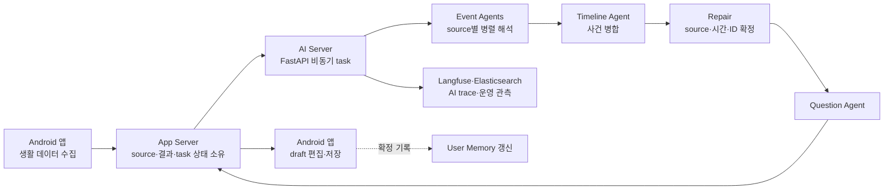

# Laimory 중간보고서 목차별 작성 가이드 초안

## Scope

AI·SW마에스트로 중간보고서의 필수 목차에 맞춰 Laimory 기획심의 원안, 공식 평가의견, 2026-07-28~08-06 alpha test 회의, 2026-08-09 AI 시스템 문서를 연결한다. 이 문서는 사용자가 검토·정제하기 전의 raw 초안이며, 승인 전에는 wiki knowledge page로 취급하지 않는다.

## Overall Narrative

중간보고서의 핵심은 기능 목록이 아니라 다음 변화와 검증을 증명하는 것이다.

> 기획심의 당시에는 모바일 생활 데이터를 자동 연결해 Timeline, 여러 회고, 장기기억과 AI 대화까지 제공하는 Personal AI Memory를 제안했다. 심의에서 permission 이전의 즉시 가치, background data 안정성, 차별성과 신뢰, 제한된 source의 유용성, AI의 구체적 부가가치, On-device SLM의 실현 가능성과 장기 retention 검증을 요구받았다. 이후 핵심 경험을 수정 가능한 일간 Timeline으로 좁혀 MVP를 구현했고, alpha test에서 source ID, structured output, 날짜·시간, 사진·위치 정책, callback, latency와 외부 API 병목을 발견했다. 중간점검 이후에는 제품 행동 지표와 기술 품질 지표로 문제를 측정하며 반복 개선한다.

각 목차는 가능하면 다음 네 요소를 포함한다.

1. 기획심의 당시 가설
2. 공식 평가의견 또는 실제 문제
3. 현재 구현·검증 증거
4. 남은 문제와 다음 지표

## 1. 프로젝트 요약

### 프로젝트명

권장 한 줄:

> **(Laimory) 흩어진 모바일 생활 데이터를 하루의 기억으로 만들어주는 AI 일간 회고 서비스**

### 프로젝트 소개

3줄 이내에서 Android, 입력 source, 수정 가능한 결과를 모두 보여준다.

> Laimory는 사진·위치·캘린더 등 모바일 생활 데이터를 연결해 사용자의 하루 Timeline 초안을 자동 생성하는 Android 서비스다. 사용자는 AI가 만든 초안을 확인하고 잘못된 내용을 수정·삭제한 뒤 메모를 더해 하루 기록을 완성한다. 기획심의 이후 넓은 Personal AI Memory 비전에서 일간 기억 복원 경험으로 MVP를 좁혀 구현·검증하고 있다.

### 기술 키워드

- 생성형 AI
- Multi-Agent
- Structured Output
- Android life logging
- LLM evaluation·observability

### ICT 연구개발 기술분류

공식 평가의견의 `소프트웨어 - 기반 SW`를 사용한다. 제출 시스템의 표기와 일치하는지 마지막에 확인한다.

### 목적 및 필요성

> 회고하고 싶지만 매일 일기를 쓰기 어려운 사용자는 사진·위치·일정처럼 이미 남아 있는 데이터를 직접 찾아 하루를 복원해야 한다. Laimory는 이 회상·정리 비용을 줄이고 사용자가 짧은 시간 안에 “오늘 내가 이렇게 보냈지”라는 기억 복원 경험을 얻도록 돕는다.

### 프로젝트 개요

> 사용자가 허용한 사진·위치·캘린더 등 source를 수집하고, AI가 source 근거를 보존한 Timeline draft를 생성한다. 사용자는 event를 열람·수정·삭제하고 메모를 추가해 기록을 저장한다. 현재는 Timeline 품질, source 정합성, 생성 안정성과 사용자의 열람·수정·저장 행동을 중심으로 검증한다.

### 프로젝트 수행 방안

> Android, App Server, AI Server를 분리해 개발하고 실제 일상 데이터로 end-to-end alpha test를 반복한다. prompt에만 의존하지 않고 구조 검증과 결정론적 Repair를 적용하며, 모델·prompt·정책을 같은 fixture에서 비교할 수 있는 평가 체계를 구축한다.

### 결과물 활용방안 및 기대효과

> 기본 Timeline과 일간 회고로 기록 부담을 줄이고, 사용자가 확정한 기록이 축적된 뒤에 장기 pattern 분석과 개인화 기능으로 확장한다. 다운로드가 아니라 Timeline 생성·열람·수정·저장과 재방문 행동으로 제품 가치를 판단한다.

## 2. 목적 및 필요성

### 문제인식

세 단락으로 구성한다.

1. **기록하고 싶지만 지속하기 어렵다.** 직접 입력형 일기는 회상·정리·작성 비용 때문에 기록 피로가 크다.
2. **생활 데이터는 존재하지만 파편화돼 있다.** 사진·위치·일정은 각 서비스에 남아 있으나 하루의 사건으로 연결돼 있지 않다.
3. **자동화만으로는 부족하다.** 사용자가 민감 permission을 줄 만큼의 즉시 가치, 별도 앱에 데이터를 맡길 신뢰, 반복 사용 이유가 필요하다.

기획심의 당시 시장 통계는 최신성과 원출처를 다시 검증한 값만 사용한다. 검증되지 않은 시장 숫자보다 사용자 문제와 현재 실험 질문을 우선한다.


### 기획의도

- AI가 완성된 일기를 대신 작성하는 것이 아니라 기억을 떠올릴 수 있는 draft를 만든다.
- 자동 생성 결과를 정답으로 취급하지 않고 수정·삭제 가능한 구조로 제공한다.
- 초기 MVP는 사진·위치·캘린더 중심의 일간 Timeline과 저장 경험에 집중한다.
- 여러 회고, Personal AI Chat과 장기 분석은 핵심 경험 검증 뒤의 확장 단계로 분리한다.
- permission은 필요한 순간과 제공 가치에 맞춰 단계적으로 요청하는 방향을 검증한다.

Persona를 기존 30대 직장인에서 20대 Android 사용자로 좁혔다면 인터뷰·테스트 모집 가능성·Android data 접근성 등 선택 근거를 적는다. 근거가 아직 약하면 `우선 검증 persona`라고 표현한다. 50대 active senior·자서전은 공식 평가의 대안 제안으로 기록하되 채택된 결정으로 쓰지 않는다.

## 3. 프로젝트 개요

### 프로젝트 소개

사용자 경험을 다음 순서로 설명하고 앱 화면 또는 prototype으로 시각화한다.

> source 연결 → 하루 Timeline 생성 → event 확인·수정·삭제 → memo 추가 → 기록 저장 → 이후 개인화

제품의 핵심 가치 순간은 모든 기능을 사용한 뒤가 아니라 생성된 Timeline을 보고 자기 하루를 떠올리는 순간으로 정의한다.

### 주요 기능

| 기능 | 중간보고서 내용 | 증거 |
|---|---|---|
| 생활 데이터 수집 | 사진·위치·캘린더 등 사용자가 허용한 source를 하루 단위 입력으로 구조화 | 수집 화면, permission 흐름, 실제 payload |
| AI 일간 Timeline | source별 Event Agent 결과를 사건 단위로 병합해 수정 가능한 draft 생성 | 실제 입력·출력, Agent trace |
| Timeline 편집·저장 | event 제목·설명·사진·memo 수정, event 삭제와 최종 저장 | 앱 시연, CRUD 동작 |
| 품질 검증 | source·시간·Calendar·Photo·ID 규칙을 structured validation과 Repair로 확인 | 오류 전후 비교, warning·trace |

User Memory는 저장된 여러 날의 Timeline에서 장기 맥락을 압축하는 지원 계층으로 설명한다. Personal AI Chat은 현재 MVP 핵심 기능처럼 전면에 두지 않는다.

### 시장분석

기획심의 원본의 경쟁군을 유지하되 비교 기준을 현재 MVP에 맞춘다.

| 경쟁군 | 강점 | 한계 또는 검증 질문 |
|---|---|---|
| 자동 logging·wearable | 자동 수집 | 별도 장치·비용·회고 경험 |
| 직접 입력형 AI journal | 회고와 글쓰기 지원 | 입력 부담과 지속성 |
| platform journal | 낮은 진입장벽과 생태계 data | 생태계 종속과 장기 맥락 활용 |

현재 차별점은 `더 많은 데이터를 모은다`가 아니라 `파편화된 source를 근거가 보존된 수정 가능한 하루 기억으로 연결한다`로 쓴다. Apple Journal·Day One과의 기능 비교, 가격과 시장 수치는 발표 시점의 공식 source로 재검증한다.

시장 타당성은 다음 funnel로 검증한다.

> 광고 메시지 → landing page → waitlist·설치 → source 연결 → Timeline 생성 → 열람 → 수정·memo → 저장 → 재방문

다운로드는 중간 단계이며 최종 성과가 아니다.

### 마케팅 검증 전략 작성 틀

> 아래 항목은 팀의 생각과 실제 실험 조건을 채우기 위한 뼈대다. 문장, 목표 수치, 예산 배분과 최종 판단은 팀이 확정한다.

#### Growth Budget Canvas

| 항목 | 작성할 내용 | 팀 작성란 |
|---|---|---|
| 서비스 유형 | B2C 앱형을 우선 검토하되 최종 선택 이유를 적는다. AI는 제품 기술인지 별도 사업 유형인지 구분한다. | `[작성 필요]` |
| 핵심 타깃 | 연령·직업만 쓰지 말고 기록 습관, 사진·일정 사용, Android 사용과 현재 불편을 한 문장으로 정의한다. | `[작성 필요]` |
| 첫 가치 행동 | 설치·가입이 아니라 첫 Timeline에서 사용자가 실제 가치를 확인한 행동 하나를 정한다. 생성, 열람, 수정·memo, 저장 중 어디까지를 activation으로 볼지 결정한다. | `[작성 필요]` |
| 리텐션 | D1·D7·D30 중 현재 단계에서 볼 지표와 재사용으로 인정할 행동을 정한다. | `[작성 필요]` |
| 현재 baseline | 표본 수, 측정 기간, 유입 경로와 함께 기록한다. 아직 없으면 `미측정`으로 쓴다. | `[작성 필요]` |
| 광고 판단 | HOLD·TEST·SCALE 중 하나를 고르고, 충족된 조건과 부족한 조건을 적는다. | `[작성 필요]` |

#### 마케팅 소구점

소구점은 다음 후보에서 팀 언어로 다시 작성한다. 여러 문제를 한 소재에 섞지 않고, 소재별로 하나의 가설만 둔다.

| 후보 | 사용자가 느끼는 문제 | 전달할 가치 | 실제 문구·소재 아이디어 |
|---|---|---|---|
| A. 기억 복원 | 지난 하루가 잘 떠오르지 않음 | 흩어진 흔적으로 하루를 다시 떠올림 | `[작성 필요]` |
| B. 기록 부담 | 일기를 쓰고 싶지만 매일 직접 쓰기 어려움 | AI가 수정 가능한 하루 초안을 먼저 만듦 | `[작성 필요]` |
| C. 데이터 파편화 | 사진·위치·일정은 남지만 하나의 기록이 되지 않음 | 여러 source를 하나의 Timeline으로 연결 | `[작성 필요]` |

#### 초기 마케팅 실험

다음 질문에 답하는 형태로 실험안을 작성한다.

- 이번 실험의 목적은 `소구점 탐색`, `베타 사용자 모집`, `앱 activation 검증` 중 무엇인가?
- organic community·Instagram 운영과 유료 Meta 광고를 어떤 순서로 실행하는가?
- 비교할 소구점은 몇 개이며, 소재 사이에서 하나의 변수만 바뀌는가?
- 총예산, 소재별 일예산, 기간과 중단 기준은 무엇인가?
- landing CTA는 무엇이며, 신청자가 실제 beta 참여로 이어지는 경로는 무엇인가?
- CTR이 높지만 beta 신청·activation이 낮을 때 어떻게 판단할 것인가?

```text
광고·콘텐츠 노출
→ landing 방문
→ beta CTA
→ 신청 완료
→ test 참여·설치
→ source 연결
→ 첫 Timeline 생성
→ 열람·수정·memo·저장
→ D1·D7 재방문
```

측정 event와 도구는 실제 구현 방식에 맞춰 채운다.

| 구간 | event 후보 | 실제 event명·도구 |
|---|---|---|
| Landing | view, CTA click, beta submit, campaign·creative 구분 | `[작성 필요]` |
| Onboarding | 시작, permission 화면·허용, source 연결 | `[작성 필요]` |
| Timeline | 생성 요청·성공·실패, 열람, 수정·삭제, memo, 저장 | `[작성 필요]` |
| Retention | 두 번째 생성·저장, D1·D7 재방문 | `[작성 필요]` |

광고 성과는 CTR 하나로 결정하지 않는다. 팀이 선택한 첫 가치 행동까지 연결 가능한 경우에는 `qualified beta 신청`, `activation`, `cost per activated user`의 우선순위를 함께 적는다.

### 시스템 구성도

기획심의 당시 독립 Reflection Engine·Memory Graph 중심 구성도를 현재 구현으로 교체한다.



다음 경계를 함께 설명한다.

- App Server가 제품 데이터와 task state의 영속 소유자다.
- AI Server는 source를 처리하는 무상태 실행 계층이다.
- LLM 결과 뒤에 코드가 항상 적용하는 불변식 검사가 있다.
- User Memory는 오늘 사건의 source가 아니라 문체·중요도·질문을 조정하는 보조 context다.
- FastAPI BackgroundTasks는 durable queue가 아니므로 장기 task 복구는 남은 과제다.

### 개발환경

계획서의 버전을 복사하지 말고 각 repository의 build·dependency·deployment 파일에서 실제 version을 추출한다.

| 구분 | 포함할 항목 |
|---|---|
| Android | Kotlin, Android SDK, Android Studio, background collection 구성요소 |
| App Server | Java, Spring Boot, MySQL, Redis, HTTP client |
| AI Server | Python, FastAPI, LangGraph, Pydantic |
| AI Provider | OpenAI, Gemini, Amazon Bedrock 공통 facade |
| Infra·배포 | AWS EC2, ECR, SSM, Docker, GitHub Actions |
| 관측 | Langfuse, Elasticsearch, Filebeat |
| 협업 | GitHub, issue tracker, Notion, Figma |

Kafka, Edge SLM과 On-device AI는 기획 시점 architecture에 포함됐지만 현재 구현 여부를 code로 확인하기 전에는 개발환경의 현재 기술로 쓰지 않는다.

### AI 활용 전략

AI의 역할과 통제 방법을 함께 쓴다.

1. 다섯 Event Agent가 location, calendar, photo, sleep/activity, notification을 담당한다.
2. Timeline Agent가 같은 사건에 해당하는 fragment를 병합한다.
3. Pydantic과 tolerant parsing으로 structured output을 검증한다.
4. Repair가 존재하지 않는 raw ID, request window, Calendar 누락, Photo 귀속, 시간·정렬 규칙을 코드로 재확정한다.
5. Question Agent가 확정 event를 기반으로 회고 질문을 시도한다.
6. 저장된 기록은 제한된 User Memory 갱신에 사용한다. 성향 계열 정보는 사용자가 직접 쓴 memo만 근거로 삼는다.
7. provider abstraction, prompt version과 Langfuse trace로 모델·prompt·정책을 비교한다.

AI가 만든 새로운 가치는 근거 없는 추론이 아니라 다음으로 정의한다.

- 파편화된 source를 같은 사건으로 연결
- 하루의 순서와 맥락을 복원
- source에서 직접 읽기 어려운 사건 관계를 제한된 근거 안에서 설명
- 사용자가 기억을 보완할 질문 제안

코딩 Agent 사용은 개발 생산성 수단으로 짧게 분리하고, 문제 정의·범위 선택·architecture·품질 기준·검증은 팀의 판단임을 설명한다.

### AI 품질 평가와 Evaluation Harness 작성 틀

> AI 구조 자체보다 `무엇을 좋은 결과로 보는가`, `어떻게 반복 측정하는가`, `변경 전후가 실제로 좋아졌는가`를 작성한다. 아래 metric과 도구는 후보이며, 최종 정의·허용 기준·가중치는 실제 서비스 불변식과 팀 판단으로 채운다.

#### 평가 질문

- Timeline이 입력 source에 충실한가?
- 서로 다른 source를 같은 실제 사건으로 올바르게 묶었는가?
- 날짜·시간·사진·Calendar·raw ID 규칙을 지켰는가?
- 사용자가 저장 전에 얼마나 많이 수정·삭제해야 하는가?
- 모델·prompt를 바꿔도 구조적 실패와 품질 저하를 반복 검출할 수 있는가?
- 품질, latency와 비용 사이에서 어떤 기준으로 운영 모델을 선택하는가?

#### 정량 metric 후보

| 구분 | metric 후보 | 정의·계산식·허용 기준 |
|---|---|---|
| Hard gate | structured first-pass success, total structured failure | `[작성 필요]` |
| Source 신뢰성 | hallucinated raw ID, source attribution precision·recall, Calendar 보존 | `[작성 필요]` |
| 사건 구성 | event clustering, 중복 event, 사건 순서·시간 정확성 | `[작성 필요]` |
| Photo·Question | photo 귀속 정확성, question coverage·중복 | `[작성 필요]` |
| 사용자 수정 부담 | 수정 field, 삭제 event, memo 추가, 저장 전 correction burden | `[작성 필요]` |
| 운영 | end-to-end 성공률, retry·timeout, p50·p95 latency | `[작성 필요]` |
| 비용 | task당 call·token·실제 비용, vision 포함 비용 | `[작성 필요]` |
| 사용자 평가 | 기억 복원 도움, 틀린 내용, 자연스러움 등 정성 점수 | `[작성 필요]` |

목표치를 임의로 채우지 않는다. 먼저 alpha fixture·trace·사용자 test에서 baseline을 만들고, hard gate와 개선 목표를 분리한다.

#### Evaluation Harness

```text
Golden fixture·안전한 alpha case
→ model × prompt version × fixture × 반복 실행
→ Pydantic·deterministic scorer
→ 필요한 항목만 LLM-as-a-Judge
→ 사람의 blind review·judge calibration
→ Langfuse dataset run·score
→ baseline 비교·regression 판정
```

Harness 설계 시 다음 빈칸을 채운다.

| 항목 | 결정할 내용 | 팀 작성란 |
|---|---|---|
| Fixture 범위 | 정상적인 하루와 source 공백·중복·시간 경계·사진 실패·민감정보 등 실패 case | `[작성 필요]` |
| Expected behavior | required·forbidden source ID, 예상 event grouping, 시간 범위, privacy rule | `[작성 필요]` |
| 실행 matrix | 비교 model, prompt version, commit, temperature, 반복 횟수 | `[작성 필요]` |
| Deterministic scorer | schema, ID, request window, 정렬, 중복, source·photo 규칙 | `[작성 필요]` |
| LLM judge | 판단이 필요한 rubric, judge model, human label과의 calibration 방법 | `[작성 필요]` |
| Human review | 표본 선택, blind review 항목, 평가자와 불일치 처리 | `[작성 필요]` |
| 결과 저장 | Langfuse dataset/run/score, trace ID, local report 형식 | `[작성 필요]` |
| Regression | PR·prompt·model 변경 시 실행 시점과 배포 차단 기준 | `[작성 필요]` |

발표에는 설계도만 넣지 말고 가능하면 같은 fixture의 변경 전후 결과, 대표 실패 case, aggregate metric 표와 Langfuse run 화면을 연결한다. 아직 구현하지 않은 evaluator나 CI gate는 `계획`으로 표시한다.

## 4. 프로젝트 수행 방안

### 팀 구성 및 역할

| 팀원 | 역할 | 보고서에 연결할 실제 산출물 |
|---|---|---|
| 이동건 | 팀장, AI, Backend | AI graph·prompt·provider·품질 평가, 제품·기술 의사결정 |
| 정수현 | Infra, Backend | App Server API·data 정합성·비동기 처리·배포·관측 |
| 전형선 | Android, 배포 | 생활 data 수집·permission UX·Timeline UI·test app 배포 |

최종 역할표는 실제 issue·PR과 팀 합의로 확인한다. 단순 기술 목록보다 각자가 해결한 문제와 다음 책임을 적는다.

### 멘토 구성 및 역할

기획서의 멘토 분야를 유지하되 `조언 → 반영 증거`로 바꾼다.

| 지도 분야 | 조언 주제 | 반영 증거 |
|---|---|---|
| 서비스·AI 품질 | MVP 축소, 제품·기술 지표, 모델 비교, 비용 | 일간 Timeline 집중, 평가 계획과 trace |
| Backend·Cloud | 비동기 처리, 운영 architecture, 변경 가능성 | App Server data ownership, callback·성능·배포 개선 |
| Android | permission, background 안정성, UX | 수집 범위 축소, 실제 이동 검증, 편집·삭제 UI |

최근 조언을 특정 멘토에게 귀속할 때는 원문 발언자와 실제 담당 분야를 확인한다.

### 추진 일정

계획과 실제를 분리한다.

| 기간 | 계획·실제 진행 |
|---|---|
| 5월 | 문제 정의, 기획심의, Personal AI Memory 원안 |
| 6월 | MVP 범위 조정, API·DB·data collection 설계 |
| 7월 | test app, Timeline CRUD, AI·Backend 통합과 첫 alpha test |
| 8월 초 | source ID, structured output, 날짜·시간, 위치·사진, callback·latency 개선 |
| 8월 중간점검 | 실제 사용자 흐름, 반영 내역, 발견한 문제, metric baseline 제시 |
| 8~9월 | landing·메시지 실험, 초기 사용자 검증, model·prompt·정책 비교 |
| 9~10월 | 반복 사용과 Timeline 품질·latency·비용 개선 |
| 11월 | 안정화, 성과 정리, 사업화 가설 재평가 |

미래 일정은 확정된 팀 일정과 예산에 맞춰 갱신한다.

### 수행 방법

| 단계        | 수행 내용                                                               |
| --------- | ------------------------------------------------------------------- |
| 기획        | 공식 평가의견을 검증 질문으로 변환하고 MVP와 persona를 좁힘                              |
| Android   | permission·수집·battery·background data를 실제 기기와 이동 상황에서 검증            |
| Backend   | source 조회, task state, 결과 저장, callback·polling과 failure path 검증     |
| AI        | source별 Agent, Timeline, Repair, Question을 Agent 단위와 end-to-end로 평가 |
| UX        | prototype과 test app에서 열람·수정·삭제·저장 행동 관찰                             |
| Marketing | A/B/C 가치 제안, landing과 app event를 연결한 소규모 실험 뒤 확대                    |

### 예상 문제점 및 해결방법

| 구분 | 문제 | 대응 |
|---|---|---|
| 개발 | Android permission·background data loss·battery | 단계적 permission, 실제 기기·이동 test, 수집 성공률·누락 측정 |
| 개발 | LLM structured failure·hallucinated raw ID | Pydantic, deterministic Repair, 동일 fixture regression |
| 개발 | 날짜·시간대·하루 경계 오류 | request window 정본화, UTC/KST·경계 fixture와 정렬 검사 |
| 개발 | 긴 생성 시간·callback·외부 API 병목 | 비동기 처리, 단계별 trace, timeout·retry·load test |
| 관리 | MVP scope 재확장 | 일간 Timeline·편집·저장을 MVP gate로 두고 확장 기능 분리 |
| Privacy | 별도 앱과 외부 model에 장기 data를 맡길 신뢰 | 전송 범위 명시, 수정·삭제·비공개, content policy와 최소 전송 |
| 상용화 | 설치 후 반복 사용 부족 | 열람·수정·저장·D1·D7 행동으로 가치 검증 |
| 비용 | model usage 증가 | model별 품질·latency·실제 청구비용 비교와 기능별 선택 |

## 5. 개발 진행현황

이 항목은 보고서에서 가장 많은 지면을 배정한다. 각 기능을 `구현 → 발견 → 대응 → 지표`로 쓴다.

| 영역          | 구현·보고된 상태                                                                   | alpha test 발견                                                                             | 다음 검증                                                   |
| ----------- | --------------------------------------------------------------------------- | ----------------------------------------------------------------------------------------- | ------------------------------------------------------- |
| Android·UX  | test app, Timeline 조회·수정·삭제, photo 선택·개별 삭제, 위치·주소 표시 개선                    | photo 과다 노출, 초기 설정 불명확, GPS noise, 주소 형식 불일치                                              | permission·수집 성공률, event 수정·삭제율                         |
| App Server  | Timeline 생성·조회·수정·삭제 연결, AI 결과의 App Server 경유 저장                            | 3분 이상 생성, polling 만료, callback 저장 실패, server token과 외부 API 병목                             | end-to-end 성공률, callback 성공률, p50·p95 latency           |
| AI Timeline | 다섯 Event Agent, Timeline, Repair, Question, prompt version, provider facade | numeric sourceId와 string schema 충돌, 존재하지 않는 ID, JSON field failure, 날짜·시간 오류, photo 설명 품질 | structured failure, hallucinated ID, 정렬·source fidelity |
| User Memory | 별도 profile 구조와 SAVED 이후 갱신 방향                                               | 동시 갱신 충돌, 순서·멱등성·부분 실패 문제                                                                 | 갱신 성공률, retry, 사용자 열람·삭제 정책                             |
| 관측·평가       | Langfuse Agent trace, Elasticsearch 운영 event, 공통 model 평가 계획                | 재현 가능한 fixture·baseline·실제 model 비교 결과 부족                                                 | 동일 fixture 반복 실행, 품질·latency·비용 비교                      |
| Infra       | EC2 자동 배포, ECR·SSM·health rollback, AgentCore 수동 경로                         | BackgroundTasks 비내구성, single worker·process-local inflight, scale-in 유실 위험                | durable queue 필요성, drain, multi-replica 설계              |

권장 증거:

- 실제 app의 생성·열람·수정·저장 흐름
- 잘못된 날짜 정렬과 수정 후 결과
- hallucinated raw ID가 Repair로 제거된 사례
- photo 과다 포함 전후
- Timeline 생성 trace와 병목 구간
- model·prompt version이 기록된 Langfuse 화면
- 오류를 issue로 만들고 수정한 commit·PR 연결

`완료`, `검증 중`, `설계 중`, `미결`을 명시한다. 회의에서 제안된 내용과 현재 code 계약을 혼동하지 않는다.

## 6. 결과물 및 기대효과

### 결과물 형태

실제로 존재하거나 재현 가능한 항목만 적는다.

- Android test app 또는 MVP build
- App Server와 Timeline API
- FastAPI AI Timeline server와 Agent graph
- Timeline 생성·편집·저장 end-to-end flow
- Langfuse trace와 운영 event logging
- model·prompt 평가 fixture·program은 실제 완료 상태를 확인한 뒤 포함
- landing page·campaign measurement는 실제 배포된 경우만 포함

### 결과물 활용방안

- 내부 alpha test에서 제품 policy와 기술 baseline을 정리한다.
- 초기 사용자에게 배포해 Timeline 열람·수정·저장과 재방문을 검증한다.
- campaign별 유입과 app 행동을 연결해 가치 제안을 비교한다.
- 저장된 기록이 충분해진 뒤 장기 pattern과 개인화 기능의 가치를 별도 검증한다.
- 검증 결과에 따라 persona, permission 순서, source 범위와 유료 기능 경계를 조정한다.

### 기대효과

| 측면 | 기대효과 | 검증 방식 |
|---|---|---|
| 사용자 | 회상·정리·작성 부담 감소와 하루 기억 복원 | 열람·수정·memo·저장, 정성 인터뷰 |
| 제품 | 기록하지 못한 사용자도 반복 가능한 회고 flow | D1·D7, 재생성·재열람 |
| 기술 | source 근거와 실패 통제가 가능한 생성 AI pipeline | source fidelity, failure·retry, trace |
| 비즈니스 | 실제 행동 기반 persona·message·유료 기능 가설 | campaign cohort와 retention·전환 |

기획심의 당시 Free·Premium·Max 가격, 운영비와 손익분기점은 검증 전 사업 가설로 표시한다.

## 7. 담당멘토 의견

팀이 멘토 의견을 대신 작성하지 않는다. 다음 evidence pack을 제공해 직접 의견을 받는다.

- 기획심의 의견 반영 matrix
- 실제 MVP·prototype
- 구현 중 발견한 대표 문제와 Before/After
- 제품·기술 지표와 현재 baseline
- 중간점검 이후 우선순위와 일정

멘토 의견에는 범위 축소의 적절성, 실제 사용자 가치, 기술 반복 개선 가능성, 최우선 위험과 다음 검증을 요청한다.

## 8. 기획심의 주요 의견 반영

| 공식 의견 | 반영·대응 | 상태와 필요한 증거 |
|---|---|---|
| permission 이전 즉시 가치 | 핵심 가치 순간을 일간 Timeline을 통한 기억 복원으로 좁힘 | prototype·첫 Timeline test 필요 |
| 무료 경험·유료 전환 구체화 | 기본 Timeline·회고와 장기 pattern·AI 대화를 단계적으로 분리 | retention·전환 data 미확보 |
| permission UX·background data loss | source 범위 축소, 단계적 permission 방향, 위치·체류 build와 실제 이동 test | 기기별 수집·battery 결과 필요 |
| 독창성과 신뢰 | 자동 수집보다 source가 연결된 수정 가능한 기억으로 차별점 재정의 | competitor·message 실험 필요 |
| 사진·위치·일정만의 유용성 | 제한된 source MVP로 직접 Timeline을 만들고 quality issue 수집 | 사용자 기억 복원 평가 필요 |
| 수정·삭제·비공개·외부 전송 | edit·delete flow와 App Server data ownership 반영 | 비공개·삭제·전송 policy 보강 |
| AI의 구체적 부가가치 | Event Agent 병렬 해석, Timeline 병합, Repair, Question으로 구조화 | Before/After와 source fidelity 제시 |
| On-device SLM 성능·battery | 전면 적용을 현재 구현으로 주장하지 않고 제한 적용 여부를 검증 과제로 유지 | 실제 benchmark 전 `미결` |
| 지속 사용과 retention | 다운로드 대신 생성·열람·수정·저장·재방문 metric 정의 | 실제 baseline·target 필요 |
| active senior pivot | 대안 persona로 보존하고 현재 우선 persona의 근거를 설명 | persona 비교 검증 필요 |

## Product And Technical Metrics

### 제품 지표

- source 연결 완료율
- 첫 Timeline 생성률과 생성까지 걸린 시간
- Timeline 열람률
- event 수정·삭제율
- memo 추가율
- 최종 저장률
- D1·D7 재방문율
- 첫 가치 경험 뒤 추가 permission 허용률
- campaign별 funnel 전환

### 기술 지표

- Timeline end-to-end 성공률
- structured output 검증 실패율
- 존재하지 않는 raw ID 비율
- source 누락·중복과 Calendar 보존률
- 날짜·시간·request window 정합성
- p50·p95 생성 latency
- result 저장·callback 성공률
- 실패 task retry 성공률
- model별 quality·latency·token·실제 비용
- Question coverage와 Repair cycle 분포

목표 숫자를 임의로 만들지 않는다. alpha test baseline, 표본 수, 측정 기간을 먼저 기록한 뒤 다음 iteration 목표를 제시한다.

## Page Allocation Recommendation

25쪽 이내라면 다음 비중을 권장한다.

- 프로젝트 요약: 1쪽
- 목적 및 필요성: 2쪽
- 프로젝트 소개·주요 기능·시장분석: 3~4쪽
- 시스템 구성도·개발환경·AI 활용 전략: 3~4쪽
- 수행 방안·역할·일정·위험: 3~4쪽
- 개발 진행현황과 Before/After: 6~8쪽
- 결과물·지표·기대효과: 2~3쪽
- 멘토 의견·기획심의 반영표: 2쪽

핵심 지면은 `개발 진행현황`과 `기획심의 주요 의견 반영`에 배정한다.

## Do Not Overclaim

- 기획서에 있던 Kafka, Edge SLM, On-device AI, Reflection Engine과 Memory Graph를 현재 구현처럼 쓰지 않는다.
- provider 후보가 존재한다는 사실을 model 비교 결과가 나온 것으로 쓰지 않는다.
- 회의에서 논의한 Redis batch, DLQ, DRAFT/SAVED와 AgentCore 전환을 code 확인 없이 완료로 쓰지 않는다.
- 시장 수치·경쟁 기능·가격·운영 비용을 최신 primary source 확인 없이 확정 사실로 쓰지 않는다.
- 다운로드·waitlist를 제품 가치나 retention의 증거로 대체하지 않는다.
- 수정·삭제가 있다는 이유만으로 비공개·외부 전송·장기 data trust 문제가 해결됐다고 쓰지 않는다.

## Linked Sources

- [[2026-08-09-pdf-laimory-planning-review-report]]
- [[2026-06-05-notes-laimory-planning-review-evaluation]]
- [[2026-06-15-markdown-notion-laimory-presentation-script-260529]]
- [[369-team-meeting-history]]
- [[laimory-planning-and-validation]]
- [[laimory]]
- [[ai-daily-timeline-generation]]
- [[laimory-user-memory]]
- [[laimory-ai-model-evaluation]]
- [[laimory-ai-runtime-and-observability]]
- [[android-life-logging-data-collection]]

## Related Pages

- [[timeline-draft-api-sequence-diagrams]]
- [[mobile-data-extraction-payload-structure]]
