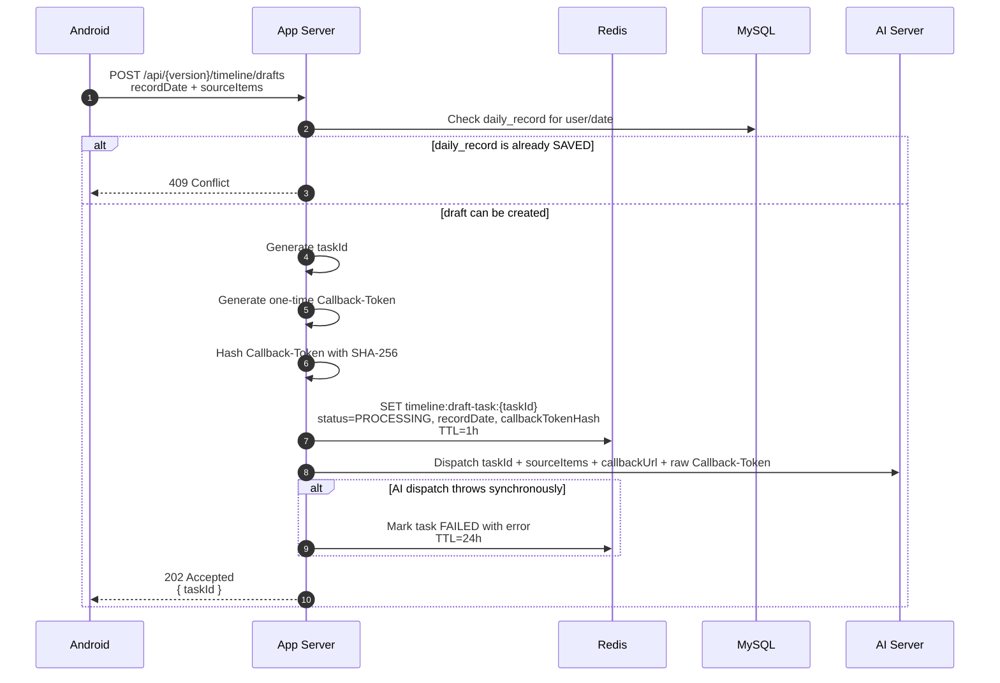
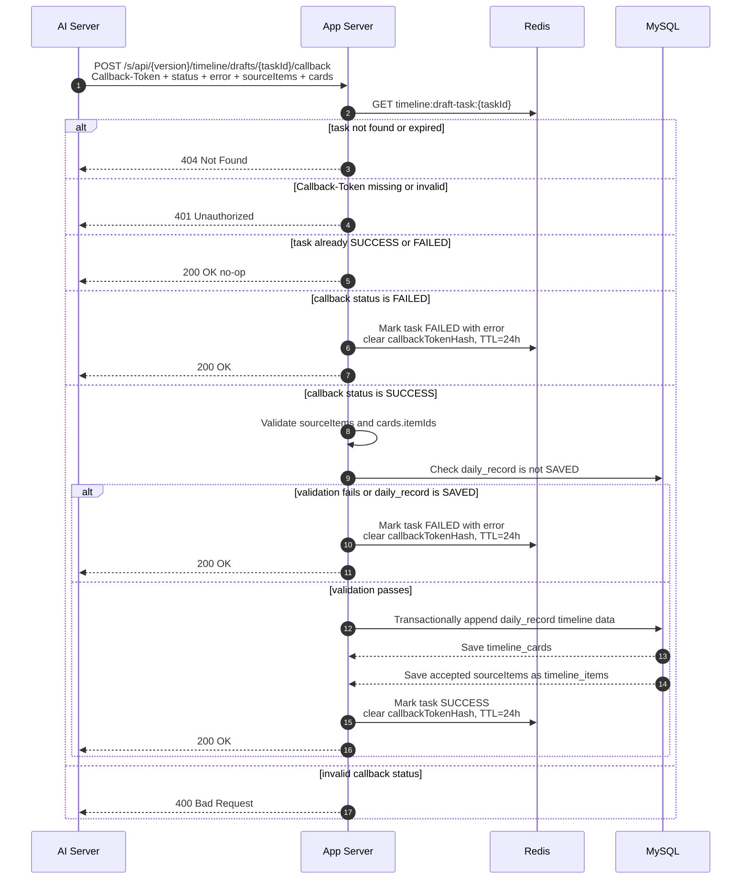
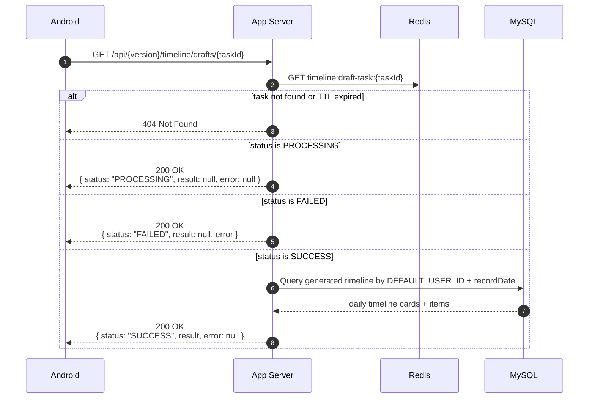

# Timeline Draft API Sequence Diagrams

## Scope

Current sequence diagrams for the three implemented Laimory timeline draft API surfaces:

- `POST /api/{applicationVersion}/timeline/drafts`
- `GET /api/{applicationVersion}/timeline/drafts/{taskId}`
- `POST /s/api/{applicationVersion}/timeline/drafts/{taskId}/callback`

These diagrams reflect the 2026-06-19 implementation reconciliation. The real AI dispatcher is still a no-op stub, but the intended server boundary and task state behavior are represented.

## 1. Create Timeline Draft Task

## 2. AI Callback Completes Task

## 3. Poll Timeline Draft Task

## Notes

- Redis task state stores `status`, `recordDate`, `error`, and `callbackTokenHash`.
- Redis does not store `dailyRecordId` or the original `sourceItems`.
- The AI server does not write directly to MySQL.
- Final validation and persistence happen on the app server callback path.
- `sourceItems` are echoed app server -> AI server -> app server callback for the MVP.
- On successful polling, the app server resolves the result by `(DEFAULT_USER_ID, recordDate)`.

## Linked Sources

- [[2026-06-19-notes-timeline-implementation-reconciliation]]
- [[2026-06-17-notes-timeline-draft-api-thought-process]]
- [[server-to-server-auth-for-laimory]]
